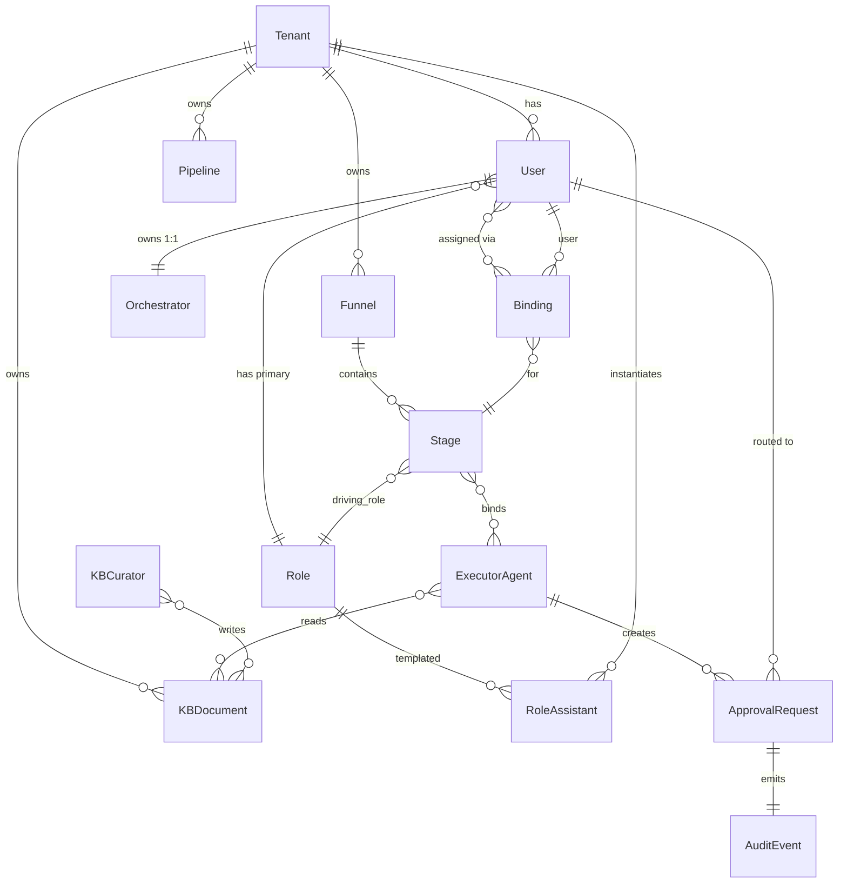
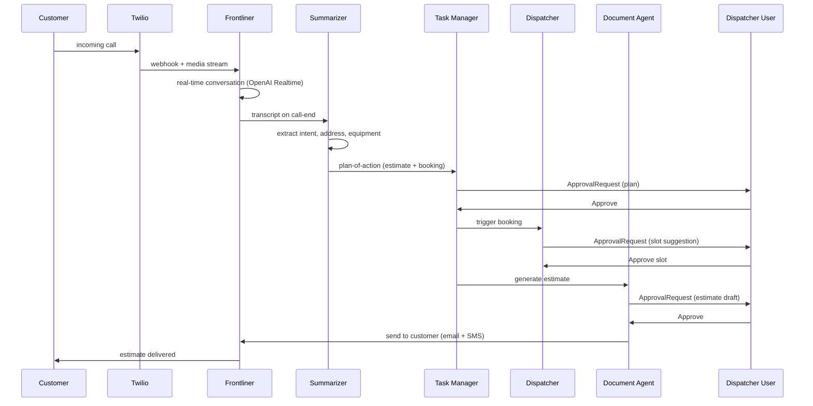

# Agent Layer Architecture — this project

**Статус:** Spec для backend / platform реализации — финальная редакция, все open questions resolved + Meta-Agent Layer для user-built funnels
**Версия:** 1.3
**Дата:** 2026-05-27
**Автор:** the team + Claude
**Для:** Юра (backend lead) и команда разработки
**Companion docs (читать обязательно перед реализацией):**
- `docs/MISSION.md` — что мы строим и для кого
- `docs/PRODUCT_PHILOSOPHY.md` — каталог 8 канонических агентов + 6 end-to-end сценариев
- `docs/FUNNEL_REGISTRY.md` — Registry A (approval templates) + Registry B (vertical packs) + coupling
- `docs/ROLE_PERMISSION_MATRIX.md` — 5 ролей, матрица entity × role × action, default approval ceilings
- `docs/VOICE_GUIDE.md` — per-role persona тон агентов
- `docs/CUSTOM_AGENTS_BUILDER.md` — user-built кастомные агенты (отдельный класс)
- `docs/BACKEND_TZ_YURA.md` — endpoint-ы и БД

Этот документ описывает **архитектуру слоя AI-агентов**: какие агенты существуют, как они связаны с юзерами/ролями/воронками, как работает approval, какие данные текут между ними. Не подменяет конкретные TZ на модули.

---

## 0. TL;DR

this project — это не «AI-функция в CRM», а **операционная система из агентов**. Архитектура трёхслойная:

1. **Personal Orchestrator** — у каждого юзера один чат-агент, который видит всё в скоупе его роли и маршрутизирует запросы внутри.
2. **Per-Role Assistant** — проекция Orchestrator-а на конкретную роль (Owner / Dispatcher / Tech / Lead-tech / Office). Хранит контекст роли, выполняет approval-ы.
3. **Executor Agents** — 14 доменных агентов (Frontliner, Dispatcher, Summarizer, Task Manager, Analyst, Document Agent, HR Agent, **Reputation & QC Agent**, Vision Estimator, KB Curator, Closer, Billing Agent, **Maintenance Steward**, Growth Agent) + 3 sub-agent (Sourcing, Humanizer, Signature). Каждый закреплён за стадиями воронок.

Юзер создаётся → ему ставится роль → автоматически инстанцируется его Personal Orchestrator + права на per-role assistant → юзер закрепляется за конкретными стадиями определённых воронок → агенты на этих стадиях знают, кому отсылать approval.

Каждый агент имеет режим автономности: **Shadow** (наблюдает) → **Suggest** (предлагает, человек approve) → **Autonomous** (действует, threshold-gated). По умолчанию Suggest. Promotion в Autonomous идёт только при success rate ≥ 95% за 100 действий + явный owner consent.

Approval engine — централизованный сервис. Любое state-changing действие агента генерит `ApprovalRequest`, маршрутизируется на `driving_role` стадии, попадает в очередь юзера, юзер approve / reject / edit, событие пишется в `audit_log`.

Поверх Executor / Sub-agent слоя живёт **Meta-Agent Layer** (§19) — 7 агентов, которые помогают end-user-у строить **свои собственные** воронки разговором (Funnel Designer, Stage Composer, Agent Composer, KB Bootstrapper, Funnel Validator, Pipeline Simulator, Promotion Coach). Это позволяет любому vertical-у (от HVAC до beauty salon) собрать рабочий agent funnel за 30-минутный разговор вместо 1-2 недель в Voiceflow / Make / Botpress.

---

## 1. Терминология

| Термин | Определение |
|---|---|
| **Tenant / Company** | Один клиент this project. Полная изоляция данных, очередей, агентов. |
| **User** | Человек-сотрудник внутри tenant. Имеет одну primary role (можно несколько при collapse). |
| **Role** | Одна из пяти позиций: Owner, Dispatcher, Tech, Lead-tech, Office. Источник scope. |
| **Personal Orchestrator** | Per-user чат-агент. Один экземпляр на юзера. Точка входа в систему. |
| **Per-Role Assistant** | Проекция Orchestrator-а в роль. Хранит per-role контекст и выполняет actions от имени роли. |
| **Executor Agent** | Доменный агент с конкретной зоной ответственности (Frontliner, Dispatcher, ...). Stateless по отношению к юзеру, stateful по отношению к funnel-у. |
| **Sub-agent / Tool** | Узкоспециализированный инструмент, который вызывает Executor (Humanizer, Signature, Parser, Vision-recognizer). Не имеет своей очереди задач. |
| **Meta-Agent** | Агент который работает с owner-ом (не с end-customer), помогая ему строить и поддерживать его собственный Executor layer. См. §19. Layer выше Orchestrator. |
| **User-built funnel** | Воронка созданная owner-ом через Meta-Agent Layer (§19), не из preset this project. Может содержать canonical executor agents + custom-built. |
| **Funnel** | Набор стадий процесса (Registry A — generic, Registry B — vertical-pack, см. FUNNEL_REGISTRY). |
| **Stage** | Одна стадия воронки. Имеет `driving_role`, `scope`, `approval_rule`, `next_stage_ids`. |
| **Binding** | Закрепление юзера за стадиями. Юзер X отвечает за стадию Y воронки Z. |
| **ApprovalRequest** | Запрос на согласование действия агента. Маршрутизируется к driving_role юзеру. |
| **AutonomyMode** | Shadow / Suggest / Autonomous. Per-agent + per-stage + per-tenant. |
| **Knowledge Base (KB)** | Per-tenant хранилище шаблонов, FAQ, исторических данных, embeddings. Источник истины для агентов. |

---

## 2. Объектная модель

### 2.1 ER-диаграмма (высокий уровень)



### 2.2 Сущности и поля (TS-нотация)

```ts
// ============== CORE ==============

interface Tenant {
  id: string;
  name: string;
  vertical: 'hvac' | 'plumbing' | 'electrical' | 'roofing' | 'solar' | 'auto' | ...;
  createdAt: ISODate;
  settings: TenantSettings;
}

interface TenantSettings {
  byok: { provider: 'openai' | 'anthropic' | 'google' | null; encryptedKey?: string };
  defaultAutonomyMode: 'shadow' | 'suggest' | 'autonomous';
  approvalCeilings: Record<RoleKey, number>;  // см. ROLE_PERMISSION_MATRIX §"Approval-rule defaults"
  workingHours: { tz: string; mon: [string, string]; tue: [...]; ... };
}

// ============== USERS & ROLES ==============

type RoleKey = 'owner' | 'dispatcher' | 'tech' | 'lead-tech' | 'office';

interface User {
  id: string;
  tenantId: string;
  email: string;
  phone?: string;
  name: string;
  primaryRole: RoleKey;
  additionalRoles: RoleKey[];      // collapse, owner может быть dispatcher
  status: 'active' | 'invited' | 'suspended' | 'terminated';
  invitedAt: ISODate;
  joinedAt?: ISODate;
  terminatedAt?: ISODate;          // см. §2.5 — мгновенный отзыв доступа
}

// ============== AGENTS ==============

type AgentLayer = 'orchestrator' | 'role-assistant' | 'executor' | 'sub-agent';

interface AgentDefinition {
  id: string;                      // 'frontliner', 'dispatcher', 'vision-estimator', ...
  layer: AgentLayer;
  label: string;
  description: string;
  capabilities: string[];          // 'inbound-call', 'outbound-sms', 'estimate-from-photo'
  tools: ToolRef[];                // какие интеграции/инструменты дёргает
  ownerRole?: RoleKey;             // primary role (collapse target)
  ownedStages: StageRef[];         // какие funnel stages драйвит по умолчанию
  defaultAutonomy: AutonomyMode;
  voiceProfileId: string;          // см. VOICE_GUIDE.md
}

interface AgentInstance {
  id: string;
  tenantId: string;
  definitionId: string;            // FK на AgentDefinition
  enabled: boolean;
  autonomyMode: AutonomyMode;
  thresholds: AutonomyThresholds;
  successRate100: number;          // success per последние 100 действий, 0..1
  createdAt: ISODate;
}

interface Orchestrator {
  id: string;
  userId: string;                  // 1:1 с юзером
  tenantId: string;
  chatThreadId: string;
  contextSnapshot: OrchestratorContext;  // что юзер видел последним
}

interface RoleAssistant {
  id: string;
  tenantId: string;
  roleKey: RoleKey;
  scopeOverrides?: ScopeOverride;   // если owner-у нужно зашить ограничение
  isCollapsedInto?: RoleKey;        // если роли нет — поглощается owner-ом
}

// ============== FUNNEL BINDING ==============

interface Binding {
  id: string;
  tenantId: string;
  userId: string;
  pipelineId: string;               // на каком конкретном pipeline-е (Registry B install)
  stageId: string;                  // конкретная стадия
  responsibility: 'driver' | 'approver' | 'reviewer' | 'observer';
  validFrom: ISODate;
  validUntil?: ISODate;             // null = пока активен
}

// ============== APPROVAL ==============

type AutonomyMode = 'shadow' | 'suggest' | 'autonomous';

interface AutonomyThresholds {
  monetary?: number;                // $ ceiling для auto-approve
  recordsAffected?: number;         // count ceiling
  externalSendAllowed?: boolean;    // можно ли отправить наружу без approve
}

interface ApprovalRequest {
  id: string;
  tenantId: string;
  agentInstanceId: string;
  stageId?: string;                 // если действие в контексте стадии
  entityType: 'lead' | 'job' | 'invoice' | 'message' | ...;
  entityId: string;
  proposedAction: {
    kind: 'create' | 'update' | 'send' | 'schedule' | 'transition';
    payload: unknown;                 // JSON Schema-валидируется
    diff?: { before: unknown; after: unknown };
  };
  routedToUserId: string;             // куда улетел approve
  fallbackUserId?: string;            // если первый не ответил за SLA
  status: 'pending' | 'approved' | 'edited' | 'rejected' | 'expired';
  decision?: { byUserId: string; at: ISODate; editPayload?: unknown };
  createdAt: ISODate;
  expiresAt: ISODate;
}

// ============== AUDIT & KB ==============

interface AuditEvent {
  id: string;
  tenantId: string;
  occurredAt: ISODate;
  actor: { kind: 'user' | 'agent'; id: string };
  action: string;                   // 'lead.update', 'invoice.send', 'stage.transition'
  entityRef: { type: string; id: string };
  beforeSnapshot?: unknown;
  afterSnapshot?: unknown;
  approvalRequestId?: string;
  ipAddress?: string;               // только для user actions
}

interface KBDocument {
  id: string;
  tenantId: string;
  kind: 'template' | 'faq' | 'historical-job' | 'snippet' | 'persona' | 'product-spec';
  title: string;
  body: string;                     // markdown
  embeddings?: number[];            // векторное представление для RAG
  tags: string[];
  createdBy: { kind: 'user' | 'agent'; id: string };
  createdAt: ISODate;
  version: number;
}
```

---

## 3. Жизненный цикл пользователя

### 3.1 Создание

Три пути:

1. **Owner first** — при регистрации tenant-а первый юзер автоматически получает `primaryRole = 'owner'`. Без owner-а tenant не существует.
2. **Invite by owner / lead-tech** — owner идёт в `/team`, отправляет invite (email + назначаемая роль). Кандидат жмёт линк → проходит OAuth (Google / Microsoft) → получает `status = 'invited'` → при первом успешном login `status = 'active'` и `joinedAt = now()`.
3. **OAuth bulk import** — owner подключает Google Workspace / Microsoft 365. Система предлагает список юзеров из домена. Owner mass-assign-ит роли (UI: чек-боксы + dropdown ролей) → bulk invite.

**При создании юзера** автоматически выполняется side-effect:

```pseudo
on user.created:
  create Orchestrator(userId, chatThreadId=newThread())
  for role in [user.primaryRole, ...user.additionalRoles]:
    grant RoleAssistantAccess(userId, role)
  emit audit.event('user.created')
```

### 3.2 Установка / смена роли

- Только owner может менять роли других юзеров.
- Смена роли не пересоздаёт Orchestrator — переезжает scope и Bindings.
- Если роль удаляется и нет других active юзеров с этой ролью → RoleAssistant `collapse` в owner. Bindings перевешиваются на owner (с alert: "у вас новые обязанности").

```pseudo
on user.role.changed(userId, fromRole, toRole):
  if no other active users with fromRole:
    roleAssistant[fromRole].isCollapsedInto = 'owner'
    rebind(stages where driving_role = fromRole, to = ownerUserId)
  audit.event('user.role.changed')
```

### 3.2.1 Scope-flags (для HR-доступа и других cross-cutting permissions)

Pattern для случаев, когда юзеру нужны дополнительные права, выходящие за primary role, **без создания новой роли**. Используется флагами на User:

```ts
interface User {
  // ... primary fields
  scopeFlags: {
    hrAccess?: boolean;       // доступ к HR-воронке + HR Agent approvals
    financeAccess?: boolean;  // расширенный доступ к Billing (помимо Office роли)
    fleetAccess?: boolean;    // для multi-location: доступ ко всем pipelines
  };
}
```

**Применение `hrAccess`:** в малом tenant (5-15 seats) Owner делает HR через себя. В большом (20+ seats) HR-функцию часто получает Office-юзер. Вместо создания 6-й роли «HR Manager» owner ставит `hrAccess = true` на конкретного юзера. HR Agent при routing approval-ов проверяет `hrAccess` flag поверх primary role. Если в tenant-е нет ни одного юзера с `hrAccess` — HR approval-ы по умолчанию идут owner-у.

**Применение `financeAccess`:** аналогично для Billing Agent — расширенный финансовый доступ может быть у юзера, чья primary role не Office.

**Применение `fleetAccess`:** для tenant-ов с несколькими локациями — flag даёт юзеру cross-location видимость без необходимости делать его owner-ом.

Scope-flag не меняет default approval ceiling (он берётся из primary role) — flag только расширяет route-target для соответствующего агента.

### 3.3 Закрепление за стадиями воронок (Bindings)

Юзер не «отвечает за всё что попало под его роль». Юзер закрепляется за конкретными стадиями конкретных pipeline-ов. Это позволяет:

- Распределить 8 техников по 3 pipeline-ам (residential install / commercial install / service)
- У dispatcher-а в крупной компании может быть scope только pipeline-а одной локации
- Lead-tech может быть approver-ом для одной воронки и observer-ом для другой

UI binding-а: `/team/{userId}/responsibilities`. Owner видит таблицу:

| Pipeline | Stage | Responsibility |
|---|---|---|
| HVAC Service (LA) | On site | Driver |
| HVAC Service (LA) | Completed | Approver |
| HVAC Equipment (LA) | (вся воронка) | Observer |

Где Pipeline — конкретный экземпляр Registry B pipeline-а, Stage — конкретная стадия с `funnelStageId` ref на Registry A.

**При создании binding-а** запускается:

```pseudo
on binding.created(userId, pipelineId, stageId, responsibility):
  validate user.primaryRole ∈ allowed_roles_for(stageId)
  index ApprovalRouter[(pipelineId, stageId)].push(userId)
  audit.event('binding.created')
```

ApprovalRouter — это in-memory + persistent индекс «для стадии X в pipeline Y кому отправлять approval». Маршрутизация ищет binding-и с `responsibility ∈ ['driver', 'approver']`, сортирует по специфичности (driver приоритетнее), отправляет первому, при отсутствии ответа за SLA — следующему.

### 3.4 Отзыв доступа при увольнении

Из PHILOSOPHY: «Сотрудник уволился — мгновенный отзыв доступа ко всем данным и агентам».

UI: owner → `/team/{userId}` → Terminate. Подтверждение (2-step).

Side-effects (атомарно в одной транзакции):

```pseudo
on user.terminate(userId):
  user.status = 'terminated'
  user.terminatedAt = now()
  revoke all OAuth tokens
  revoke all API keys
  invalidate all sessions
  for binding in user.bindings:
    if exists other active driver for binding.stageId: 
      remove binding
    else:
      reassign to RoleAssistant fallback (owner if no peer)
  archive Orchestrator chatThread (read-only)
  for kbDoc in KBDocument where createdBy.id = userId:
    mark kbDoc.author_status = 'terminated' (NOT deleted — historical record stays)
  audit.event('user.terminated')
```

После terminate юзер физически не может залогиниться, его агенты-ассоциации заморожены, история сохраняется для audit.

---

## 4. Роли и матрица доступа

Источник истины — `docs/ROLE_PERMISSION_MATRIX.md`. Здесь только то, что нужно для агентского слоя.

5 ролей: **Owner** / **Dispatcher** / **Tech** / **Lead-tech** / **Office**.

Каждая Executor Agent работает **от имени конкретной роли**. То есть:

- Frontliner работает от имени Dispatcher (при inbound звонке) или от имени Office (при outbound напоминании об оплате) — в зависимости от стадии.
- Dispatcher-agent работает от имени Dispatcher.
- Vision Estimator работает от имени Lead-tech (требует expertise оценки).

Это значит: разрешения агента = разрешения роли, от имени которой он действует, минус ограничения, прописанные в его `AgentDefinition.scopeOverrides`.

**Default approval ceilings** (см. ROLE_PERMISSION_MATRIX §"Approval-rule defaults"):

| Role | Auto-approve ceiling | Above → escalate to |
|---|---|---|
| Dispatcher | book ≤ tenant-set $ ceiling | Owner |
| Tech | parts ≤ $200/ticket | Lead-tech |
| Lead-tech | route override ≤ tenant-set $ ceiling | Owner |
| Office | invoice send ≤ tenant-set $ ceiling | Owner |
| Owner | no ceiling | — |

---

## 5. Каталог Executor Agents

Все агенты ниже — **канонические для всех tenant-ов** (отличается только конфиг). User-built кастомные агенты — отдельный класс, см. CUSTOM_AGENTS_BUILDER.md.

Формат каждой карточки:

> **Зона ответственности** · **Триггеры** · **Входы** · **Выходы** · **Инструменты** · **Стадии, которые драйвит** · **Driving role** · **Default autonomy** · **KB-зависимости**

### 5.1 Frontliner

**Зона:** вся внешняя коммуникация бизнеса в обе стороны. Голос, SMS, мессенджеры (WhatsApp, Telegram, FB Messenger, Instagram DM), email, веб-чат, голосовая почта, агрегаторы (Yelp, Google Business, Angi, Thumbtack).

**Триггеры:**
- inbound: webhook от Twilio (call/SMS), Meta Webhooks (WA/IG/FB), Gmail API push, intercom-like web chat, Yelp Bookings API
- outbound по событию из funnel (например, stage transition требует отправить confirmation)
- outbound по событию от другого агента (Dispatcher → Frontliner: «подтверди слот клиенту»)

**Входы:** raw текст / транскрипт звонка / шаблон сообщения + контекст entity (lead, job, customer)

**Выходы:**
- transcript + intent (qualified / not-interested / emergency / spam)
- proposed reply (через Humanizer sub-agent)
- structured fields для lead/customer (имя, адрес, тип проблемы)
- ApprovalRequest при outbound в режиме Suggest

**Инструменты:**
- Twilio Voice + Programmable Messaging (звонки, SMS, MMS)
- OpenAI Realtime API (real-time голос)
- Meta Graph API (WA, IG, FB)
- Gmail API / SMTP
- Yelp Booking API
- Humanizer sub-agent (см. §5.13)

**Стадии:** New, Triage, Booking, Confirmation, Follow-up — во всех воронках где есть touch с клиентом.

**Driving role:** Dispatcher (по умолчанию). На outbound в Sales B2B → Owner. На billing follow-up → Office.

**Default autonomy:**
- **inbound classification:** Autonomous (классифицировать звонок ≠ действие наружу)
- **outbound first 30 days per tenant:** Suggest (owner approves каждое)
- **outbound after 30 days + success ≥ 95%:** Autonomous под threshold (ответ < 160 символов, не billing/contract, рабочее время) — иначе Suggest

**KB-зависимости:** scripts/{vertical}/inbound-greeting, scripts/{vertical}/qualification-questions, FAQ-snippets, customer-history (last 5 jobs at address).

---

### 5.2 Dispatcher

**Зона:** управление календарём, распределение работы между техниками, оптимизация маршрутов, переносы и отмены.

**Триггеры:**
- новый qualified lead в Sales / Service / Install воронке
- ручная команда от owner-а / dispatcher-юзера («забукируй X на завтра 10-12»)
- cron для Maintenance-воронки (видит контракты, у которых due-date через N дней)
- HR-воронка: собеседования (Interview-1 booking, Interview-2 booking стадии)

**Входы:** entity нуждается в slot (lead, job, interview), constraints (skill, location, customer preference)

**Выходы:**
- список подходящих слотов (top-3) с rationale
- proposed booking (tech + time + customer confirm channel)
- ApprovalRequest при booking над threshold
- route optimization для дня (если несколько jobs)

**Инструменты:**
- Google Calendar / Microsoft 365 Calendar (read + write)
- HouseCall Pro / ServiceTitan / Zoho FSM (как booking sink если интегрирован)
- Mapbox / Google Maps Distance Matrix (для route optimization)
- Tech roster + skills + availability (внутренняя сущность)

**Стадии:**
- Lead qualification: Triage (handoff if qualified)
- Service / Install / Maintenance: Scheduled, En route (re-routing)
- HR: Interview-1 booking, Interview-2 booking
- Sales B2B: Discovery booking

**Driving role:** Dispatcher (или Owner в collapse).

**Default autonomy:**
- **booking ≤ promised-price ceiling:** Autonomous
- **booking > ceiling OR пересечение с другим job:** Suggest
- **отмена / перенос с уведомлением клиента:** Suggest всегда
- **HR booking:** Suggest всегда (owner ставит свой календарь — нельзя авто)

**KB-зависимости:** tech-skill-matrix, tenant-working-hours, route-distance-cache, customer-preference (preferred-tech, preferred-window).

---

### 5.3 Summarizer (Scribe)

**Зона:** обработка любого транскрипта / записи / письма / встречи — выдаёт structured summary за 30 секунд.

**Триггеры:**
- завершение звонка (Twilio call-end webhook)
- завершение Zoom/Google Meet встречи (через recording webhook)
- inbound email с вложением транскрипта
- ручное "summarize this thread" от Orchestrator

**Входы:** transcript / audio file / text thread + entity context (с кем разговор был)

**Выходы:**
- summary (3-5 предложений)
- key decisions (extracted as actionable items)
- proposed next steps (passed to Task Manager)
- classification (для Sales: тип запроса; для Service: severity; для HR: pass/fail)
- structured field extraction (адрес, модель оборудования, бюджет, дата)

**Инструменты:**
- LLM (Claude Sonnet 4.5 / GPT-4o)
- Whisper / Deepgram (если audio без транскрипта)
- KB lookup (для классификации работ по vertical-словарю)

**Стадии:** Summary стадия в каждой воронке (после любого touchpoint).

**Driving role:** none (служебный). Передаёт результат driving role стадии.

**Default autonomy:** Autonomous (summary без отправки наружу — безопасно). Если содержимое summary помечено sensitive (PII, юридическое) — режим Suggest.

**KB-зависимости:** vertical-glossary, classification-taxonomy, prior-conversations-by-customer.

---

### 5.4 Task Manager

**Зона:** превращает summary / стадию воронки в конкретные tasks, отслеживает дедлайны, эскалирует.

**Триггеры:**
- approve plan-of-action от менеджера
- stage transition (новый job → задачи для tech)
- SLA breach (задача висит > порог) → эскалация

**Входы:** plan-of-action (от Summarizer) / stage entry rules

**Выходы:**
- Task records (assignedTo, dueAt, completionCriteria)
- reminders (SMS / in-app / email)
- escalation alerts owner-у если задача overdue
- completion → audit-event → возможный stage transition

**Инструменты:**
- Internal tasks store
- Push notifications (FCM / APN)
- Slack integration если подключён
- Calendar block-out (если задача требует время)

**Стадии:** Выполнение стадии в Install / Service / Maintenance / QC / HR воронках.

**Driving role:** Driver стадии, на которой создаётся task.

**Default autonomy:** Autonomous для создания / напоминания. Suggest для эскалации с alert-ом owner-у.

**KB-зависимости:** task-templates per vertical (например, HVAC install checklist), SLA-table per task-type.

---

### 5.5 Analyst

**Зона:** даёт owner-у картину бизнеса. Утренний briefing, evening report, real-time alerts, periodic deep-dives.

**Триггеры:**
- cron 07:00 (briefing) и 18:00 (evening report) per tenant-timezone
- real-time threshold trip (выручка < 50% from-last-week-MA, conversion drop > 15%)
- explicit "what changed?" в Orchestrator

**Входы:** aggregated data из всех воронок + ad sources + integrations

**Выходы:**
- briefing card (вчера / неделя / месяц с deltas)
- alerts (severity: info / warning / critical)
- recommendations (с rationale из KB и историч. данных)
- drill-down on click

**Инструменты:**
- Internal analytics DB (read-only)
- Ad source connectors (Google Ads, Meta, Yelp — для attribution)
- LLM для генерации текста briefing-а

**Стадии:** Отчёт стадия в Sales / Service / Maintenance / QC / Reputation воронках + standalone briefing surfaces (/briefing, /evening, /dashboards).

**Driving role:** Owner (это его tool).

**Default autonomy:** Autonomous (только отчёты, не действия). Если recommendation предлагает изменить tenant config (например, "увеличь auto-approve ceiling") → Suggest.

**KB-зависимости:** vertical-benchmarks, tenant-historical-baselines, vertical-seasonality.

---

### 5.6 Document Agent

**Зона:** генерация всех документов tenant-а — proposals, estimates, invoices, contracts, warranties, NDA, COI, W9.

**Триггеры:**
- stage transition требует доку (Estimate → Drafted, Sales B2B Proposal, HR Document prep)
- ручной "make me an estimate" от менеджера
- recurring (например, monthly invoice по maintenance контракту)

**Входы:**
- template ID (из KB)
- entity context (customer, job, parts, labor)
- pricing inputs (margin calc от Estimate-margin sub-agent если есть)

**Выходы:**
- готовый PDF / DOCX / HTML preview
- ApprovalRequest (всегда, см. autonomy)
- после approve — send через Signature sub-agent или email

**Инструменты:**
- Template engine (Handlebars / Liquid + KB шаблоны)
- PDF renderer (Puppeteer / wkhtmltopdf)
- DocuSign / PandaDoc API (через Signature sub-agent)
- Humanizer sub-agent (для писем-сопроводок)

**Стадии:**
- Estimate воронка: Drafted, Sent
- Sales B2B: Proposal, Contract
- Install: Закрытие (invoice + warranty)
- HR: Document prep, Signature loop

**Driving role:** Office (invoices) / Lead-tech (estimates) / Owner (contracts) / HR Agent (HR docs) — зависит от стадии.

**Default autonomy:** Suggest всегда. Owner / Office approve каждый документ перед send. Promotion в Autonomous возможна только для invoice send ≤ tenant ceiling после 100 успешных send-ов.

**KB-зависимости:** **критически зависим от KB**. Все шаблоны живут в KB. Owner загружает шаблоны в /knowledge один раз → Document Agent их использует. Без загруженного шаблона Document Agent fails-loud, не пытается генерить из памяти.

---

### 5.7 HR Agent

**Зона:** весь цикл найма от sourcing до contract signing. Управляет HR-воронкой (11 стадий, см. FUNNEL_REGISTRY §5).

**Триггеры:**
- owner открывает новую вакансию (`/hiring/new`)
- кандидат отвечает на outreach (через Frontliner)
- стадия HR-воронки требует HR-agent action
- cron: проверка stale candidates (no-response > 5 days)

**Входы:** vacancy spec (от owner), candidate profile, summary интервью, reference check результаты

**Выходы:**
- candidate shortlist
- outreach messages (через Frontliner + Humanizer)
- document requests ("пришли ID, SSN, EPA cert")
- contract draft (через Document Agent)
- onboarding handoff в Onboarding sub-funnel

**Инструменты:**
- Sourcing sub-agent (Indeed, LinkedIn parser, см. §5.12)
- Frontliner (для коммуникации с кандидатами)
- Dispatcher (для booking интервью)
- Summarizer (для интервью recordings)
- Document Agent + Humanizer + Signature

**Стадии:** все 11 стадий HR-воронки + Sales B2B (через Sourcing).

**Driving role:** HR Manager (если есть в tenant-е, как отдельная роль) или Owner (collapse).

**Default autonomy:**
- Sourcing & shortlist: Suggest
- Outreach к кандидату: Suggest first 30 дней per tenant, потом Autonomous под template
- Booking интервью: Suggest (owner-календарь)
- Document prep / contract: Suggest всегда
- Reference check: Autonomous

**KB-зависимости:** outreach templates, screening question banks, reference-check scripts, vertical-specific certification lists (EPA 608, NATE, plumbing C-36, etc.).

---

### 5.8 Reputation & QC Agent

**Зона:** двойная — Quality Control loop после каждой завершённой работы + online reputation management. Объединены в одного агента (resolved §15.12), потому что tight coupling: QC выход определяет Reputation action.

**Триггеры:**
- **QC loop:** job-close event (Install / Service / Maintenance completed) — N часов спустя (configurable, default 24h) автоматически инициирует контакт с клиентом
- **Reputation monitoring:** new review webhook от любой платформы
- **Cron weekly:** rating delta vs competitors, review velocity

---

**A. Quality Control flow (после каждой завершённой работы):**

```
Stage QC.Outbound contact:
  Reputation & QC Agent → Frontliner (channel-tool)
  Goal: связаться с клиентом, спросить «как прошло»
  Channels по приоритету: voice call → SMS если нет ответа → email последним
  Default channel — VOICE (см. killer-feature §17.1).
  
Stage QC.Classify:
  Summarizer обрабатывает ответ клиента
  Outcome buckets:
    - SATISFIED (positive, no issues)
    - SATISFIED_WITH_NOTES (positive, minor issues to fix)
    - NEUTRAL (no strong opinion)
    - NOT_SATISFIED (negative — escalate)
    - NO_RESPONSE (3 attempts, no contact) — soft-close

Stage QC.Action:
  IF SATISFIED:
    → §B. Review request
    → задача "send reward token" (промокод / discount на next visit) через Document Agent + Frontliner
  
  IF SATISFIED_WITH_NOTES:
    → создать ticket для lead-tech на fix
    → review request НЕ отправлять до закрытия ticket
    → после ticket close — повторить QC loop
  
  IF NOT_SATISFIED:
    → создать ticket P1 для lead-tech
    → option 1 (auto): уведомить owner через push + email
    → option 2 (escalation): если customer хочет «поговорить с человеком сейчас» —
       transfer голосового звонка на ответственного (Frontliner orchestrates handoff)
    → review request БЛОКИРОВАН до resolution
  
  IF NO_RESPONSE:
    → лог в audit
    → review request не отправляется (этичный default — не спамим)
```

**Routing для escalation:** ApprovalRouter определяет «ответственного» — это lead-tech, у которого binding на pipeline-стадию `On site` / `Completed` для этого job. Если несколько — driver приоритет, потом seniority.

---

**B. Review request с distribution-ползунком (killer feature):**

Owner в `/settings/reputation` настраивает распределение запросов review между платформами через **визуальный ползунок**:

```
Google Reviews:  [████████████████░░░░] 80%
Meta (FB Page):  [████░░░░░░░░░░░░░░░░] 20%
Yelp:            [░░░░░░░░░░░░░░░░░░░░] 0%
BBB:             [░░░░░░░░░░░░░░░░░░░░] 0%
```

Сумма всегда = 100%. Reputation Agent при отправке review request делает **weighted random** на основе текущего распределения. Каждый customer получает request на ОДНУ платформу (не спамим across).

Use cases:
- Tenant строит присутствие на Google → 100% Google
- Tenant хочет диверсифицировать → 60% Google / 30% Yelp / 10% Meta
- Tenant идёт на Yelp Elite программу → временно 80% Yelp
- Per-vertical defaults: HVAC = 80% Google / 20% Meta, restaurants = 40% Google / 40% Yelp / 20% TripAdvisor

**Дополнительные правила:**
- Owner может настроить **customer-segment overrides** (например, для customers найденных через Meta Ads — 100% Meta, чтобы closed-loop attribution работал)
- Если customer уже оставил review на платформе X → исключается из дальнейших requests на эту платформу для следующих jobs (no double-asking)
- Если platform-account не connected — slider для неё disabled с tooltip «подключи Google Business Profile чтобы активировать»

**Reward на next visit:**
- Token-based discount (например, `THANK10` на 10% на next service)
- Document Agent генерит SMS/email с token
- Frontliner отправляет вместе с review link
- Token tracked в Billing Agent для apply при следующем invoice
- Owner настраивает: % discount, expiration window, blackout periods (peak season)

---

**C. Reputation monitoring & response:**

**Входы:** review text + rating + customer reference (если можно мапнуть к customer ID через имя/телефон)

**Выходы:**
- proposed reply (через Humanizer) — Suggest для всех ratings, Autonomous под template для 4-5★ после approve первых 10
- escalation для negative review (alert owner + создание ticket если customer mappable)
- content posts (case studies, photos) на платформы
- weekly delta report через Analyst в morning briefing

**Инструменты:**
- Google Business Profile API
- Yelp Fusion API
- BBB API
- Meta Graph API (FB Pages reviews, IG comments)
- Apple Maps Connect API
- Angi / Thumbtack APIs
- Frontliner (для outbound — voice/SMS/email)
- Document Agent (для генерации reward tokens, content posts)

**Стадии:**
- QC loop (новая воронка `quality-control` уже есть в FUNNEL_REGISTRY Registry A, post wave-66)
- Reputation funnel (6 стадий — уже есть в FUNNEL_REGISTRY)

**Driving role:** Owner (для содержательных решений: respond / escalate / config распределения). Operational actions делает агент через Frontliner.

**Default autonomy:**
- QC outbound call: Autonomous (template-based опросник)
- QC classification: Autonomous (Summarizer-grade)
- Review request с distribution: Autonomous после 30-дневного approve каждого
- 4-5★ review reply: Autonomous под template после 10 approve
- 1-3★ review reply: Suggest всегда + alert owner
- Negative review escalation: Autonomous (alert + ticket) + Suggest для public reply
- Content publishing: Suggest всегда

**KB-зависимости:** reply templates per platform per star-rating, brand-voice guide, case-study assets, competitor watchlist, reward-token catalog, escalation-script для negative QC outcomes.

**Метрики:**
- QC contact rate (% завершённых jobs где удалось связаться)
- CSAT (customer satisfaction score) из QC outcomes
- NPS proxy (% promoter / detractor)
- Review request → posted-review conversion per platform
- Rating trend per platform (rolling 30d)
- Negative review resolution time (от alert до public reply / customer contact)

---

### 5.9 Vision Estimator *(дополнительный к 8 каноническим)*

**Зона:** оценка работы по фотографиям. Tech / customer кидает фото проблемы / объекта → агент возвращает scope of work + estimated cost.

**Триггеры:**
- customer uploads фото в чат (через Frontliner)
- tech делает site-visit фото (стадия Site visit в Sales B2B / Install)
- ручной "estimate this" от lead-tech-юзера

**Входы:**
- 1+ фото (JPEG/HEIC/PNG)
- optional: текстовое описание от пользователя
- entity context (адрес, vertical, customer history)

**Выходы:**
- detected equipment / scope items (HVAC модель + age, plumbing fixture type, electrical panel age)
- estimated labor hours
- parts list with prices (из KB pricing catalog)
- proposed estimate draft → handoff в Document Agent
- confidence score per detection

**Инструменты:**
- Vision-recognizer sub-agent (Claude 4.5 Vision / GPT-4o Vision / специализированная модель для HVAC nameplate OCR)
- KB pricing catalog (per-tenant за каждым SKU цена)
- Similar-historical-jobs RAG (поиск похожих фото из прошлых jobs)

**Стадии:**
- Sales B2B: Technical pre-assessment
- Install: On site (photo capture для post-install verification)
- Service / Repair: Triage (если customer прислал фото проблемы)

**Driving role:** Lead-tech (требует expertise валидации).

**Default autonomy:** Suggest всегда. Vision модели ошибаются на nameplates (особенно outdoor equipment в плохом свете). Lead-tech approve / edit оценку перед handoff в Document Agent. После 100 успешных оценок (lead-tech не правил > 90%) per vertical — Autonomous для модели определения, но estimate всё равно Suggest.

**KB-зависимости:** **критически зависим от KB**. Pricing catalog (без него нет cost), similar-job-photos с verified outcomes (без них Vision не умеет калиброваться под vertical), tenant-specific brand SKU shortcut-ы.

**Архитектурное решение (§15.1):** реализуется как отдельный Executor (не sub-agent у Document Agent), потому что triggered отдельным event (photo upload), используется multi-consumer (Document для estimate, Task Manager для warranty claim, KB Curator для тэгинга), и lead-tech использует standalone для решения «ехать на site или нет» — без последующего document.

---

### 5.10 KB Curator (Knowledge Agent) *(дополнительный к 8 каноническим)*

**Зона:** агент-архивист Knowledge Base. Метафора: «секретарь-делопроизводитель в офисе» — сортирует входящие документы, чистит дубли, говорит owner-у «у тебя не подшит W9 на этого подрядчика». Превращает разрозненные документы в чистый RAG-ready источник для всех агентов.

**Архитектурное решение (§15.3):** реализован как **гибридный агент** с двумя modes — `automated` (cron, без LLM: embeddings, dedup, tagging) и `interactive` (LLM, owner chat: proactive alerts о пропущенных шаблонах, dedup suggestions, knowledge gap detection). Не разделять на backend service + chat agent — unified observability и единая mental model «всё что обрабатывает данные = agent».

**Маленький tenant (5 человек, 10 шаблонов):** KB Curator работает фоном, owner его почти не замечает.
**Средний tenant (20 человек, 200 документов):** без KB Curator KB превращается в свалку за полгода, Document Agent начинает галлюцинировать «вроде у меня был шаблон».
**Большой tenant (50+ человек, тысячи jobs):** обязателен — без него вся historical база бесполезна для Vision Estimator и Analyst.

**Триггеры:**
- owner uploads документ в /knowledge
- agent fails-loud "нужен template Y, его нет в KB" → KB Curator создаёт draft и просит owner заполнить
- cron weekly: дедупликация (два похожих template → owner выбирает «оставить какой»)
- new historical-job попадает в KB (после Install close) → embeddings + tags

**Входы:** raw document / structured record / agent-generated draft

**Выходы:**
- normalized KBDocument (правильный kind, tags, embeddings)
- deduplication suggestions
- alerts owner-у: «не хватает template X для verticali Y, без него Document Agent fails»
- knowledge graph (связи между customers / equipment / typical-problems)

**Инструменты:**
- Embeddings API (text-embedding-3-small / Voyage AI)
- LLM для извлечения структуры из PDF / DOCX
- OCR (если документ — фото)
- Vector DB (pgvector / Qdrant)

**Стадии:** служебный, не привязан к воронкам.

**Driving role:** Owner (он source-of-truth для KB).

**Default autonomy:** Suggest для дедупликации + alert-ов. Autonomous для embeddings / tagging.

**KB-зависимости:** сам управляет KB.

---

### 5.11 Closer (Deal Closer) *(дополнительный к 8 каноническим)*

**Зона:** дожимает клиента до сделки на финальных стадиях Sales-воронки. Закрывает leak между "estimate sent" и "estimate accepted" — типичная зона потерь по индустрии (≥ 30% leads теряются на этой стадии).

**Триггеры:**
- Estimate воронка: статус "Sent", customer не ответил > 24h
- Sales B2B: Negotiation stage
- Service: customer received estimate, не подтвердил booking > 12h
- сигнал от Analyst: deal probability dropping

**Входы:** entity history (вся переписка), original estimate, customer profile, conversion patterns из KB

**Выходы:**
- proposed touchpoint (call script / SMS draft / email draft)
- цель каждого touchpoint-а (выяснить возражение / предложить альтернативу / закрыть)
- discount-request если ROI положительный → ApprovalRequest owner-у
- handoff обратно к Frontliner для отправки

**Инструменты:**
- Frontliner (для отправки touchpoint-а)
- KB conversion-pattern library
- Analyst (для конверсионных бенчмарков)
- Sales play-book per vertical (in KB)

**Стадии:**
- Sales: Estimate (если customer молчит) → Booking
- Sales B2B: Negotiation
- Service: Awaiting reply

**Driving role:** Owner или Senior Manager (зависит от tenant-а — если есть Sales Manager роль).

**Default autonomy:** Suggest всегда (closing — сенситивно). Owner approve каждый touchpoint первый месяц. После 100 успешных closes под threshold (avg deal size < $5k) → Autonomous для template-based follow-up.

**KB-зависимости:** conversion play-books per vertical, common objections + responses, discount-ROI table per customer-segment.

**Архитектурное решение (§15.2):** реализован как отдельный Executor (не режим Frontliner), потому что разные оптимизационные target-ы (close rate vs response rate), разные KB-зависимости (play-books vs scripts), разный тон (persuasive vs informational), разные метрики команды. Closer **думает** «что сказать», Frontliner **отправляет** (используется как channel-tool — аналог Document Agent + Signature Agent).

---

### 5.12 Sourcing Agent *(sub-agent HR / Sales B2B)*

**Зона:** парсинг внешних источников для шортлиста — кандидатов (HR) или prospects (Sales B2B).

**HR mode входы / источники:** Indeed, LinkedIn (private API через клиента), ZipRecruiter, Glassdoor, локальные facebook-groups.

**Sales B2B mode входы / источники:** building-permit databases (для signal "недавно прошёл permit на HVAC retrofit"), business directories (Yelp, Yellow Pages), industry associations, news mentions.

**Выходы:** ranked shortlist + rationale per item.

**Driving role:** HR Agent (HR mode) или Frontliner (Sales B2B mode).

**Default autonomy:** Autonomous для сбора shortlist, Suggest для outreach (см. Frontliner).

---

### 5.13 Humanizer Agent *(sub-agent)*

**Зона:** убирает AI-паттерны из любого outbound текста. Делает так, чтобы клиент / кандидат не отличил от живого человека.

**Применяется всегда** к outbound текстам от Frontliner, Document Agent, HR Agent, Reputation Agent.

Правила (из global this project voice + tenant voice profile):
- no em-dashes, no "moreover/furthermore", no rule of three padding
- no "I hope this helps", no "Let me know if you have any questions" (заменяет на конкретное)
- сохраняет ключевые факты (цены, даты, имена) — fail-loud если потерял

**Тех. реализация:** post-processing LLM call с tenant-voice persona + строгой проверкой post-hoc что факты не потеряны.

---

### 5.14 Signature Agent *(sub-agent)*

**Зона:** маршрутизация документа через подписание. DocuSign / PandaDoc / HelloSign.

**Триггеры:** Document Agent → "это approved, отправь на подпись"

**Выходы:** signing-status updates, final signed PDF → KB

**Default autonomy:** Autonomous (отправка на подпись), Suggest на counter-sign owner-ом (это его подпись).

---

### 5.15 Billing Agent (RevOps) *(дополнительный к 8 каноническим)*

**Зона:** весь финансовый lifecycle tenant-а — invoices, payments, collections, AR/AP, recurring billing, tax, vendor bills. Document Agent отвечает только за **генерацию** PDF, Billing Agent отвечает за **lifecycle и логику**.

**Триггеры:**
- Install / Service funnel завершился стадией «Completed» → создать invoice draft
- Stripe / Square webhook о payment (success / fail / chargeback)
- Cron daily 09:00: aging buckets check, reminder schedule
- Cron monthly: maintenance contract recurring billing
- HCP / ServiceTitan webhook о job-close с invoice flag

**Входы:** job/estimate data, payment events, contract terms, customer credit limit

**Выходы:**
- invoice records с lifecycle status (draft / sent / pending / overdue / paid / written-off)
- payment matching (incoming payment → invoice)
- reminder messages (через Frontliner как channel-tool — analog Closer + Frontliner)
- aging reports (через Analyst как input)
- 1099 forms EOY (через Document Agent для рендера)
- vendor bill approval queue для Office юзера

**Инструменты:**
- Stripe / Square / ACH APIs
- QuickBooks / Xero / FreshBooks connectors
- Tax rate API (per-state sales tax: TaxJar / Avalara)
- HCP / ServiceTitan для two-way invoice sync
- Frontliner (для отправки клиенту reminders)
- Document Agent (для PDF render — sub-tool)

**Стадии (новая воронка `billing-lifecycle`, см. §8.4):**

Invoice draft → Invoice review → Invoice sent → Payment pending → Reminder T+7 → Reminder T+14 → Overdue T+30 → Collection → Paid (terminal) **или** Write-off (terminal с owner approval)

**Driving role:** Office (если есть). Collapse → Owner. Owner может назначить `financeAccess = true` любому юзеру для расширенного доступа.

**Default autonomy:**
- Invoice draft generation: Autonomous
- Invoice send ≤ tenant ceiling: Autonomous под threshold (после 100 успешных send-ов)
- Invoice send > ceiling: Suggest всегда
- Payment matching при clear ID: Autonomous
- Payment matching ambiguous (partial / unidentified): Suggest
- Reminder T+7 / T+14 template-based: Autonomous после 30-дневной обкатки
- Late fee применение: Suggest всегда (политика чувствительна — индустрия / штат / customer relationship)
- Collection tier 2+: Suggest + alert owner
- Vendor bill approval ≤ recurring-vendor ceiling: Autonomous
- Vendor bill new vendor: Suggest всегда
- Refund: human-required всегда
- Write-off: human-required (Owner approves)

**KB-зависимости:** payment-terms-templates, late-fee-policy per vertical, tax-rate-table per state, vendor-master-list, collection-scripts, customer-credit-history.

**Связь с другими агентами:**

| Сосед | Связь |
|---|---|
| **Document Agent** | Используется как sub-tool для рендера PDF invoice. Billing **думает** «что и когда», Document **рендерит**. |
| **Frontliner** | Channel для отправки reminders / collection messages. |
| **Task Manager** | Получает tasks от Billing на end-of-month closing, 1099 EOY collection, write-off review. |
| **Analyst** | Поставляет finance metrics в morning briefing (DSO, AR aging buckets, MRR for maintenance contracts, cash flow forecast). |
| **Closer** | Получает signal от Billing «deal X в Quote status > 7 days no-touch» → запускает touchpoint. |

**Метрики:**
- DSO (Days Sales Outstanding) per tenant
- collection rate per aging bucket
- payment matching auto-rate
- avg time from job-close to invoice-sent (target < 24h)
- bad debt % (write-off / total invoiced)

---

### 5.16 Maintenance Steward Agent *(дополнительный к 8 каноническим)*

**Зона:** proactive lifecycle менеджмент maintenance-контрактов. Помнит каждого contract customer, заранее (за N недель) инициирует scheduling, предотвращает churn, ведёт multi-property accounts (для управляющих компаний).

Killer pattern, который покрывает огромный leak revenue для service business: maintenance contracts продаются, но customer забывает использовать — либо tenant забывает напомнить — либо приходит время и tech не доступен. Maintenance Steward закрывает все три leak-а.

**Триггеры:**
- cron daily 06:00: проверка всех active maintenance contracts на наличие upcoming visits
- contract milestone: «через 4 / 2 / 1 неделю до scheduled visit window»
- customer пропустил 2 maintenance visits подряд → churn risk alert
- new property добавлена в multi-property account → автоматически создать maintenance schedule

**Входы:** active maintenance contracts (из Billing recurring sub-funnel), customer properties, tech roster + availability, seasonal calendars (HVAC peak Jun-Aug = high demand, harder to schedule)

**Выходы:**
- proactive outreach «через 3 недели у вас maintenance visit, давайте забукируем slot» (через Frontliner)
- pre-booked slot suggestions (через Dispatcher для tech availability)
- multi-property batch schedule (для management companies — одну неделю объехать 12 properties)
- churn risk alerts owner-у «customer X пропустил 2 maintenance visits, контракт expire через 3 мес — позвонить»
- renewal proposal generation (через Document Agent) за 60 дней до contract end
- seasonal compliance reminders (HVAC: filter change перед summer, plumbing: pipe inspection перед freeze season)

**Инструменты:**
- Dispatcher (для booking visits)
- Frontliner (для outreach к customer)
- Billing Agent (для recurring invoice triggering, contract end-date awareness)
- Document Agent (для renewal proposals, visit reports)
- Analyst (для churn risk scoring)
- HouseCall Pro / ServiceTitan / Zoho FSM (two-way contract sync)
- Weather API (для seasonal pre-emptive scheduling)

**Стадии (новая воронка `maintenance-lifecycle` в FUNNEL_REGISTRY):**

| Stage | Driving | Action |
|---|---|---|
| Active contract | Maintenance Steward | monitor, ждать visit window |
| Pre-visit outreach (T-4 weeks) | Maintenance Steward → Frontliner | первый touch «бронируем slot» |
| Visit booked | Maintenance Steward → Dispatcher | slot подтверждён, calendar block |
| Visit reminder (T-2 days) | Maintenance Steward → Frontliner | напоминание customer + tech |
| Visit completed | Task Manager | переход в Service / QC loops |
| Renewal window (T-60 days до contract end) | Maintenance Steward → Document Agent | renewal proposal |
| Renewed | Maintenance Steward | active contract reset |
| Churn alert | Owner | если 2 visits skipped или renewal declined |

**Driving role:** Office (контрактный менеджмент) или Owner. Multi-property accounts → Lead-tech (operational coordination).

**Default autonomy:**
- Pre-visit outreach template-based: Autonomous после 30 дней
- Visit booking: Autonomous под Dispatcher threshold
- Reminder T-2 days: Autonomous всегда
- Renewal proposal generation: Suggest всегда (owner approve content)
- Churn alert: Autonomous (alert не действие)
- Multi-property batch schedule: Suggest (требует human judgment по приоритезации)

**KB-зависимости:** maintenance-checklists per vertical (HVAC seasonal, plumbing annual), renewal-proposal templates, seasonal-equipment-care guides (для customer education в pre-visit messages), churn-prediction signals catalog.

**Метрики:**
- contract utilization rate (% scheduled visits / contracted visits)
- pre-emptive booking rate (% visits booked > 2 weeks ahead vs reactive)
- contract renewal rate
- multi-property efficiency (avg miles between visits per property cluster)
- churn predictions accuracy (% predicted churns that actually churn)

**Killer use case:** для управляющих компаний с 50+ properties это превращает this project из «one-off service helper» в «de-facto maintenance operations system». Конкуренты (HCP, ServiceTitan) имеют maintenance modules, но они passive (показывают расписание) — Maintenance Steward proactive (сам инициирует).

---

### Сводная таблица агентов

| # | Agent | Layer | Driving role | Default autonomy | Phase |
|---|---|---|---|---|---|
| 1 | Frontliner | Executor | Dispatcher / Office | Suggest → Autonomous | P2 |
| 2 | Dispatcher | Executor | Dispatcher | Autonomous под threshold | P2 |
| 3 | Summarizer | Executor | (служебный) | Autonomous | P2 |
| 4 | Task Manager | Executor | Driver стадии | Autonomous | P2 |
| 5 | Analyst | Executor | Owner | Autonomous (только отчёты) | P2 |
| 6 | Document Agent | Executor | Office / Lead-tech / Owner | Suggest | P2 |
| 7 | Billing Agent (RevOps) | Executor | Office (+ financeAccess) | Mixed | P2 |
| 8 | HR Agent | Executor | Owner (+ hrAccess) | Suggest | P4 |
| 9 | Reputation & QC Agent | Executor | Owner | Mixed | P4 |
| 10 | Vision Estimator | Executor | Lead-tech | Suggest | P5 |
| 11 | KB Curator | Executor (hybrid) | Owner | Mixed | P3 |
| 12 | Closer | Executor | Owner / Senior Manager | Suggest | P5 |
| 13 | Growth Agent | Executor | Owner | Suggest | P5+ |
| 14 | Maintenance Steward | Executor | Office / Owner | Mixed | P4 |
| 15 | Sourcing | Sub-agent | под HR / Frontliner | Autonomous (collect) | P4 |
| 16 | Humanizer | Sub-agent | post-processing | Autonomous | P2 |
| 17 | Signature | Sub-agent | под Document Agent | Mixed | P2 |

Все 8 канонических из PHILOSOPHY + 6 дополнительных (Billing, Vision, KB Curator, Closer, Growth, Maintenance Steward) = 14 Executor агентов + 3 sub-agent = 17 total. Все архитектурные решения зафиксированы в §15.

---

## 6. Режимы автономности

Три режима per agent instance per tenant. Применяются также per stage (можно более автономный режим разрешить только на конкретной стадии).

### 6.1 Shadow

Агент наблюдает, ничего не делает наружу. Записывает что **сделал бы**, в shadow-log. Используется:
- первые 7 дней онбординга tenant-а (owner смотрит «что предложил бы агент за вчера»)
- после major upgrade модели (regression check)
- по требованию owner-а

**UX:** в Orchestrator chat появляется лента "Если бы я был включён — отправил бы это / забукировал бы это". Owner per-item Approve / Reject. Approve в Shadow не выполняет действие, только калибрует модель и promotion-rate.

### 6.2 Suggest (default)

Агент предлагает действие через `ApprovalRequest`. Маршрутизация по `driving_role` + `stage binding`. Юзер approve / edit / reject.

**SLA на approve:** настраивается per tenant. Defaults:
- urgent (inbound customer waiting): 15 минут → escalate fallback
- normal (outbound, не время-критично): 4 часа → escalate
- low (analytics recommendation): 24 часа → expire silently

### 6.3 Autonomous

Агент действует сразу. Конфигурация через `AutonomyThresholds`:

```ts
{
  monetary?: number;            // только под $X
  recordsAffected?: number;     // только если затрагивает ≤ N entities
  externalSendAllowed: boolean; // можно ли отправить наружу
  timeWindow?: 'always' | 'business-hours' | 'extended-hours';
  recipientWhitelist?: string[];// только этим customer-ам auto
}
```

Любое автономное действие всё равно создаёт `AuditEvent` с пометкой `autoApproved: true`.

### 6.4 Promotion path

Агент не стартует в Autonomous. Promotion правила:

| From | To | Condition |
|---|---|---|
| Shadow | Suggest | Owner toggle + agent работал в shadow ≥ 7 дней |
| Suggest | Autonomous (под threshold) | success rate ≥ 95% за последние 100 actions + owner explicit toggle |
| Autonomous | Suggest | success rate упал < 90% за 10 actions, либо owner manual demote |

Promotion **per-agent per-tenant**, никогда не глобально.

---

## 7. Approval engine

### 7.1 Типы ApprovalRule (из FUNNEL_REGISTRY)

```ts
type ApprovalRule = 
  | { mode: 'auto' }                  // всегда без человека
  | { mode: 'human-required'; approver_role: RoleKey }  // всегда человек
  | { mode: 'auto-under'; threshold: { field: string; op: '<' | '<=' | '>'; value: number }; approver_role: RoleKey };
```

При попытке агента выполнить state-changing действие:

```pseudo
function attemptAction(agent, action, stage):
  rule = stage.approval_rule
  
  if rule.mode == 'auto':
    return execute(action)
    
  if rule.mode == 'auto-under':
    if evaluateThreshold(action, rule.threshold):
      return execute(action)  // auto под threshold
    // else fall-through к human approval
    
  // human-required OR auto-under-failed
  req = createApprovalRequest(agent, action, stage, rule.approver_role)
  routedUser = ApprovalRouter.route(stage.id, rule.approver_role)
  enqueue req for routedUser
  emit notification(routedUser, req)
  return { status: 'pending', requestId: req.id }
```

### 7.2 Routing (кто получает approve)

ApprovalRouter ищет binding-и:

1. найди bindings WHERE stageId = X AND responsibility IN ('driver', 'approver') AND user.status='active'
2. если несколько — отсортируй по `responsibility=driver` first, потом по seniority (lead-tech > tech)
3. отправь request первому, ставь SLA, по истечении — fallback к следующему
4. если все упали — escalate owner-у с alert «у вас 3 unrouted approval-а»

### 7.3 Dispatcher как первая линия

В архитектуре PHILOSOPHY dispatcher — первая линия approval для рутинных операций (booking, routing). Owner — escalation для over-threshold.

В коде это значит: Dispatcher binding-и должны быть на большинстве operational стадий по дефолту, owner — только на high-value (Sales B2B Contract, Sales Estimate Owner-review над $X).

### 7.4 Owner override

В UI у owner-а в Orchestrator есть постоянная панель "Pending approvals across the team" (все pending не только его). Owner может одной кнопкой выхватить approve у dispatcher-а («я лучше сам подтвержу» / «не успевает — я подтвержу за него»). После override SLA-timer останавливается, audit-event пишет `overriddenBy: ownerUserId`.

### 7.5 Голосовая эскалация (P0 stub, P8 implementation)

Для критических events (inbound звонок от existing customer класса VIP, или job-блокер при выполнении on-site) — Frontliner / Task Manager могут **голосом** позвонить driving-юзеру и спросить approval голосом. Реализация через Twilio outbound call + LLM на real-time API, юзер голосом отвечает yes/no, транскрипт пишется как ApprovalRequest decision.

**Архитектурное решение (§15.6):** в P0 stub-нуть API (`POST /api/approvals/{id}/voice-escalate` → 501 Not Implemented), чтобы не ломать архитектуру когда дойдёт очередь. Полная реализация P8. Опт-ин per tenant. Use case покрывает 1-3% approvals — не стоит P0 effort при том, что в P2 агенты в Suggest mode и voice escalation бессмысленен.

### 7.6 Escalation tiers и recovery actions (resolved §15.9)

ApprovalRequest никогда не expires silently. 4-tier маршрутизация:

| Tier | Trigger | Действие |
|---|---|---|
| **L1 — Pending** | request создан, в SLA | стоит в очереди routedToUserId. SLA defaults: urgent 15 мин, normal 4ч, low 24ч |
| **L2 — Breach** | SLA нарушен | route на `fallbackUserId` (если есть в binding) + push notification на оба телефона. SLA timer перезапускается с уменьшенным окном (50%) |
| **L3 — Owner alert** | 2× SLA нарушен | escalate to Owner с aggregated alert «у тебя N unrouted approval-ов на роль X». Owner может одной кнопкой override (взять все) или re-route |
| **L4 — Recovery action** | 3× SLA нарушен | emit `approval.abandoned` event. Agent **создаёт recovery action** — не бросает контекст. Примеры:<br>• inbound call approval → Frontliner auto-SMS «Извини, перезвоним сегодня»<br>• estimate-send approval → Document Agent уведомляет customer «Estimate готовится, пришлю до конца дня»<br>• booking approval → Dispatcher отменяет hold на слоте, customer получает «давайте перенесём»<br>• HR offer approval → HR Agent уведомляет candidate «Решение задерживается, обновим в течение 48ч» |

Принцип: **lead never lost silently**. Failure mode для approval = customer-facing graceful degradation, не тишина.

Recovery action сам по себе создаёт новый ApprovalRequest (но low-priority) для разбора причины срыва SLA — owner видит в weekly Analyst briefing «у тебя 7 abandoned approvals за неделю, расследуй».

---

## 8. Funnel binding: агент ↔ стадия

### 8.1 Из FUNNEL_REGISTRY

`FunnelStage.driving_role` — это RoleKey. Маппинг **роль → агент**:

| Role | Default executor agent для стадии этой роли |
|---|---|
| Owner | Orchestrator (через approval queue) |
| Dispatcher | Dispatcher agent + Frontliner для коммуникации |
| Tech | Task Manager для checklist-ов |
| Lead-tech | Task Manager + Vision Estimator при оценках |
| Office | Document Agent для инвойсов |

Это **дефолт**. Per-stage можно override через `Stage.preferredAgents: string[]`. Например, HR-воронка стадия "Document prep" имеет `preferredAgents: ['document-agent', 'humanizer']`.

### 8.2 Стадии с несколькими агентами (handoff)

Некоторые стадии требуют последовательной работы нескольких агентов. Пример Sales B2B "Proposal":

```
Stage: Proposal
driving_role: Owner
preferredAgents: 
  1. Estimate-margin-agent (sub-agent) — рассчитать margin
  2. Document Agent — собрать proposal из template
  3. Humanizer — пройтись по cover letter
  4. Signature — отправить на подпись после approve
```

Реализуется как workflow внутри стадии. State-машина: `idle → estimating → drafting → humanizing → awaiting-approve → signing → done`. ApprovalRequest владельцу создаётся в `awaiting-approve`, и пока он не approve — workflow заблокирован.

### 8.3 Кастомные воронки + кастомные агенты

User-built кастомные агенты (см. CUSTOM_AGENTS_BUILDER.md) могут привязываться к user-built кастомным funnel-ам. Owner в funnel builder ставит стадию → выбирает либо канонического агента, либо своего кастомного.

Канонические агенты работают по hardcoded Python модулям. Кастомные — по schema-driven config (trigger + data sources + instructions + actions, prompt-based).

Разные таблицы в БД (`agents` для канонических instance-config, `custom_agents` для user-built), но единый Approval engine их обрабатывает.

### 8.4 Billing lifecycle funnel (новая воронка в FUNNEL_REGISTRY)

Воронка для Billing Agent (§5.15). Добавляется в FUNNEL_REGISTRY как 8-я канонические воронка. Driving agent: Billing Agent. Driving role: Office (+ financeAccess flag).

| Stage | Driving | Scope | Approval rule | Next |
|---|---|---|---|---|
| **Invoice draft** | Billing Agent | job data, parts, labor, tax-rate, customer credit | auto (после job-close event) | Invoice review |
| **Invoice review** | Billing Agent → Office | + margin calc | auto-under ceiling (после 100 успешных send-ов), иначе Office approve | Invoice sent |
| **Invoice sent** | Billing Agent → Frontliner | + delivery channel (email / SMS / portal) | auto | Payment pending |
| **Payment pending** | Billing Agent | monitoring incoming payments | auto-match при clear ID; Suggest при ambiguous | Paid **или** Reminder T+7 |
| **Reminder T+7** | Billing Agent → Frontliner | template + customer history | auto after 30-day обкатки, Office approve если custom message | Reminder T+14 **или** Paid |
| **Reminder T+14** | Billing Agent → Frontliner | escalation template | Suggest всегда | Overdue T+30 **или** Paid |
| **Overdue T+30** | Billing Agent → Office | + late fee policy | human-required | Collection **или** Paid |
| **Collection** | Office → (3rd party collection если настроено) | full customer financial history | human-required | Paid (terminal) **или** Write-off |
| **Paid** | Billing Agent | payment confirmation | auto | (terminal) |
| **Write-off** | Owner | + tax implication | human-required (Owner approves) | (terminal) — emit audit-event for tax reporting |

**Recurring sub-funnel** (для maintenance контрактов): cron monthly запускает Invoice draft → Invoice sent automatically. Owner получает digest «N invoices sent for maintenance month-X».

**Vendor bill sub-funnel** (AP side): inverse direction. Receive bill → Categorize → Approve → Schedule payment → Pay → Reconcile. Driving role: Office (+ financeAccess).

### 8.5 Кто двигает воронки — Stage Conductor pattern (resolved §15.14)

Один из частых вопросов команды: «кто переключает entity со стадии на стадию — Dispatcher? Owner? Каждый агент сам?»

Ответ: **Stage Conductor pattern**.

**Conductor** для каждой стадии — это **driving_role-agent текущей стадии**. Не глобальный «диспетчер воронок», а локальный — кто владеет текущей стадией, тот и продвигает entity дальше.

Пример Service-воронки:

| Stage | Driving role | Conductor (агент) | Triggers переход |
|---|---|---|---|
| Reported | Dispatcher | **Frontliner** (от имени Dispatcher) | classification → Triage |
| Triage | Dispatcher → Lead-tech | **Summarizer + Dispatcher** | severity assessment → Scheduled |
| Scheduled | Dispatcher | **Dispatcher Agent** | booking confirmed → En route |
| En route | Tech | **Task Manager** (tech checklist) | tech tap «arrived» → On site |
| On site | Tech | **Task Manager + Vision Estimator** | tech tap «completed» → Completed |
| Completed | Office | **Billing Agent** | invoice sent → handoff to QC loop |

**Принципы:**
1. Conductor никогда не один. Это всегда: driving-role's primary agent + могут участвовать tool-agents (Summarizer, Humanizer, Vision и т.д.) как помощники.
2. Переход между стадиями требует **trigger condition** — определён в FunnelStage. Может быть автоматическим (timer / event) или approval-gated.
3. Conductor может **отказаться двигать** entity дальше если condition не met — это становится ApprovalRequest «не могу продвинуть, нужна помощь».
4. **Personal Orchestrator** видит полную progression entity по всем funnel-ам. Но он не Conductor — он observer + router approval-ов.
5. Dispatcher Agent — это **Conductor только для своих стадий** (Triage, Scheduled, En route routing). Не universal pipeline manager.

**Когда нужен явный «движитель» вне driving role:**
- Cross-funnel transitions (Service Completed → Reputation QC loop): emit cross-funnel event, target funnel's first-stage Conductor его обрабатывает.
- Bulk transitions (owner делает «все эти 12 leads → mark as lost»): UI bulk action, owner action attribuируется напрямую, обходя Conductor.
- Manual override (owner / driving user): любой user с binding `responsibility = driver | approver` может вручную двинуть entity, audit фиксирует override.

**Что НЕ делает Conductor:**
- Не переименовывает стадии (это template-level)
- Не меняет approval rules (это template-level)
- Не двигает entities в чужих воронках (cross-funnel — через event bus)
- Не overrride decision человека (если user reject, Conductor не двигает дальше)

---

## 9. Knowledge Base layer

### 9.1 Сущности KB

| kind | Описание | Кто пишет | Кто читает |
|---|---|---|---|
| `template` | Шаблон документа (proposal, estimate, contract) | Owner upload + KB Curator normalize | Document Agent |
| `faq` | Часто задаваемые вопросы клиентов + ответы | Owner / KB Curator (из summaries) | Frontliner |
| `snippet` | Короткие phrase-pack (greetings, closings, objection responses) | Owner / Closer (из conversion patterns) | Frontliner, Closer |
| `historical-job` | Завершённый job с outcomes, photos, parts used | Task Manager (на close) | Vision Estimator, Dispatcher (similarity lookup) |
| `persona` | Tenant voice profile (per-vertical, per-customer-segment) | Owner / Reputation Agent | Humanizer |
| `product-spec` | Equipment specs (HVAC models, plumbing fixtures specs) | Owner upload + KB Curator | Vision Estimator, Document Agent (для warranty) |
| `pricing-catalog` | SKU + цена + labor hours | Owner upload | Vision Estimator, Document Agent (estimate generation) |
| `script` | Call/message scripts per stage | Owner / Closer | Frontliner |
| `compliance` | Vertical-specific compliance (HVAC R-454B, plumbing C-36, solar permits) | Owner upload | All agents (как guardrail) |

### 9.2 RAG-pipeline

При любом запросе агента к KB:

```
1. agent.requestKB(query, kindFilter, k=5)
2. embed(query) → vector
3. pgvector cosine-similarity search в KBDocument.embeddings
4. WHERE tenantId = current
5. WHERE kind ∈ kindFilter
6. возврат top-k с similarity scores
7. agent включает в prompt с source citations
```

Все agent outputs **обязаны** показывать KB sources, которые они использовали (для UI inspect и audit).

### 9.3 KB и Vision Estimator

Vision Estimator зависит от `historical-job` для similarity lookup ("этот outdoor unit похож на job #4521 — там менялся compressor за $1,840"). Без historical базы Vision работает только на generic vision model, что снижает точность оценки на 30-50%.

Это означает: для нового tenant-а Vision Estimator в первый месяц должен работать в Suggest only режиме с пометкой "оценка без historical context". KB Curator активно индексирует завершённые jobs.

### 9.4 KB Curator daily routine

```
every 24h per tenant:
  1. найди kbDocuments без embeddings → создай
  2. найди kbDocuments одного kind с similarity > 0.95 → создай dedup-suggestion для owner
  3. найди agent.kb-misses за вчера ("я искал X, не нашёл") → создай alert "не хватает template Y"
  4. найди kbDocuments по historical-job без tags → запусти tagging
  5. сжатие старых historical-job (> 1 год) → суммаризация в meta-document
```

---

## 10. End-to-end сценарии

### 10.1 Inbound customer call → estimate sent

Триггер: Twilio inbound webhook на tenant-phone.



Все 4 approval-а попадают одному dispatcher-юзеру в очередь. При autonomy=Autonomous под threshold (booking < $X, estimate < $Y) — approval-ы skipped, всё происходит за 30 секунд.

### 10.2 Photo estimate

Триггер: customer в WhatsApp кидает фото "вот моя система, нужна оценка".

```
1. Frontliner detect attachment → handoff к Vision Estimator
2. Vision Estimator parse photo:
   - detect: outdoor condensing unit, Carrier 24ACC636, est. 2018
   - condition: external rust, fan housing ok
   - serial-plate OCR: serial=XXX (matched to KB warranty lookup)
3. Vision Estimator → similarity lookup в historical-jobs
   - found: 3 similar jobs in this tenant, avg cost $1,840 for full replacement
4. Vision Estimator → Document Agent: draft estimate with 3 options (repair / partial / replace)
5. Lead-tech user gets ApprovalRequest (Vision is Suggest by default)
   - Lead-tech adjusts: "это R-410A, не R-22 — пересчитай"
   - Edit → Document Agent regenerates
6. Lead-tech Approve
7. Document Agent → Frontliner → customer in WhatsApp
```

### 10.3 HR hire от sourcing до contract

Триггер: owner в `/hiring/new` опубликовал вакансию "HVAC tech, residential, LA, EPA 608 required".

```
Stage Source:
  Sourcing-agent parses Indeed + LinkedIn → 14 кандидатов
  Owner shortlist 5

Stage First contact:
  HR Agent → Frontliner → 5 кандидатам outbound SMS + email
  3 ответили, 2 ignored

Stage Phone screen:
  Frontliner conducts pre-screen (10 min Q&A по EPA, опыт, ожидаемая ставка)
  Summarizer summary каждый
  2 кандидата passed, 1 failed (rate too high)

Stage Interview-1 booking:
  Dispatcher → owner calendar + кандидата availability
  ApprovalRequest owner-у (свой календарь)
  Owner approves slots
  Frontliner отправляет кандидатам confirm

Stage Interview-1 (live):
  Owner conducts (Zoom recording)
  Summarizer post-call summary
  Owner annotates "pass" для обоих

Stage Reference check:
  HR Agent → отправляет 6 templated reference emails
  4 ответа за 48h
  HR Agent summary

Stage Interview-2 booking → Interview-2 (Director):
  Same flow

Stage Decision:
  HR Agent аггрегирует все summaries + reference check
  Owner → Hire candidate A

Stage Document prep:
  Document Agent + Humanizer → contractor agreement
  ApprovalRequest owner-у
  Owner edits "испытательный срок 90 дней"
  Document Agent regenerates

Stage Signature loop:
  Signature → DocuSign → candidate signs → owner signs
  Signed PDF → KB

Onboarding sub-funnel triggered.
```

### 10.4 QC after install → Reputation request

```
Trigger: Install funnel reached terminal stage "Completed" + 24h passed

Stage QC.Trigger:
  Task Manager auto-creates QC pipeline entity

Stage QC.Customer-contact:
  Frontliner → outbound call (или SMS если customer prefers)
  "Здравствуйте, John, вчера Mike установил Carrier — всё работает, есть замечания?"

Stage QC.Summary:
  Summarizer classifies feedback
  → positive (no issues)

Stage Reputation.Trigger:
  Reputation Agent gets event "positive QC for customer C123"
  Schedule outreach 2 дня спустя (не сразу — feels pushy)

Stage Reputation.Request:
  Frontliner → SMS "Если работа понравилась, оставь отзыв: https://g.page/..."
  
Если negative QC:
  Stage Escalation:
    Task Manager creates "fix" task assigned to lead-tech
    Alert owner immediately
    Reputation request NOT triggered
```

---

## 11. Технические артефакты для разработчиков

### 11.1 Event bus

Все cross-agent коммуникации идут через **per-tenant event bus** (Redis Streams / NATS / в крайнем случае Postgres LISTEN/NOTIFY). Events:

```ts
type AgentEvent =
  | { kind: 'inbound.call.received'; tenantId; callId; from; transcript? }
  | { kind: 'inbound.message.received'; tenantId; messageId; channel; from; body }
  | { kind: 'lead.created'; tenantId; leadId; source }
  | { kind: 'stage.transitioned'; tenantId; pipelineId; entityId; fromStage; toStage }
  | { kind: 'approval.requested'; tenantId; requestId; routedTo }
  | { kind: 'approval.decided'; tenantId; requestId; decision }
  | { kind: 'agent.action.executed'; tenantId; agentInstanceId; action }
  | { kind: 'kb.miss'; tenantId; agentInstanceId; query; kindFilter }
  | { kind: 'job.completed'; tenantId; jobId; outcomes }
  | { kind: 'review.received'; tenantId; platform; rating; text }
  | ...;
```

Каждый agent — это consumer одного или нескольких event types. Idempotency через `eventId`.

### 11.2 API контракты (минимальный perimeter для платформы)

```
# Users
POST   /api/users/invite                  → invite + assign role
PATCH  /api/users/{id}/role               → change role (owner only)
POST   /api/users/{id}/terminate          → terminate

# Bindings
GET    /api/bindings?userId|stageId        → list
POST   /api/bindings                       → create
DELETE /api/bindings/{id}                  → remove

# Agents
GET    /api/agents                         → list canonical + custom
GET    /api/agents/{instanceId}            → instance config
PATCH  /api/agents/{instanceId}            → update autonomy mode, thresholds
POST   /api/agents/{instanceId}/promote    → shadow→suggest or suggest→autonomous
POST   /api/agents/{instanceId}/demote     → reverse

# Approvals
GET    /api/approvals?status=pending&userId  → my queue
POST   /api/approvals/{id}/approve           → approve as-is
POST   /api/approvals/{id}/edit              → approve with edit payload
POST   /api/approvals/{id}/reject            → reject with reason
POST   /api/approvals/{id}/override          → owner takes over from another user

# Funnels (см. FUNNEL_REGISTRY + BACKEND_TZ_YURA_AI_FUNNEL_OS)
GET    /api/funnels/templates                → Registry A
GET    /api/pipelines                         → instances (Registry B applied)
POST   /api/pipelines                         → install template
PATCH  /api/pipelines/{id}/stages             → reorder / add / remove

# KB
GET    /api/kb?kind=template&query=...        → search
POST   /api/kb                                → upload
PATCH  /api/kb/{id}                           → update
DELETE /api/kb/{id}                           → soft delete
POST   /api/kb/{id}/embed                     → re-embed (admin only)

# Audit
GET    /api/audit?entityRef=lead:42&from=...&to=...   → query

# Billing
GET    /api/billing/invoices?status=overdue           → AR aging
POST   /api/billing/invoices                          → manual create
PATCH  /api/billing/invoices/{id}/write-off           → owner only
GET    /api/billing/aging-buckets                     → 0-30/30-60/60-90/90+
POST   /api/billing/payments/match                    → manual payment match
GET    /api/billing/vendor-bills?status=pending       → AP queue

# Cost ceilings & rate limits (§15.10)
GET    /api/tenants/{id}/cost-budget                  → monthly LLM budget + usage
PATCH  /api/tenants/{id}/cost-budget                  → set soft/hard ceiling
GET    /api/agents/{instanceId}/rate-limit            → current bucket state
PATCH  /api/agents/{instanceId}/rate-limit            → override default

# Voice escalation (P0 stub, P8 implementation)
POST   /api/approvals/{id}/voice-escalate             → 501 in P0
```

### 11.3 Authn / Authz

- JWT с claims `{userId, tenantId, role}`
- Любой query фильтруется `WHERE tenantId = jwt.tenantId` на уровне ORM middleware
- Agent actions от имени роли: agent service authenticates internal service-token, в action header `X-Acting-As-Role`
- Tenant-Safety Auditor (см. AGENT_ROSTER) проверяет на каждом deploy что нет cross-tenant запросов

### 11.4 Метрики per agent (must-have для observability)

```
agent.action.count         (tenant, agent, mode)
agent.action.success_rate  (tenant, agent, last 100)
agent.approval.latency_ms  (tenant, agent, approver_role)
agent.approval.edit_rate   (tenant, agent) — % когда юзер edit-ил перед approve (сигнал качества)
agent.approval.abandoned   (tenant, agent) — счётчик L4 recovery actions (см. §7.6)
agent.kb.miss_rate         (tenant, agent, kind)
agent.cost_usd             (tenant, agent, model)
agent.cost_pct_of_budget   (tenant, agent) — для cost-ceiling warnings (§15.10)
agent.rate_limit_hits      (tenant, agent) — сколько раз упёрся в per-hour cap
agent.autonomy.promotions  (tenant, agent) — счётчик shadow→suggest→autonomous
```

Dashboard этих метрик нужен owner-у в `/agents` и admin-у this project для cross-tenant patterns.

### 11.5 Cost ceilings и rate-limiting (resolved §15.10)

Три уровня защиты от runaway costs / circular triggers / cost spikes:

**1. Per-tenant monthly LLM budget** (для billing predictability):
- `soft_ceiling_usd` — на 80% от лимита Analyst пишет alert в morning briefing owner-у
- `hard_ceiling_usd` — на 110% агенты переключаются в Suggest mode (Autonomous блокирован), новые actions откладываются. Owner получает alert «бюджет превышен, повысь лимит или дождись следующего месяца»
- Default: `null` (без лимита, для self-managed tenant). Setup wizard предлагает $200 / $500 / $2000 / unlimited по vertical-benchmarks.

**2. Per-agent rate-limit** (для loop protection):
- Default: max **100 actions/час** per agent per tenant (same as CUSTOM_AGENTS_BUILDER уже имеет)
- При превышении: cooldown 5 минут, alert owner-у «agent X hit rate limit — возможен loop, проверь конфигурацию»
- Configurable per agent (Analyst может иметь 1000/час для briefing batch, Frontliner стандарт 100/час)

**3. Per-agent monthly cost cap** (опциональный granular control):
- Default: `null` (без cap, наследует tenant budget)
- Use case: owner подозревает что Vision Estimator съест слишком много (фото-heavy) и хочет cap $100/месяц именно на него

Owner видит **Cost Dashboard** в `/settings/billing` → tab «AI Costs»:
- текущий месяц / прошлый месяц
- breakdown по агентам (топ-5 + others)
- breakdown по операциям (inference cost / embedding cost / vision cost)
- projections до конца месяца
- recommended budget на следующий месяц (от Analyst)

---

## 12. Anti-scope (что НЕ делают агенты)

| Не делают | Почему |
|---|---|
| Не исполняют произвольный код | Sandbox restriction. Только typed actions из ActionRegistry. |
| Не пересекают tenant boundary | Per-tenant DB + queue isolation. Cross-tenant cmd → audit alert + block. |
| Не действуют без audit | Любое action пишет AuditEvent. Без audit-write action rejected. |
| Не интерпретируют instructions из inbound сообщений | Защита от prompt injection. User-сообщения треатятся как data, не как commands. |
| Не отправляют PII в LLM-prompt без masking | KB Curator + system middleware маскируют SSN, credit-card, account#. |
| Не делают critical actions без human | Send invoice > ceiling, send contract, terminate user, change tenant settings — всегда human-required. |
| Не модифицируют свою autonomy сами | Promotion path manual. Agent не может self-promote. |
| Не помнят cross-session beyond KB | Долгоживущая память только через KB + audit log. Agent context ephemeral. |
| Не пишут в systems которые owner не подключил | Если HouseCall Pro не connected — Dispatcher не пишет туда даже если "знает" что это надо. |
| Не выдумывают customer data | KB-miss → fail-loud "не знаю" вместо галлюцинации. |

---

## 13. Безопасность

(Краткое summary, полный текст см. PHILOSOPHY § "Безопасность" и SECURITY.md)

1. **Tenant isolation** — DB row-level security + tenant-scoped Redis namespaces + per-tenant LLM keys (BYOK option).
2. **Encryption** — AES-256 at rest, TLS 1.3 in transit.
3. **PII vault** — SSN, ID, payment data в отдельной зашифрованной таблице с per-row encryption key.
4. **Audit immutable** — append-only, sha-chained блоки, не позволяет редактировать прошлые events.
5. **2FA mandatory** для всех users с role=owner и role=office.
6. **Termination instant** — see §3.4.
7. **Prompt injection defense** — system-level guardrails, user-content всегда wrapped в `<user_content>...</user_content>` tags, system prompts immutable per agent.
8. **Compliance** — SOC 2 Type II, CCPA, HIPAA-готовность для tenant-ов в medspa vertical (опт-ин).

---

## 14. Roadmap implementation order (финальный)

| Phase | Scope | Deliverable |
|---|---|---|
| **P0 (foundation)** | Tenant / User / Role / Binding модель, `hrAccess`/`financeAccess`/`fleetAccess` scope-flags, Personal Orchestrator skeleton, voice-escalation API stub (501), cost-ceiling / rate-limit infrastructure | Юзер инвайтится, получает чат, лимиты enforced |
| **P1 (approvals + audit)** | Approval engine, ApprovalRouter с 4-tier escalation (§7.6), audit log (append-only, sha-chained), recovery actions, PII vault | Любой агент может создать approval, юзер видит очередь, lead never lost silently |
| **P2 (canonical operations)** | **Frontliner, Dispatcher, Summarizer, Task Manager, Document Agent, Analyst, Billing Agent, Humanizer, Signature** — каждый в Suggest mode | End-to-end Sales + Service + Install + Billing воронки работают, owner approve каждое действие |
| **P3 (KB layer)** | KBDocument + embeddings (pgvector / Qdrant) + KB Curator (automated mode только в P3, interactive mode в P3.5), RAG для всех P2 агентов | Agent decisions ground in tenant-specific KB, не галлюцинируют |
| **P4 (people ops + customer lifecycle)** | HR Agent (полный 11-stage HR funnel), **Reputation & QC Agent (с voice QC и review distribution ползунком)**, **Maintenance Steward (proactive scheduling, churn prevention)**, Sourcing sub-agent (HR mode) | HR воронка работает E2E, online reputation managed, maintenance customers лояльны |
| **P5 (advanced + growth)** | Vision Estimator (photo → estimate), Closer (deal recovery), Growth Agent (lead-source health, creative A/B, ad-spend optimization, email sequences), Sourcing (Sales B2B mode) | Photo estimate ready, deal leakage closed, marketing automated |
| **P6 (autonomy promotion)** | Shadow → Suggest → Autonomous promotion path, per-agent thresholds UI, success-rate metrics dashboard, cost-dashboard | Owner может поднимать агентов в Autonomous под threshold, видит cost transparency |
| **P7 (Meta-Agent Layer Phase 1 + Partner)** | User-built funnels через conversation (§19): Funnel Designer / Stage Composer / Agent Composer / Funnel Validator + lifecycle до Shadow mode. + **Partner / Agency Layer (§18)** с white-label + multi-tenant management + revenue share | Любой vertical может собрать свою воронку за 30-минутный разговор. Marketing agencies могут resell this project под своим брендом |
| **P8 (Meta-Agent Layer Phase 2 + Voice UX)** | KB Bootstrapper / Pipeline Simulator (synthetic personas + voice playback) / Promotion Coach. Voice escalation (full), Personal Orchestrator mobile chat для technician-ов (hands-free, voice-first, offline queue), voice biometric для high-stakes approvals | User-built funnels тестируются перед prod через synthetic personas. Tech получает voice ассистент в машине. Regulated-vertical-ready |
| **P9 (Marketplace + Cross-tenant learning)** | Marketplace для funnel templates / custom agents / KB seeds. Cross-tenant learning через privacy-preserving aggregation. Revenue share infrastructure для template publishers | Ecosystem-driven growth. Top tenants становятся template publishers. Insights без compromise privacy. |

**Критический путь до first paying customer:** P0 → P1 → P2 (Sales + Service воронки + Billing) → P3 (KB) — это MVP. Остальное — следующие итерации.

---

## 15. Resolved architectural decisions

Все вопросы предыдущих ревизий закрыты решениями ниже. Каждое решение зафиксировано в соответствующей секции документа, здесь — обоснование выбора и trade-offs для будущих ревизоров.

### 15.1 Vision Estimator — отдельный Executor (не sub-agent у Document Agent)

**Решение:** отдельный Executor (§5.9).

**Обоснование:**
- Triggered отдельным event (photo upload), не следствие генерации документа
- Multi-consumer: используется Document Agent (для estimate), Task Manager (для warranty claim), KB Curator (для тэгинга прошлых работ)
- Lead-tech использует standalone для решения «ехать на site или нет» — без последующего document
- Разные KB-зависимости (historical-jobs + pricing catalog vs templates)
- Метрики разные (accuracy detection vs document delivery rate)

**Trade-off:** +1 агент в roster (Document Agent остаётся минимальным, фокус на render).

### 15.2 Closer — отдельный Executor, использует Frontliner как channel-tool

**Решение:** отдельный Executor (§5.11), pattern «Closer думает, Frontliner отправляет» — аналог Document Agent + Signature Agent.

**Обоснование:**
- Разный optimization target: Closer = close rate, Frontliner = response rate / coverage
- Разные KB-зависимости: Closer = conversion play-books + objection libraries, Frontliner = scripts + greetings
- Разный тон: Closer = persuasive / consultative, Frontliner = informational / neutral
- Разные метрики команды (Closer measured by ROI per touch, Frontliner by SLA latency)
- Можно отдельно настраивать autonomy (Closer должен быть строже из-за цены ошибки)

**Trade-off:** усложняется handoff Closer → Frontliner, но pattern уже используется в Document + Signature, реюзаемо.

### 15.3 KB Curator — гибридный агент с двумя modes

**Решение:** один логический агент (§5.10) с `automated mode` (cron, без LLM) + `interactive mode` (LLM, owner chat).

**Обоснование:**
- Batch-часть (embeddings, dedup, tagging) — это backend-работа, дешевле без LLM
- Interactive часть (proactive alerts «не хватает template Y», dedup suggestions, knowledge gap detection) требует LLM и chat-интерфейса с owner-ом
- Разделение на 2 сущности (backend service + agent) — лишний overhead, ломает единую mental model «всё что обрабатывает данные = agent»
- Unified observability (один dashboard метрик)

**Trade-off:** реализация требует двух code-paths внутри одного агента (cron jobs + chat handlers), но это явная архитектурная граница, не запутанная.

### 15.4 Marketing — Growth Agent в P5+, не в MVP

**Решение:** в MVP покрывается комбинацией Sourcing (lead gen) + Frontliner (outbound) + Reputation (контент) + Analyst (attribution). В P5+ выделяется в полноценный **Growth Agent** (§14).

**Обоснование:**
- MVP-tenant-ы (5-15 seats) редко имеют выделенного маркетолога, маркетинг outsource-ится
- Vertical-фокус: HVAC owners часто не имеют маркетингового опыта, им нужны готовые решения, не configurable kit
- В P5 у нас уже есть достаточная база метрик (от Analyst) и outreach инфраструктуры (Frontliner) для построения Growth Agent поверх
- Конкурентное давление (ServiceTitan Marketing Pro) реальное, но не блокер для first 100 paying customers

**Growth Agent зона (P5+):** lead-source health monitoring, creative A/B тестирование, ad-spend optimization (LSA / Google Ads / Meta), email sequence orchestration, CAC tracking per source. Driving role: Owner.

### 15.5 HR Manager — scope-flag `hrAccess` (не новая role)

**Решение:** добавить `User.scopeFlags.hrAccess: boolean` (§3.2.1). Не плодить 6-ю primary role.

**Обоснование:**
- Малые tenant-ы (5-15 seats) делают HR через Owner. Большие (20+) часто назначают Office-юзера на HR функцию.
- Создание 6-й role требует переработки matrix entity × role × action (15 ролей-уровней проверок везде в коде)
- Scope-flag — surgical: даёт +1 binding на HR-воронку без изменения базовых разрешений
- HR Agent при routing approval-ов проверяет flag поверх primary role: если в tenant есть user с `hrAccess` — приоритет на него, иначе owner

**Pattern переиспользуется:** `financeAccess` для Billing Agent, `fleetAccess` для multi-location tenant-ов. Это масштабируемое решение для cross-cutting permissions.

### 15.6 Voice escalation — P0 stub, P8 implementation

**Решение:** в P0 stub API endpoint (`POST /api/approvals/{id}/voice-escalate` → 501 Not Implemented). Полная реализация P8 (§14).

**Обоснование:**
- Use case покрывает 1-3% approvals (только critical VIP / on-site blocker)
- Технически сложно: real-time LLM (OpenAI Realtime), voice biometric для verification, latency budget
- В P2 агенты работают в Suggest mode — voice escalation бессмысленна (нечего escalate)
- В P0 stub-нуть API позволяет не ломать архитектуру когда дойдёт очередь — фронт может референсить endpoint, бэк отдаёт 501 с понятным message

**Trade-off:** теряем «wow-feature» в early demos, но не блокирует first customers.

### 15.7 Personal Orchestrator для tech — mobile-first voice chat в P3

**Решение:** до P3 tech живёт в mobile job list + push notifications. В P3 (когда KB layer готов) добавить minimal voice-first chat (§14, P8 → передвинуть в P3).

**Обоснование:**
- Desktop chat-UX для tech бесполезен (он в полях, не за компьютером)
- PHILOSOPHY обещает «ассистент для каждой позиции» — tech не исключение
- Voice-input в машине (hands-free) — естественный UX для tech
- Нужен offline queue (bad connection в полях)
- UX сильно отличается от owner-chat: короче, voice-first, 3-button reply

**Не блокер для MVP** — tech получает базовый функционал через mobile push + job list.

### 15.8 Sales B2B Sourcing — Yelp + Google Places primary, building permits enrichment

**Решение:**
- **Primary (P5):** Yelp Fusion API + Google Places API (широкое покрытие, $$ дешёвая интеграция)
- **Enrichment (P5):** building permits через ATTOM Data / Reonomy (опционально per tenant, signal boost для «recent HVAC permit» сигналов)
- **P6+:** news mentions через NewsAPI / Google Alerts (для expansion announcements)

**Обоснование:**
- Yelp + Google Places покрывают любую SMB → high recall, низкая precision
- Building permits = high precision, низкая coverage (не везде есть API) → enrichment layer
- Грязная атрибуция первичных источников компенсируется LLM filtering на стороне Sourcing agent
- News mentions — high signal, низкий volume, не для daily sourcing

### 15.9 Approval expiration — 4-tier escalation с recovery actions

**Решение:** см. §7.6. Никаких silent expires.

**Обоснование:**
- Lead/customer waiting silently — критический failure mode для service-business
- Owner оверрайд через L3 alert — масштабируемое (одна кнопка для batch approval)
- Recovery action в L4 — превращает agent failure в graceful customer-facing degradation
- Recovery action создаёт low-priority post-mortem approval для разбора причин — owner видит patterns в weekly briefing

**Принцип:** lead never lost silently.

### 15.10 Cost ceiling — три уровня защиты (per-tenant budget + per-agent rate-limit + optional per-agent cost cap)

**Решение:** см. §11.5.

**Обоснование:**
- Только per-tenant budget — недостаточно для loop protection (один runaway agent съест бюджет за час)
- Только per-agent rate-limit — недостаточно для billing predictability (1000 cheap actions vs 10 expensive)
- Только per-agent cost cap — избыточная конфигурация для большинства tenant-ов
- Три уровня в комбинации: tenant budget = predictability, rate-limit = safety, per-agent cap = optional granular control

**Trade-off:** dashboard сложнее (3 типа лимитов), но необходимо для enterprise tenant-ов и self-hosted-уровня предсказуемости.

### 15.11 Billing Agent — отдельный Executor (resolved 2026-05-27)

**Решение:** выделить Billing Agent как отдельного Executor (§5.15). Document Agent остаётся отвечать только за **генерацию** PDF.

**Обоснование:**
- Office role не имеет dedicated executor agent (только Document Agent частично покрывает генерацию)
- Billing workflow — это полноценная воронка (§8.4) с разной логикой на каждой стадии (draft / sent / pending / overdue / collection / paid / write-off)
- Финансовая логика чувствительна: late fee policy, tax rules, payment terms — специализация
- Integration heavy: Stripe / Square / QuickBooks / TaxJar — узкий набор tools отдельный от Document Agent
- Audit trail для финансов имеет regulatory requirements (SOX-like даже для SMB)
- Без выделения Billing размазывается между Task Manager (reminders) / Frontliner (отправка) / Analyst (AR tracking) — слабое разделение ответственности

**Pattern:** Billing **думает** «что и когда выставить» → Document Agent **рендерит** PDF → Frontliner **отправляет** клиенту. Reuse Closer + Frontliner + Document + Signature pattern.

### 15.12 Reputation + QC объединены в одного агента (resolved 2026-05-27)

**Решение:** объединить Quality Control loop и Reputation management в один **Reputation & QC Agent** (§5.8). Не делать двух отдельных агентов.

**Обоснование:**
- Tight coupling: QC outcome определяет Reputation action (satisfied → review request, not satisfied → ticket + block review)
- Один customer experience continuum (звонок «как прошло» → review request → reputation reply)
- Меньше handoff-ов в hot path
- Owner config (review distribution ползунок, reward tokens, escalation rules) лежит в одном месте
- KB-зависимости пересекаются (templates per platform per outcome)

**Killer features внутри:**
- Proactive voice QC call (§16.1)
- Review distribution ползунок per platform (§16.2)
- Reward tokens на next visit (Billing Agent integration)
- Automatic escalation для negative outcome — ticket + alert + optional voice transfer на lead-tech

### 15.13 Maintenance Steward — отдельный Executor (resolved 2026-05-27)

**Решение:** выделить Maintenance Steward как отдельного Executor (§5.16). Не делать функцией Dispatcher.

**Обоснование:**
- Dispatcher работает в реактивном режиме (новый lead → найти slot). Maintenance Steward работает в **проактивном** (за 4 недели до visit window инициирует scheduling)
- Multi-property accounts требуют batch optimization (1 tech на 12 properties в неделю) — это другая логика чем per-job dispatching
- Churn prevention — отдельная задача (Analyst сигнализирует, Steward действует)
- Renewal automation (за 60 дней до contract end) — отдельный lifecycle
- Recurring contracts — это significant % revenue для service business; agent ownership этим = разница между «features» и «продуктом»

**Killer use case:** для управляющих компаний с 50+ properties превращает this project в de-facto maintenance operations system. Конкуренты passive (показывают расписание) — Maintenance Steward proactive (сам инициирует).

### 15.14 Кто двигает воронки — Stage Conductor pattern (resolved 2026-05-27)

**Решение:** см. §8.5. Conductor = driving_role-agent текущей стадии (локальный, не глобальный).

**Обоснование:**
- Альтернатива «один глобальный pipeline manager» (например Dispatcher двигает всё) — анти-паттерн: bottleneck, ответственность размазана, scope-violations
- Альтернатива «каждый агент самостоятельно эмиттит transitions» — chaos, нет central enforcement стадийных rules
- Stage Conductor pattern: locality + clear ownership + enforceability (стадии знают свой Conductor, transitions проверяются)
- Personal Orchestrator остаётся observer + approval router, не Conductor (чтобы не делать его bottleneck)

### 15.15 Partner / Agency Layer — отдельный layer в P7 (resolved 2026-05-27)

**Решение:** Partner — это новая сущность поверх Tenant (§18). Реализуется в P7 вместе с custom agents (одновременно расширяемая платформа для users и для resellers).

**Обоснование:**
- Marketing agencies / system integrators — крупный sales channel для vertical SaaS
- White-label требование от enterprise prospects (управляющие компании, franchise parents)
- Cross-tenant aggregation (revenue share, multi-tenant analytics) не вписывается в per-tenant scope без отдельного layer
- Конкуренты (ServiceTitan, HCP) имеют partner programs, но они referral-only — this project даёт true white-label + multi-tenant management

**Не блокер для MVP:** P7 после core (P0-P5) ready. Но архитектурно учитываем в P0 — Tenant.partnerId? nullable поле сразу.

### 15.16 Vertical Templates — single engine, per-vertical preset (resolved 2026-05-27)

**Решение:** this project — один engine. Vertical = preset из (funnels + agents config + KB seeds + integrations + voice profile). См. §17.

**Обоснование:**
- Hardcoded vertical = ограничение scale (каждый новый vertical = месяцы разработки)
- Preset-based = новый vertical за 2-4 недели (configure existing, не build new)
- Тот же core engine обслуживает HVAC и tinting и medspa — это economy of scale
- Owner онбординг — vertical select → preset → 30-min customization (vs 2-week setup конкурентов)

### 15.17 Meta-Agent Layer — отдельный слой для user-built funnels (resolved 2026-05-27)

**Решение:** добавить **Meta-Agent Layer** (§19) — 7 агентов (Funnel Designer, Stage Composer, Agent Composer, KB Bootstrapper, Funnel Validator, Pipeline Simulator, Promotion Coach), которые работают с **owner-ом** (не с end-customer) для построения **его собственного** Executor layer через conversation.

**Обоснование (синтез market research + this project strategy):**

- **Horizontal expansion** требование: this project сейчас продаётся в home-services / auto. Чтобы расширяться в beauty / personal services / B2B services без месяцев per-vertical разработки — нужна self-service возможность собрать funnel для любого vertical.
- **Market gap (research):** no tool combines vertical-specific templates + role-aware decomposition + approval-first autonomy + meta-agent that interviews the owner. Voiceflow has HVAC templates но они conversational-only. Lindy / Bland Norm имеют prompt-to-agent но vertical-agnostic. Relevance AI имеет multi-agent workforces + progressive autonomy но assumes you know the workflow.
- **this project-unique combination:** vertical scaffolding (9 канонических funnels + 14 executor agents с tuned defaults) → owner вводит **deltas** vs scaffolding, не строит from scratch. Это **30 минут разговор vs 1-2 недели drag-drop в Voiceflow**.
- **Reuse internal Claude architecture:** mental model Meta-Agent Layer = Chief Architect + Quad-Lens + Reflexion Critic + Skill Extractor (см. §19.7 mapping). Proven pattern для AI-assisted creation of AI-systems. DRY на mental-model уровне.
- **Approval-first preserved:** все user-built agents автоматически создаются в Shadow mode → Suggest → Autonomous (под threshold). Не повторяем Zapier anti-pattern (autopilot by default).
- **Safety enforced:** Funnel Validator (M5) checks 90+ rules перед prod release. Pipeline Simulator (M6) прогоняет 12+ synthetic personas включая edge cases. Owner listens FAIL transcripts перед launch (voice playback differentiation vs text-only competitors).

**Trade-off:** +7 агентов в roster, +3 phases в roadmap (P7-P9). Но это strategic moat — конкуренты строят либо vertical SaaS (без AI) либо AI-builders (без vertical depth). this project — единственный с обоими.

**Killer numerical impact:** 10-30x faster onboarding нового vertical (30 min vs 1-2 weeks). Превращает this project из «AI CRM for HVAC» в «AI operations platform that builds itself for any service business».

---

**Все архитектурные решения зафиксированы. Документ готов к передаче backend команде.**

---

## 16. Killer Differentiators (что превращает this project в продукт, который выбирают)

Это конкретные фичи, которые на рынке либо отсутствуют, либо делаются плохо, и которые становятся «легко» в нашей архитектуре благодаря агентскому слою. Каждая фича — это не строка в roadmap, это сжатый сценарий «почему customer уходит от ServiceTitan / HCP к нам».

### 16.1 Proactive voice QC (звонок, а не email)

**Что:** после каждой завершённой работы система **сама звонит** клиенту (не SMS, не email — voice call), задаёт 2-3 вопроса, классифицирует ответ, действует.

**Почему killer:**
- Email/SMS QC опросники имеют 5-15% response rate. Voice call — 60-80%
- Конкуренты не делают voice QC (требует voice infra + real-time LLM)
- Owner перестаёт терять negative feedback который тонет в письмах
- Positive QC сразу конвертируется в review request на нужной платформе (§5.8 B)

**Как реализовано:** Reputation & QC Agent + Frontliner channel + OpenAI Realtime API.

**Vertical mapping:**
- HVAC / plumbing / electrical: после каждого Service / Install job
- Auto repair / tinting: после pickup
- Maintenance contracts: после каждого scheduled visit

### 16.2 Review distribution ползунок (configurable per tenant)

**Что:** owner настраивает где собирать reviews — 80% Google / 20% Meta / 0% Yelp. Система делает weighted random при каждом review request.

**Почему killer:**
- Конкуренты дают «request review» кнопку без стратегии распределения
- Owner может optimization-ить под конкретную задачу (Yelp Elite программа, Google Local Pack ranking, Meta Ads attribution)
- Excludes platforms где customer уже оставил review (no double-asking)

**Vertical mapping:**
- HVAC: default 80% Google / 20% Meta (Google Local Services Ads приоритет)
- Restaurants / hospitality: 40% Google / 40% Yelp / 20% TripAdvisor
- B2B services: 70% Google / 30% LinkedIn (если будет integration)

### 16.3 Proactive maintenance scheduling (Maintenance Steward)

**Что:** для customer-ов с maintenance контрактом система **сама** инициирует scheduling за 3-4 недели до visit window, бронирует slot, шлёт reminders T-2 days, post-visit QC.

**Почему killer:**
- ServiceTitan / HCP показывают расписание (passive), но не звонят сами
- Customers забывают использовать maintenance contracts → tenant теряет revenue → renewal rate падает
- Для управляющих компаний с 50+ properties — multi-property batching экономит miles + hours

**Как реализовано:** Maintenance Steward Agent (§5.16) + Dispatcher + Frontliner.

### 16.4 Vision-based instant estimate

**Что:** customer кидает фото проблемы в WhatsApp / SMS / web chat → через 30 секунд получает estimate с 3 options (repair / partial / replace) + price range.

**Почему killer:**
- Конкуренты требуют site visit для estimate (2-5 дней delay)
- 30% leads теряются в этот delay
- Vision Estimator работает на tenant-specific historical-jobs → точнее чем generic vision

**Vertical mapping:**
- HVAC: outdoor unit nameplate OCR → modelnumber → KB lookup → parts + labor
- Plumbing: leak source detection → severity → emergency vs scheduled
- Auto repair: damage assessment с фото → insurance claim ready
- Tinting: window measurement с фото → instant price quote
- Roofing: drone/satellite imagery → площадь + condition → estimate

### 16.5 Conversation continuity при смене сотрудника

**Что:** если sales rep / dispatcher / tech уволился, новый сотрудник видит **всю историю общения с customer** (transcripts, agreements, preferences) — никаких «давайте начнём заново».

**Почему killer:**
- В типичной HCP/ServiceTitan установке история привязана к user, увольнение = потеря context
- this project: Personal Orchestrator архивируется при terminate (§3.4), но customer entity + all conversations остаются в tenant scope
- Новый rep при первом open customer card видит «Mike в прошлый раз обещал customer-у скидку 5% при следующем service»
- Конкурентам этого не сделать без агентского слоя (там «conversation» = email thread в Outlook, не структурированный context)

### 16.6 Approval-first design (vs автономный AI)

**Что:** каждое action агента **по умолчанию** требует human approve. Owner promotes в Autonomous только под threshold после 100 успешных actions.

**Почему killer:**
- CrewAI / AutoGen / vertical AI-плагины — это автономные агенты, которые «иногда косячат», owner теряет sleep
- this project — owner всегда видит что предложит агент перед отправкой
- Permits trust building (Shadow → Suggest → Autonomous градация)
- Compliance / regulatory дружелюбно (audit trail каждого decision)

### 16.7 BYOK + tenant isolation

**Что:** tenant может принести свой OpenAI / Anthropic / Google API key. Данные не покидают tenant boundary. Per-tenant DB rows + per-tenant Redis namespaces + per-tenant encrypted PII vault.

**Почему killer:**
- Enterprise customers (multi-site management companies) часто требуют data residency
- Tenant с уже подписанным enterprise OpenAI контрактом может его reuse
- Compliance: HIPAA-ready для medspa vertical, SOC 2 для всех

### 16.8 Multi-property / multi-location native support

**Что:** один tenant = много locations / properties / sites. Каждая может иметь свой pipeline / dispatcher / tech roster. Cross-location reporting в Analyst.

**Почему killer:**
- HVAC chains (10+ branches), management companies (50+ properties) — рынок underserved
- ServiceTitan может, но требует enterprise SKU $$$
- this project поддерживает via `fleetAccess` scope-flag (§3.2.1) + per-pipeline binding

### 16.9 Cross-funnel agent reuse (одна voice, везде)

**Что:** Frontliner — один и тот же агент для Sales / HR / Reputation / Maintenance. С разными scripts, но единой brand voice личностью.

**Почему killer:**
- В type конкурентов разные modules (sales bot, HR bot, support bot) — разные voices, разный UX, customer не понимает «это та же компания?»
- this project — один Frontliner с tenant-specific persona в Humanizer (§5.13). Customer узнаёт voice tenant-а везде.

### 16.10 AI-detected churn risk

**Что:** Analyst видит patterns «customer X не отвечал на 2 maintenance напоминания подряд, NPS дропнул с 9 до 6, late payment 30+ дней» → alert owner «risk to lose, recommended action: personal call».

**Почему killer:**
- Большинство SMB owner-ов узнают о churn-е после факта (customer не возобновляет contract)
- this project поднимает signal заранее
- Recommended action автоматически готовит call script через Closer

### 16.11 Voice biometric approval (P8)

**Что:** для high-stakes approvals (write-off > $X, customer escalation в legal) система требует voice approve от owner — record voice phrase, biometric match.

**Почему killer:**
- Конкуренты не имеют voice biometric
- Защита от social engineering (если кто-то получил доступ к owner-email — не может approve write-off)
- Compliance для regulated verticals (medspa)

---

## 17. Vertical Templates (как одна архитектура работает для разных бизнесов)

this project продаётся в нескольких vertical-ах. Каждый vertical = preset из (funnels + agents config + KB seeds + integrations + voice profile). Single engine, multiple verticals.

### 17.1 HVAC (anchor vertical)

**Funnels:** Sales (B2C) → Estimate → Install / Service / Maintenance → QC → Reputation. Sales B2B для commercial contracts.

**Active agents:** все 17. Особенно важны Maintenance Steward (recurring revenue), Vision Estimator (nameplate OCR), Reputation & QC (high-touch).

**KB seeds:** EPA 608 list, R-410A → R-454B migration, common Carrier/Trane/Lennox SKUs, HVAC seasonal-care templates.

**Integrations priority:** HouseCall Pro / ServiceTitan, Twilio, Google LSA, Google Reviews, QuickBooks.

**Killer for HVAC:** seasonal load forecasting (Analyst видит «через 3 недели peak season, нужно nанять temp tech»), refrigerant compliance auto-check, warranty registration automation (Carrier portal sync).

---

### 17.2 Plumbing

**Funnels:** Same as HVAC + Emergency sub-funnel (priority routing). Maintenance contract менее распространён (replace by per-job basis).

**Active agents:** все 17. Emergency routing через Dispatcher с override на on-call tech.

**KB seeds:** plumbing-codes per state (C-36 California), common fixture brands, freeze-prevention seasonal templates (Dec-Feb).

**Killer for plumbing:** «freeze event response» — Maintenance Steward за 3 дня до forecast freeze шлёт всем contract customers «protect your pipes», generates spike в Service jobs.

---

### 17.3 Electrical / Solar

**Funnels:** Same as HVAC + Permit sub-funnel (state/county permits required).

**Active agents:** все 17. Permit handling через Document Agent + KB compliance docs.

**KB seeds:** NEC code references, permit requirements per county, solar incentive programs (federal ITC + state rebates), inverter / panel manufacturer SKUs.

**Killer for solar:** incentive calculator integrated в estimate (Document Agent pulls current federal ITC + state programs → adjusts customer-facing price).

---

### 17.4 Auto repair

**Funnels:** Walk-in + Booked + Insurance Claim sub-funnel.

**Active agents:** все 17 + 1 vertical-specific (Insurance Claim Coordinator — sub-agent для interaction с insurance APIs).

**KB seeds:** VIN decoder, OE part numbers per make/model, labor time guides (ALLDATA / Motor / Mitchell), state inspection requirements.

**Killer for auto:** **VIN-based instant history** — tech сканит VIN → видит все past visits at any tenant location, recommended maintenance per OEM schedule. Cross-location loyalty for chains.

---

### 17.5 Auto tinting / detailing / window film

**Funnels:** упрощённый Sales (быстрый convert) + Service (1-day jobs) + Reputation. Maintenance не нужен (one-off service).

**Active agents:** Frontliner, Dispatcher, Summarizer, Task Manager, Document Agent, Billing, Reputation & QC, Vision Estimator (площадь стёкол с фото), Closer. Не нужны: HR (часто owner-operator), Maintenance Steward.

**KB seeds:** tinting brand catalog (3M, Llumar, SunTek), VLT regulations per state, common car models stencils, ceramic vs dyed pricing.

**Killer for tinting:**
1. **Instant price quote с фото машины** — Vision Estimator измеряет window площадь, KB lookup → цена
2. **Multi-bay scheduling** — shop has 4 bays, Dispatcher знает каждый
3. **Insurance claim integration** для auto repair add-on tinting

---

### 17.6 Roofing

**Funnels:** Sales B2C + Sales B2B (commercial) + Estimate (drone/satellite) + Install + Warranty.

**Active agents:** все 17 + drone/satellite imagery integration для Vision Estimator.

**KB seeds:** roofing material catalog (shingle types, metal, tile), permit requirements, warranty templates (manufacturer + workmanship).

**Killer for roofing:** drone/satellite estimate (EagleView API integration) → 10-минутный estimate vs 2-day site visit конкурентов.

---

### 17.7 Maintenance / cleaning recurring services

**Funnels:** Sales (one-time install) → Recurring contract → Maintenance (heavy use Maintenance Steward) → Reputation per visit.

**Active agents:** Maintenance Steward — главный агент. Plus Frontliner (per-visit communication), Dispatcher (route batching), Billing (recurring), Reputation & QC (per-visit).

**KB seeds:** service checklists per visit type, supply inventory, customer property notes (gate codes, pet info, key location).

**Killer for cleaning:** «property notebook» — Maintenance Steward поддерживает per-property notes that update across all visits («gate code changed last week», «family added new dog»), tech видит на arrive.

---

### 17.8 Pest control / pool service / lawn care

**Funnels:** Same pattern as recurring maintenance.

**Active agents:** аналогично 17.7.

**KB seeds:** treatment catalogs (chemicals, EPA-registered products), seasonal pest activity per region, equipment maintenance schedules.

---

### 17.9 Medspa / aesthetic clinics

**Funnels:** Sales (high-touch consultation) → Treatment package → QC → Reputation. HIPAA mode required.

**Active agents:** все 17 + HIPAA enforcement on PII vault. Frontliner с stricter PII masking.

**KB seeds:** treatment protocols, before/after photo library (consent-managed), HIPAA-compliant forms.

**Killer for medspa:** HIPAA-ready out of box (tenant isolation + encrypted PHI vault + consent tracking), AI-driven before/after photo organization (Vision Estimator repurposed для photo classification).

---

### Cross-vertical template engine

Per vertical this project ships:
1. **Funnel preset** (Registry B vertical pack — уже есть hvac-service, plumbing-emergency, etc.)
2. **Agent config preset** — какие агенты активны, какие autonomy thresholds default
3. **KB seed** — generic templates + vertical-specific terminology
4. **Integration preset** — приоритеты подключений
5. **Voice profile** — vertical-appropriate tone (medspa = warmer, HVAC = direct, auto = friendly-technical)

Owner при onboarding выбирает vertical → preset применяется → owner кастомизирует (~30 минут setup vs 2 недели configure-from-scratch).

---

## 18. Partner / Agency Layer (P7+)

Для marketing agencies / system integrators / consultants, которые приводят клиентов и подключают.

### 18.1 Partner role

Новая tenant-сущность (не User): **Partner**. Partner может owning несколько Tenants (white-label).

```ts
interface Partner {
  id: string;
  type: 'marketing-agency' | 'system-integrator' | 'consultant' | 'franchise-parent';
  name: string;
  ownedTenantIds: string[];
  revenueShare?: { pct: number; recurring: boolean };
  whiteLabel?: { brandName: string; logoUrl: string; primaryColor: string };
}
```

### 18.2 Partner agents (новый layer)

Поверх per-tenant агентов появляется **Partner-level layer** с собственными агентами:

| Partner Agent | Зона |
|---|---|
| **Tenant Onboarding Agent** | Быстрый setup нового tenant — vertical preset, KB seed import, integration wizard, training session schedule |
| **Cross-tenant Analyst** | Aggregated metrics across partner's tenants — какие лучше performing, где помочь |
| **Lead Attribution Agent** | Tracking какие leads partner привёл и в какие tenants они конвертировались (с какой revenue) |
| **Partner Support Bot** | First-line поддержка для partner-сотрудников (не end-user-ов) |
| **Revenue Share Agent** | Автоматический monthly settlement — calculate partner share, generate invoice tenant → partner, route payment |

### 18.3 White-label support

Partner может брендировать this project UI под себя:
- Domain CNAME (`crm.partnerbrand.com`)
- Logo, colors, brand name везде в UI
- Custom email sender («from PartnerBrand» вместо «from this project»)
- Custom support contact

Tenant-end-user видит Partner brand, не знает что это this project engine. Win-win: partner получает «свой» CRM-продукт без разработки, this project получает channel sales.

### 18.4 Multi-tenant management dashboard

Partner-юзер при login попадает в `/partner/dashboard` (новый surface):
- Grid всех owned tenants с health metrics
- Cross-tenant search «найти customer X across all my clients»
- Bulk operations (apply config template, push integration update)
- Per-tenant onboarding progress

### 18.5 Revenue model для partners

Несколько вариантов monetization:
1. **Revenue share recurring** — partner получает % от subscription дохода своих tenant-ов forever
2. **One-time setup fee** — partner получает $X за onboarded tenant
3. **Both** — initial + recurring
4. **White-label markup** — partner может resell с собственным pricing

Все варианты автоматизируются Revenue Share Agent с monthly billing.

### 18.6 Partner SDK / API access

Partner получает дополнительный API perimeter:
- Create / configure tenants programmatically
- Bulk update settings across tenants
- Webhook subscriptions на tenant events (для CRM-партнёра — feed events в их Salesforce)
- Read-only cross-tenant analytics endpoint

**Killer for partner layer:**
- Конкуренты (ServiceTitan, HCP) имеют partner programs, но они в основном referral-only
- this project даёт true white-label + multi-tenant management в одном продукте
- Marketing agencies могут resell как «AI CRM for HVAC» под своим брендом
- Franchise parents (10-50 location chains) могут манагить child-tenants централизованно

---

## 19. Meta-Agent Layer: User-Built Funnels (P7+)

Самая стратегическая глава этого документа. Описывает архитектуру **второго слоя агентов** — тех, кто помогает end-user-у строить **свой собственный** агентский слой. То есть owner салона красоты / autoshop / любого бизнеса описывает свой процесс на обычном языке, и Meta-Agent Layer собирает для него готовую воронку с агентами на каждой стадии.

### 19.1 Mental model

Текущий CUSTOM_AGENTS_BUILDER позволяет owner-у создать **одного** изолированного агента через 7-step wizard (см. CUSTOM_AGENTS_BUILDER.md). Это полезно для batch-задач («каждое утро присылай в Slack Google Ads digest»), но не покрывает главный use case: **построить процесс работы с клиентами** для бизнеса, который не подпадает под наши 9 канонических voronok.

Пример: owner салона красоты говорит в Orchestrator chat:
> «У меня клиенты записываются на маникюр через Instagram DM. Хочу: получить запрос → согласовать слот → отправить напоминание за день → после визита спросить отзыв и попросить review.»

Это **5-stage funnel** который this project не shipped как preset (мы home-services first, не personal services), но архитектура должна позволить owner-у его построить за **30 минут разговора**, не за неделю drag-drop.

### 19.2 Meta-Agent Layer Roster (7 агентов)

Эти агенты живут на отдельном архитектурном слое поверх Executor / Sub-agent. Они не работают с end-customer-ами tenant-а напрямую — они работают с **owner-ом**, помогая ему строить и поддерживать его собственные Executor Agents.

| # | Meta-Agent | Зона |
|---|---|---|
| M1 | **Funnel Designer** | Conversational discovery процесса owner-а, выдаёт structured funnel spec |
| M2 | **Stage Composer** | Для каждой стадии suggest подходящего агента (canonical reuse > custom build) |
| M3 | **Agent Composer** | Когда нужен custom agent — формирует config (расширение CUSTOM_AGENTS_BUILDER) |
| M4 | **KB Bootstrapper** | Conversational выгребает у owner-а scripts / FAQ / templates / examples для seed KB новой воронки |
| M5 | **Funnel Validator** | Проверяет получившуюся воронку на consistency, security, cost projection |
| M6 | **Pipeline Simulator** | Прогоняет воронку через synthetic-persona simulations перед prod release |
| M7 | **Promotion Coach** | Отслеживает quality новой воронки после launch, координирует Shadow → Suggest → Autonomous |

Дальше — карточки каждого.

---

#### M1. Funnel Designer

**Зона:** conversational discovery бизнес-процесса owner-а. Узнаёт «что вы хотите автоматизировать», выдаёт structured funnel spec.

**Триггеры:**
- Owner в Orchestrator chat: «Хочу настроить процесс для X», «Хочу новую воронку», «Помоги мне автоматизировать Y»
- Owner в `/funnels/new` нажимает «Build with AI» (entry point B alongside template library)
- Detection intent: Orchestrator routes message to Funnel Designer когда detect funnel-creation intent

**Conversation pattern (важно):**

Не form-based wizard. Discovery идёт через **trigger-first** mental model (см. §19.4.5 — pattern из Lindy / Cassidy):

```
FD: «Что запускает этот процесс? Кто-то звонит? Пишет в Instagram? Заполняет форму на сайте? Или это вы сами начинаете?»
Owner: «Когда клиент пишет в Инстаграм»
FD: «Окей. И что вы хотите чтобы произошло первым?»
Owner: «Чтобы спросили на какую процедуру записывается, когда удобно»
FD: «Понял. Качество и длительность процедур у вас разные?»
Owner: «Да, маникюр 1 час $50, педикюр 1.5 часа $70, гель $30, ...»
FD: «Это пригодится дальше. Пока зафиксируем: 'qualification' стадия — узнать какая процедура и предпочтительное время. Далее что?»
... [продолжение discovery до полного процесса]
FD: «Резюмирую что я понял:
  1. Receive (Instagram DM) → 2. Qualify (процедура + время) → 3. Book (предложить слоты) → 4. Confirm (за день напомнить) → 5. Review (после визита спросить отзыв)
Это похоже на типичную appointment-funnel в personal-services. У нас нет preset для салонов, но я могу собрать на лету. Окей?»
Owner: «Да»
FD: → handoff to Stage Composer (M2)
```

**KB-зависимости:** `funnel-archetypes` (KB-managed каталог известных pattern-ов процессов — appointment-booking, lead-qualification, recurring-service, etc.), `vertical-glossary` (термины personal-services / beauty / автосервиса), 9 канонических this project-funnels как scaffolding.

**Vertical scaffolding (key differentiator, из market research):**

Funnel Designer **не** начинает с blank canvas как Voiceflow / Lindy. Он стартует с **vertical scaffolding** — каталог из 9 канонических this project funnel-ов + funnel-archetypes библиотеки. Когда owner описывает процесс, Designer matching-ит к ближайшему archetype:

| Описание owner-а | Matched archetype | Pre-filled stages |
|---|---|---|
| «клиенты записываются и приходят» | appointment-funnel | Receive → Qualify → Book → Confirm → Visit → Review |
| «мы выезжаем по адресу что-то починить» | service-call | (= existing Service funnel template) |
| «продаём пакет услуг на N месяцев» | subscription-sale | Lead → Demo → Proposal → Close → Onboard → Renew |
| «клиент звонит в emergency» | emergency-dispatch | Receive → Triage → Dispatch (priority) → On site → Resolution |

Owner НЕ должен изобретать stages — он соглашается / меняет существующий scaffolding. **Это collapses неделю drag-drop работы в Voiceflow в 30-минутный разговор.**

**Выходы:**
- FunnelDraft объект со stages, transitions, hypothesized driving_role per stage
- Confidence score на каждой стадии (была ли стадия из scaffolding или freeform)
- Open questions если что-то ambiguous («не понял что после стадии X — handoff в Service или новый process?»)

**Driving role:** Owner (это его процесс).

**Default autonomy:** Always Suggest. Owner approve каждую стадию в discovery.

---

#### M2. Stage Composer

**Зона:** для каждой стадии из FunnelDraft suggest подходящего агента. Принцип: **reuse canonical > extend canonical > build custom**.

**Триггеры:** Funnel Designer завершил discovery → handoff FunnelDraft

**Conversation pattern (per-stage):**

```
SC: «Stage 1: Receive (Instagram DM). Это идеально покрывается нашим Frontliner агентом — он уже умеет работать с Instagram через Meta Graph API. Окей использовать?»
Owner: «Окей»
SC: «Stage 2: Qualify (узнать процедуру + время). Frontliner это тоже умеет, но потребуется dialog script. Я сгенерю draft на основе вашего меню (маникюр / педикюр / гель). Согласен?»
Owner: «Да»
SC: → KB Bootstrapper (M4) для запроса меню в structured формат
SC: «Stage 3: Book. Подходит Dispatcher — он работает с календарём. У вас сейчас Google Calendar?»
Owner: «Нет, я в Apple Calendar»
SC: «Окей, добавлю в integration setup задачу подключить Apple Calendar. Stage 4: Confirm (T-1 day reminder). Это снова Frontliner на cron-trigger. Stage 5: Review. Это наш Reputation & QC Agent — он специально для post-visit. Стандартный flow ОК?»
Owner: «Да, и попроси Google review в основном»
SC: «Запомнил: Google 80%, Meta 20% по умолчанию ползунок. Резюме:
  Stage 1: Frontliner (Instagram)
  Stage 2: Frontliner + custom dialog script (нужен ваш input)
  Stage 3: Dispatcher (Apple Calendar)
  Stage 4: Frontliner (cron T-1)
  Stage 5: Reputation & QC (Google 80% / Meta 20%)
Что подтверждаем?»
Owner: «Подтверждаю»
SC: → handoff Agent Composer (M3) для всех `custom` stages, KB Bootstrapper (M4) для всех script-dependent stages, Funnel Validator (M5) когда всё готово.
```

**Принципы матчинга (применяет market pattern §19.4.4 hierarchical manager + specialists):**

1. **Reuse canonical (high confidence):** если стадия точно подпадает под existing Executor (Frontliner для коммуникации, Dispatcher для scheduling, Document для PDF, etc.) — predict canonical с small custom config (scripts/persona).
2. **Extend canonical (medium confidence):** если стадия — это modified behavior канонического (например Frontliner с уникальным script для редкой процедуры) — predict canonical + custom KB seed.
3. **Build custom (low confidence):** если ничего не подходит — handoff Agent Composer (M3) для генерации нового agent definition.

**Метрика:** percentage stages assigned via reuse vs extend vs custom. Цель: > 70% reuse через 6 мес использования, чтобы tenant не строил parallel-vendored architecture поверх this project.

**Driving role:** Owner.

---

#### M3. Agent Composer

**Зона:** когда Stage Composer determines «нужен custom agent» — Agent Composer формирует config. Это **расширение CUSTOM_AGENTS_BUILDER в funnel-aware режиме**.

**Архитектурное расширение:**

CUSTOM_AGENTS_BUILDER текущий: 7-step wizard, output `CustomAgent` для standalone executions.

Расширение: Agent Composer работает в **funnel-context** — он знает в какой стадии этот агент будет жить, какие entities приходят от предыдущей стадии, какой ApprovalRule на стадии, какая driving_role.

```
AC: «Создаём агента для Stage 2 (qualify процедуру + время). На входе у вас будет inbound Instagram DM с упоминанием услуги. Какие вопросы он должен задать, если клиент не уточнил процедуру?»
Owner: «Спросить какую процедуру, на руки или ноги, есть ли пожелания по мастеру»
AC: «Запомнил. Draft prompt: [...] Окей?»
Owner: «Добавь — если новый клиент, пусть спросит откуда узнал»
AC: «Учёл. Tools для этого агента: read из KB (меню услуг), write в lead-record поля procedure / preferred-time / mentioned-master / source. Approval rule: Stage 2 — auto под template, Suggest для unrecognized процедур (не в KB меню). Окей?»
Owner: «Окей»
AC: → emit AgentDefinition + AgentInstance в `custom_agents` table + binding в funnel template + handoff KB Bootstrapper для меню upload.
```

**Hybrid deterministic + LLM pattern (из market research §19.4.2):**

Каждый custom agent на стадии может комбинировать deterministic (scripted) и LLM-driven nodes:

```ts
interface CustomAgentBehavior {
  scripted_nodes: {
    greeting: string;            // exactly this text
    qualification_questions: string[];
    objection_responses: Record<string, string>;
  };
  llm_nodes: {
    free_form_response: { 
      system_prompt: string;
      guardrails: string[];
    };
    fallback: { ... };
  };
  routing_rules: {
    when: 'customer_off_script' | 'edge_case' | ...;
    then: 'use_llm' | 'escalate_human';
  };
}
```

Это даёт **predictability** (greeting всегда одинаковый) + **flexibility** (objection handling через LLM). Маленький tenant получает consistency, большой — гибкость на edge cases.

**Global / interrupt nodes (из market research §19.4.5 Bland Global Nodes):**

Каждый funnel автоматически наследует **global nodes** — действия доступные из любой стадии без потери контекста:

- «what are your hours?» → ответ из KB, возврат к текущей стадии
- «can I speak to a human?» → escalate, save context
- «cancel this booking» → routing к Cancellation sub-flow
- «what's my last visit?» → CRM lookup, возврат

Owner НЕ строит эти global nodes вручную — они часть funnel template scaffolding.

**Driving role:** Owner.

**Default autonomy:** Suggest для всех new custom agents — first 30 days. Promotion Coach (M7) tracks и suggest promote когда success rate ≥ 95%.

---

#### M4. KB Bootstrapper

**Зона:** при создании новой воронки идентифицирует knowledge gaps и через conversation выгребает у owner-а scripts / FAQ / templates / меню / examples. Builds seed KB для новой воронки.

**Триггеры:**
- Stage Composer определил «этому агенту нужны scripts/templates которых нет в KB»
- Funnel Validator (M5) обнаружил KB-miss («Reputation Agent нужен reward token template — отсутствует»)
- Owner upload документ → KB Bootstrapper извлекает structured data

**Conversation pattern:**

```
KB-B: «Для Stage 2 (qualify) мне нужно ваше меню услуг — название, длительность, цена. У вас есть PDF / Excel / Google Sheet?»
Owner: [uploads PDF меню]
KB-B: «Я извлёк 12 услуг с ценами и длительностью. Проверьте:
  - Маникюр классический, 1ч, $50
  - Маникюр с покрытием, 1.5ч, $65
  - ...
Всё верно?»
Owner: «Маникюр классический сейчас $55, обновите»
KB-B: «Обновил. KBDocument создан как 'service-menu', тэги [salon, prices, services]. Frontliner и Document Agent теперь могут это читать. Дальше: для Stage 5 (Review) — есть ли у вас текст благодарности или мне сгенерить дефолтный?»
Owner: «Сгенерь, я отредактирую»
KB-B: «Draft: 'Спасибо что были у нас сегодня! ...' Окей или меняем?»
Owner: «Добавь скидку 10% на следующий визит»
KB-B: → KBDocument 'review-thank-you' updated + добавлен reward-token configuration в Reputation & QC settings
```

**После завершения** funnel handoff в KB Curator (M5 transitions to ongoing maintenance).

**KB-зависимости:** vertical-default-templates (если owner не имеет своего — Bootstrapper предлагает starter из preset), parsing-tools (для PDF / DOCX / images через OCR).

**Driving role:** Owner.

---

#### M5. Funnel Validator

**Зона:** проверяет получившуюся воронку на consistency, security, cost projection перед prod release. Это **аналог Chief Architect + Reflexion Critic** для end-user agent funnels (см. §19.7 — аналогия с нашим internal Claude architecture).

**Checks (90+ rules):**

**Structural:**
- [ ] Все стадии имеют driving_role + approval_rule
- [ ] Все стадии имеют next_stage_ids или помечены terminal
- [ ] Нет circular transitions (A → B → A без exit)
- [ ] Каждая стадия имеет emits_audit_event
- [ ] Все custom agents имеют KB-dependencies satisfied (либо KB documents exist, либо bootstrapped)

**Security:**
- [ ] Custom agent не превышает permissions owner-а
- [ ] Tool access matches role scope (custom agent для Office-стадии не получает доступ к payroll)
- [ ] Tenant-Safety check: cross-tenant data access невозможен
- [ ] PII handling: каждый custom agent с inbound customer data маркирован для PII vault
- [ ] Prompt injection defense: user-content wrapped в `<user_content>` tags во всех custom prompts

**Compliance:**
- [ ] Audit trail enforced
- [ ] Vertical-specific compliance check (medspa → HIPAA flag; HVAC → R-454B refrigerant compliance)

**Cost:**
- [ ] Projected monthly LLM cost (estimate based на expected throughput) ≤ available tenant budget
- [ ] Per-agent rate-limit defaults применены
- [ ] Warning если cost > 20% от existing baseline

**UX / approval gaps:**
- [ ] Нет стадии без approval-point когда action затрагивает customer-facing communication
- [ ] Recovery actions defined для каждой стадии с external send
- [ ] SLA defaults применены к каждому ApprovalRequest type

**Output:**
- PASS — voronка ready for testing (handoff M6 Pipeline Simulator)
- WARN — есть concerns, перечислены, owner approve override каждый
- BLOCK — есть critical violations, перечислены, owner возвращается к Stage Composer / Agent Composer для fix

**Driving role:** Owner approves overrides на WARN.

**Default autonomy:** Autonomous для validation (только reports), Suggest для override WARN.

---

#### M6. Pipeline Simulator

**Зона:** прогоняет user-built funnel через synthetic-persona simulations перед prod release. Это **критический killer-pattern** из market research (Bland's Norm, FutureAGI, Cognigy Simulator).

**Что делает:**

1. Генерит синтетических personas: типичный customer + edge cases (angry, confused, off-script, foreign accent, ambiguous intent, indecisive, price-sensitive, в спешке, intoxicated, kid prankster, etc.). По vertical — preset list.
2. Прогоняет каждую персону через всю воронку с simulated inbound (Instagram DM, voice call, SMS) — agent отрабатывает как в проде, но в sandbox-е без external sends.
3. Записывает full transcript каждой simulation.
4. Owner смотрит transcripts (или **слушает** для voice — это разрыв с конкурентами, никто из text-only simulators не даёт voice playback).
5. Eval score per simulation: customer satisfaction, scope adherence, edge case handling, escalation correctness.
6. Owner approves или возвращает в Agent Composer для refinement.

**Conversation pattern:**

```
PS: «Прогнал воронку через 12 синтетических клиентов. Результат:
  - 9/12 SUCCESS — клиент забукался, корректный flow
  - 2/12 WARN — клиент задал вопрос не по теме, агент не дал internal info но ответ был slightly off-topic
  - 1/12 FAIL — клиент сказал 'хочу гель на ногтях нарисуй цветочки' — агент не понял что это маникюр + дизайн (новая категория услуг), не было в меню

Хотите послушать FAIL case?»
Owner: «Да, и WARN-ы»
PS: → plays 3 audio transcripts (если voice) или displays text
Owner: «Понял, мне надо добавить категорию 'дизайн ногтей' в меню. И на WARN — ответ нормальный»
PS: → handoff KB Bootstrapper (M4) для добавления категории + re-simulate
```

**Synthetic persona pool (per vertical):**

| Vertical | Common personas | Edge cases |
|---|---|---|
| HVAC | typical AC repair / emergency / new install / quote shopping | angry (warranty dispute), spanish-only, elderly (slow speech), suspicious (insurance fraud check) |
| Beauty / salon | first-time / regular / VIP / package buyer | indecisive, complaining-from-previous, gift-card buyer, kid making prank booking |
| Auto repair | scheduled service / breakdown / insurance | uninsured, fraud claimant, towing operator, dealer warranty check |
| Medspa | consultation / repeat / package | minor (consent issue), pregnant (procedure restriction), pre-op |

KB-зависимости: per-vertical persona library, eval rubrics, brand-voice guide.

**Driving role:** Owner.

**Default autonomy:** Autonomous (только simulation, не real action). Owner review результаты.

**Killer feature:** owner может пригласить team listen — staff salon приходит на 15-min session и слушает simulation вместе с owner, дают feedback. Это builds trust перед launch.

---

#### M7. Promotion Coach

**Зона:** после prod-release нового user-built funnel, Promotion Coach отслеживает quality, координирует Shadow → Suggest → Autonomous progression. **Прогрессивная autonomy (market pattern §19.4.8 — Relevance AI ships explicitly).**

**Triggers:**
- Funnel only что launched (after Pipeline Simulator approval)
- Cron weekly: check progression criteria for каждого active user-built agent
- Quality regression detected (success rate drops by >5%)

**Lifecycle phases coach-ит:**

| Phase | Duration | Action |
|---|---|---|
| **Shadow** | 7 days | Agent работает в Orchestrator chat shadow-log, реальных actions нет. Owner смотрит «что сделал бы». Coach reports % approve / reject. |
| **Suggest (per-action)** | 30 days | Каждое action требует owner approve. Coach tracks success rate, surface edge cases в KB. |
| **Suggest (batch)** | 60 days | Owner approves batch (например утренний digest всех вчерашних predictions). |
| **Autonomous (threshold-gated)** | ongoing | Action ≤ threshold auto, > threshold remains Suggest. Coach monitors regressions. |
| **Mature** | 6+ months | Threshold можно расширить или поднять. Coach предлагает upgrades. |

**Promotion criteria (per agent):**

- Success rate ≥ 95% за последние 100 actions (из Suggest decisions: approved as-is)
- Edit rate < 10% (если owner edits >10% — agent ещё не хорош)
- Zero security incidents
- Cost within budget
- KB coverage > 80% (low kb-miss rate)

Если все met → owner получает alert «Agent X готов к promotion в Autonomous. Recommended threshold: $Y. Approve?»

**Promotion Coach как coach (не controller):**

Никогда не promotes автоматически без owner consent. Только **recommends**. Owner final word — это soul approval-first философии (§16.6).

**Driving role:** Owner.

**Default autonomy:** Autonomous (только reports + recommendations).

---

### 19.3 End-to-end сценарий: салон строит appointment funnel за 30 минут

**00:00 — Owner открывает Orchestrator chat**
```
Owner: «У меня нет процесса в this project для приёма заявок из Инстаграма, давай настроим»
Orchestrator: → detect funnel-creation intent → handoff Funnel Designer (M1)
```

**00:01 — 00:08 — Discovery с Funnel Designer**
(см. §19.2 M1 conversation pattern — 5 stages выявлены)

**00:08 — 00:15 — Stage Composer matches agents**
(см. §19.2 M2 conversation pattern — 4 stage используют canonical, 1 нужен custom dialog)

**00:15 — 00:22 — Agent Composer строит custom для Stage 2**
(см. §19.2 M3 conversation pattern — qualify-procedure agent generated)

**00:22 — 00:25 — KB Bootstrapper выгребает service menu + reward template**
(см. §19.2 M4 conversation pattern — меню upload, thank-you generated)

**00:25 — 00:26 — Funnel Validator runs 90 checks**
(PASS, 2 WARNs — owner approves overrides)

**00:26 — 00:28 — Pipeline Simulator runs 12 synthetic personas**
(9 SUCCESS, 2 WARN, 1 FAIL — owner listens FAIL case)

**00:28 — 00:30 — Iteration: добавили категорию «дизайн ногтей»**
Re-simulate → 11 SUCCESS, 1 WARN. Owner approves launch.

**00:30 — funnel в Shadow mode**
Promotion Coach (M7) monitors. Через 7 дней — owner ревью «эти 23 заявки агент бы обработал так — approve или reject». Через 30 дней — Suggest-per-action. И так далее.

**Сравнение с конкурентами:**
- Voiceflow: 1-2 недели drag-drop работы owner-а
- Lindy / Bland: 1-2 дня prompt engineering owner-а
- this project: 30-минутный разговор без рисования и без знания prompt engineering

---

### 19.4 Архитектурные паттерны (синтез market research + this project-specific)

10 паттернов которые применяем (с указанием источника):

**19.4.1 Prompt-to-agent meta-builder (Bland Norm, Lindy)**
Owner описывает в plain English («когда клиент пишет в Инстаграм, мы хотим...») — meta-agent (Funnel Designer) генерит pathway. Не form-based wizard.

**19.4.2 Hybrid deterministic + LLM nodes (Voiceflow, Botpress)**
Каждый custom agent комбинирует scripted (greeting, KYC) + LLM (objection handling). Bundled в `CustomAgentBehavior` (§19.2 M3).

**19.4.3 Squads / agent handoff с shared context (Vapi Squads)**
Funnel stages = sequence specialized agents с preserved context. Это уже native в this project (Stage Conductor pattern §8.5) — упоминаем явно как match с market pattern.

**19.4.4 Hierarchical manager + specialists (CrewAI)**
Stage Composer работает как manager — decomposes по стадиям, delegates к specialized agents (canonical reuse > custom). Personal Orchestrator работает как top-level manager (§3.1).

**19.4.5 Global / interrupt nodes (Bland Global Nodes)**
Каждый funnel наследует global actions («what are your hours?», «speak to human», «cancel booking») — accessible from any stage без losing context. Native в this project starting Phase 1 (§19.2 M3).

**19.4.6 Tool definition via OpenAPI auto-generation (Relevance AI)**
Owner подключает HouseCall Pro / Zoho / Apple Calendar через **integration wizard** (existing /connections page) — не пишет JSON schemas. Agent Composer auto-detects available tools.

**19.4.7 Synthetic-persona simulation testing (Bland Norm, FutureAGI, Cognigy)**
Pipeline Simulator (§19.2 M6). Voice playback differentiation vs text-only competitors.

**19.4.8 Progressive autonomy (Relevance AI)**
Promotion Coach (§19.2 M7). Shadow → Suggest → Autonomous gradation. Owner владеет каждой promotion.

**19.4.9 Trigger-first builder mental model (Lindy, Cassidy)**
Funnel Designer стартует с «что запускает процесс?». Native в conversation pattern (§19.2 M1).

**19.4.10 Template-first onboarding для верtical-ов (Voiceflow HVAC templates)**
this project ships 64+ templates: 9 funnels × ~8 verticals (HVAC / plumbing / electrical / auto / tinting / cleaning / pest / medspa / beauty-as-extension). Owner customizes existing, не строит from scratch. См. §17 Vertical Templates.

---

### 19.5 Vertical Scaffolding (key this project differentiator)

Из market research: **no tool combines vertical-specific funnel templates + role-aware agent decomposition + approval-first autonomy + meta-agent that interviews the owner about their actual process.**

Funnel Designer + Stage Composer + Vertical Templates (§17) = **this project-unique combination**:

- Voiceflow has HVAC templates но они conversational only (single-stage), не multi-funnel
- Lindy / Bland Norm имеют prompt-to-agent но vertical-agnostic — meta-agent не знает что HVAC service-call funnel выглядит так-то
- Relevance AI имеет multi-agent workforces + progressive autonomy но assumes you already know the workflow

this project starts с **trade's actual operational reality** (9 канонических funnels, 5 ролей, 14 executor agents с vertical-tuned defaults) — Funnel Designer использует это как scaffolding. Owner вводит **deltas** vs scaffolding, не full process from scratch.

Numerical impact: время setup нового funnel
- Conventional (Voiceflow / Make / Botpress): 1-2 weeks
- Prompt-first (Lindy / Bland): 1-3 days с prompt iteration
- this project Meta-Agent Layer: **30 min разговор** с simulation review

10-30x faster onboarding. Это P7+ differentiator который превращает this project из «AI CRM with custom agents» в «AI operations platform that builds itself for your business».

---

### 19.6 Anti-patterns которых избегаем

5 анти-паттернов из market research (с реальными примерами конкурентов):

**19.6.1 Drag-drop DAG editor как primary interface (Make.com, n8n)**
Owner of 45-year-old HVAC company с $3M revenue не будет рисовать DAG. this project — conversational only. Visualization воронки доступна (для inspection), но building всегда conversational.

**19.6.2 Auto-pilot LLM agents без approval gates (Zapier Agents default)**
В Zapier user обнаруживает что AI отправил $400 invoice не тому customer-у post-hoc. this project approval-first by default (§16.6). User-built agents автоматически создаются в Shadow mode.

**19.6.3 Building blocks too granular (Vapi / AutoGen)**
Vapi expose каждую primitive (transcriber, TTS, system prompt sections, termination conditions) отдельно. Power users любят; trade owners stall. this project bundles в personas + behaviors (§19.2 M3 — `CustomAgentBehavior`).

**19.6.4 Single-prompt agents pretending to be workflows (Vapi default Assistant)**
Vapi default — один system prompt с tools attached. Работает для FAQ; разваливается для 6-step HVAC service call. this project per-stage agent model already avoids (§8.5 Stage Conductor).

**19.6.5 Cost scaling that surprises (Zapier per-task)**
Mid-month overage когда inbound spike. this project — per-seat / per-funnel pricing + transparent cost dashboard (§11.5). Pipeline Simulator (M6) projects cost перед launch.

---

### 19.7 Аналогия с нашей internal Claude architecture (для команды разработки)

Команда this project уже использует **точно такую же mental model** в собственной разработке:

| Claude / this project development | End-user funnel building |
|---|---|
| Chief Architect (synthesise master spec) | Funnel Designer (M1) |
| Micro / Macro / Cartographer / DSA Architects (quad-lens parallel) | Stage Composer + KB Bootstrapper + Funnel Validator (parallel checks) |
| app-front-agent (executor) | User-built agents (Stage 1-N executor) |
| Reflexion Critic (post-impl adversarial review) | Pipeline Simulator (M6) |
| Skill Extractor (post-wave pattern capture) | Promotion Coach (M7) |
| Self-Improvement Reviewer (cross-wave) | Cross-tenant learning (§19.10) |

Это не случайность — это **proven pattern для AI-assisted creation of AI-systems**. Мы используем его внутри (build features for this project), exposing to end-user (build agents for tenant). DRY на mental-model уровне.

---

### 19.8 Безопасность user-built funnels

Дополнительные guardrails поверх §13 Безопасность:

1. **Scope enforcement at create-time:** Meta-Agent не может создать child agent с permissions превышающими owner-а
2. **Prompt injection defense at agent-instance level:** все user-provided text wrapped в `<user_content>` tags в generated prompts
3. **Cost projection mandatory:** Funnel Validator (M5) refuses approve если projection > 20% tenant budget без explicit override
4. **Sandboxed simulation:** Pipeline Simulator (M6) execution полностью в sandbox tenant-namespace, external sends mocked
5. **Tenant-Safety Auditor sign-off:** для voronok затрагивающих PII или payment data — automatic flag for review by this project team (P7 manual, P8 automated)
6. **Versioned rollback:** каждая user-built funnel имеет versions. Owner может rollback одной кнопкой при regression
7. **A/B testing safety:** при A/B-тесте новой воронки, max 20% traffic на experimental version пока нет 100 successful actions

---

### 19.9 Lifecycle user-built funnel

```
Draft (Funnel Designer + Stage Composer + Agent Composer + KB Bootstrapper)
  ↓
Validated (Funnel Validator PASS or WARN-with-overrides)
  ↓
Simulated (Pipeline Simulator — 12+ personas, owner reviews)
  ↓
Shadow (7 days, Orchestrator log only, no real actions)
  ↓
Suggest per-action (30 days, owner approve каждое)
  ↓
Suggest batch (60 days, owner approve batches)
  ↓
Autonomous threshold-gated (ongoing, Promotion Coach monitors)
  ↓
Mature (6+ months, threshold expansion possible)
  ↓
Optional: Shared as template (Marketplace, see §19.10)
```

Owner может в любой момент:
- Pause funnel (Promotion Coach freezes, no new actions)
- Demote (откатить из Autonomous в Suggest при quality issue)
- Edit (return в Stage Composer / Agent Composer)
- Fork (создать version 2.0 для A/B testing)
- Archive (если процесс больше не нужен — но история сохраняется)

---

### 19.10 Marketplace и Cross-tenant learning (P8+)

**Marketplace:**

Tenants могут **share** свои user-built funnels с другими. Два режима:

1. **Internal sharing** (для Partner / franchise parent — §18): partner делится своими mature funnels со всеми tenants в его network. Например HVAC franchise с 50 child-tenants — parent делает «Carrier-certified install funnel» один раз, все 50 получают.
2. **Public marketplace**: tenant может опубликовать funnel template public. Другие tenants импортируют. Optional revenue share (publisher получает % при installation).

Marketplace items:
- Funnel templates (full воронки)
- Stage modules (отдельные стадии)
- Custom agents (single-purpose, как в CUSTOM_AGENTS_BUILDER)
- KB seeds (vertical-specific knowledge packs — например «California HVAC compliance pack»)

Quality control: marketplace items проходят automated review (Funnel Validator + Pipeline Simulator) + this project-team manual review для top-shelf placement.

**Cross-tenant learning (privacy-preserving):**

Если 100 beauty salons используют похожую appointment funnel, this project aggregate-ит patterns (без raw data crossing tenants) и suggest improvements:

- «90% салонов в вашем vertical имеют stage 'Allergy check' перед booking — добавить?»
- «Salons с >$100k revenue включают 'package upsell' stage — попробуете A/B test?»
- «Average response time на Instagram DM у топ-quartile salons — 4 минуты. У вас — 12. Recommend Frontliner autonomy upgrade»

Это **privacy-preserving** через differential privacy + aggregation (минимум N tenants для каждого insight, no raw data sharing).

---

### 19.11 Roadmap fit

**P7 — Meta-Agent Layer Phase 1:**
- Funnel Designer (M1)
- Stage Composer (M2)
- Agent Composer (M3, extends CUSTOM_AGENTS_BUILDER backend)
- Funnel Validator (M5)
- Lifecycle Draft → Validated → Shadow

**P8 — Meta-Agent Layer Phase 2:**
- KB Bootstrapper (M4) — production grade с OCR + structured extraction
- Pipeline Simulator (M6) — voice playback + persona library
- Promotion Coach (M7) — automated progression tracking

**P9 — Marketplace + Cross-tenant learning:**
- Marketplace UI (publish / discover / install)
- Quality review pipeline
- Privacy-preserving cross-tenant aggregation
- Revenue share infrastructure

**Critical path для killer feature:** P7 это P0-equivalent для **horizontal expansion** this project. До P7 мы продаём только home-services / auto. После P7 любой service vertical может adopt-нуть this project в self-service режиме за 30 минут setup.

---

## 20. Что НЕ покрыто этим документом

Этот документ описывает **архитектуру слоя**. Не подменяет:

- **Точные API spec** — см. BACKEND_TZ_YURA*.md
- **Per-agent system prompts** — будут в `lib/agents/{agent}/prompt.md` per agent (не в этом docs/)
- **UI спецификации** — в master spec-ах по wave-ам (`docs/specs/`)
- **Кастомные user-built single-agents (single-purpose)** — см. CUSTOM_AGENTS_BUILDER.md (Meta-Agent Layer §19 это funnel-level extension того же CUSTOM_AGENTS_BUILDER pipeline)
- **Sales Battle / Auto Plan** — см. SALES_BATTLE_ARCHITECTURE.md
- **Compliance details** — см. SECURITY.md
- **Pricing / plans / billing** — см. ROADMAP.md
- **Marketplace UI / revenue-share механика** — будет в отдельном MARKETPLACE_SPEC.md (P9)

---

## Приложение A. Quick reference card для разработчика

**Создаёшь новый агент?** Проверь:
- [ ] Layer (orchestrator / role-assistant / executor / sub-agent)
- [ ] Ownership role (от чьего имени действует)
- [ ] Triggers (events, cron, manual)
- [ ] KB dependencies (что читает)
- [ ] Tools (что дёргает наружу)
- [ ] Default autonomy mode + promotion criteria
- [ ] Стадии, которые драйвит
- [ ] Audit event kinds, которые эмитит
- [ ] Anti-scope (что точно не делает)

**Создаёшь новую стадию воронки?** Проверь:
- [ ] `driving_role` определён
- [ ] `approval_rule` определён (mode + threshold + approver_role)
- [ ] `preferredAgents` указан (или указано что используется default per role)
- [ ] `next_stage_ids` определён (или это terminal)
- [ ] `emits_audit_event` true
- [ ] KB-зависимости перечислены

**Создаёшь новую роль (если когда-либо)?** Проверь:
- [ ] Permission matrix дополнена (ROLE_PERMISSION_MATRIX.md)
- [ ] Default approval ceiling задан
- [ ] Collapse-target определён (если роли нет, кому переходит)
- [ ] Voice profile создан (VOICE_GUIDE.md)
- [ ] Existing funnel stages re-bound (если новая роль "вынимает" работу из существующих)
- [ ] **Прежде чем добавлять primary role — рассмотри scope-flag pattern (§3.2.1)**. Большинство «расширенных permissions» решаются flag-ами (`hrAccess`, `financeAccess`, `fleetAccess`) без переработки matrix

**Подключаешь новый tenant?** Проверь cost-ceiling setup:
- [ ] Monthly LLM budget установлен (default $500 для MVP-tier tenant, $2000 для Business-tier)
- [ ] Rate-limit per agent — default 100 actions/час (overrides для Analyst до 1000)
- [ ] Cost dashboard виден owner-у в /settings/billing → AI Costs
- [ ] Setup wizard объясняет soft/hard ceiling механику

---

## Приложение B. Mapping старых концепций → новой архитектуры (для backend команды)

Если в коде встречается одно из ниже — это **legacy concept**, заменить на новое:

| Legacy | Современное название | Где задокументировано |
|---|---|---|
| «AI assistant» (общее) | Personal Orchestrator OR Per-Role Assistant OR Executor Agent (зависит от layer) | §1 |
| «Call agent» / «Voice agent» | Frontliner (для inbound/outbound voice) | §5.1 |
| «Scheduler agent» / «Calendar AI» | Dispatcher Agent | §5.2 |
| «Transcript bot» / «Note-taker» | Summarizer | §5.3 |
| «Reminder system» | Task Manager | §5.4 |
| «AI accountant» / «Invoice bot» | Billing Agent (RevOps) | §5.15 |
| «Recruiter AI» / «HR bot» | HR Agent + Sourcing sub-agent | §5.7, §5.12 |
| «Photo AI» / «Vision AI» | Vision Estimator | §5.9 |
| «Marketing AI» | Growth Agent (P5+) | §15.4 |
| «Approval workflow» | Approval Engine + ApprovalRouter | §7 |
| «Knowledge base bot» | KB Curator | §5.10 |
| «Sales role» (как primary role) | Owner / Office с `financeAccess` flag | §3.2.1 |
| «HR Manager role» (как primary role) | Office / Owner с `hrAccess` flag | §3.2.1 |
| «AI workflow builder» / «no-code automation» | Meta-Agent Layer (§19) — conversational, не drag-drop |  §19 |
| «Drag-drop funnel editor» | Funnel Designer (M1) conversational discovery | §19.2 |
| «Agent template marketplace» | Marketplace + Cross-tenant learning (§19.10) | §19.10, P9 |
| «Bot tester» / «simulation environment» | Pipeline Simulator (M6) с synthetic personas + voice playback | §19.2 M6 |

---

**Документ готов к передаче backend команде. Все open questions resolved (§15). Версия 1.3.**

**Changelog:**
- v1.0 (initial): 16 секций, core architecture, 10 open questions
- v1.1: 16 секций, 11 resolved decisions (включая Billing Agent), scope-flags, escalation tiers, cost ceilings
- v1.2: 19 секций (+ Killer Differentiators, Vertical Templates, Partner Layer), Reputation & QC merged с QC, Maintenance Steward agent, Stage Conductor pattern
- **v1.3 (current): 20 секций + Meta-Agent Layer (§19) — 7 meta-agents для user-built funnels. Roadmap расширен P7-P9. Market research синтезирован (10 patterns + 5 anti-patterns + key gap)**
