# Spec Lineage Graph

> Auto-generated by `build-lineage-graph.mjs` — do not edit manually. Last update: 2026-05-30T16:25:35.551Z

```mermaid
graph TD
  docs_AGENTIC_ENGINEERING_TZ_md["ТЗ — Agentic Engineering для thi..."]
  docs_AGENTIC_ENGINEERING_TZ_V2_md["ТЗ — Agentic Engineering V2 (thi..."]
  docs_AGENT_LAYER_ARCHITECTURE_md["Agent Layer Architecture — this ... (L1)"]
  docs_AGENT_LAYER_QUALITY_SPEC_md["Agent Layer Quality & Safety Spe... (L1)"]
  docs_AGENT_ROSTER_md["Agent Roster (canonical reference)"]
  docs_ANTI_PATTERNS_CATALOG_md["Anti-Patterns Catalog"]
  docs_AUTONOMOUS_PIPELINE_md["Autonomous Quality Pipeline"]
  docs_CODING_STANDARDS_md["Coding Standards"]
  docs_CONSTITUTION_md["this project Constitution (L0)"]
  docs_DEBUGGING_md["Debugging Guide"]
  docs_DEVOPS_md["DevOps"]
  docs_DOD_md["Definition of Done (DOD)"]
  docs_DOR_md["Definition of Ready (DOR)"]
  docs_ENGINEERING_SYSTEM_ASSESSMENT_md["Agentic Engineering Framework дл..."]
  docs_GROUNDING_CONTRACT_md["Grounding Contract — Source Cita..."]
  docs_HIERARCHICAL_SPEC_SYSTEM_md["Hierarchical Spec System — this ... (L1)"]
  docs_KAIZEN_PHILOSOPHY_md["this project — Kaizen Philosophy"]
  docs_MEMORY_MERGE_PROTOCOL_md["Memory MCP merge protocol"]
  docs_MISSION_md["Mission — <YOUR PRODUCT>"]
  docs_MODULE_SPEC_SYSTEM_md["Module Spec System (L1)"]
  docs_MULTI_LEVEL_VERIFICATION_md["Multi-Level Verification System ... (L1)"]
  docs_PROACTIVE_HOLISTIC_ANALYSIS_TRIGGER["Mandatory: Proactive Holistic An... (L1)"]
  docs_PROACTIVE_SURFACING_PROTOCOL_md["Proactive Surfacing Protocol (L1)"]
  docs_ROUTINES_md["Routines — scheduled maintenance"]
  docs_SECURITY_md["Security Model"]
  docs_SELF_IMPROVEMENT_PROTOCOL_md["Self-Improvement Protocol"]
  docs_SESSION_START_md["Session Start Checklist"]
  docs_TESTING_md["Testing Strategy"]
  docs_TOYOTA_WAY_md["The Toyota Way — our dev system"]
  docs_WEB_STANDARDS_md["Web Standards"]
  docs_formal_README_md["Formal Model: AndonHalt (TLA+)"]
  docs_quality_glossary_md["Ubiquitous Language — Domain Glo... (L1)"]
  docs_quality_qas-template_md["Quality Attribute Scenario Templ..."]
  docs_quality_stride-template_md["STRIDE Threat Model Template"]
  docs_surfacing-concerns-current_md["Proactive Surfacing — No Concern..."]
  docs_MISSION_md -->|implements| docs_AGENT_LAYER_ARCHITECTURE_md
  docs_PRODUCT_PHILOSOPHY_md -->|refines| docs_AGENT_LAYER_ARCHITECTURE_md
  docs_MISSION_md -->|implements| docs_AGENT_LAYER_QUALITY_SPEC_md
  docs_PRODUCT_PHILOSOPHY_md -->|refines| docs_AGENT_LAYER_QUALITY_SPEC_md
  docs_MISSION_md -->|implements| docs_HIERARCHICAL_SPEC_SYSTEM_md
  docs_PRODUCT_PHILOSOPHY_md -->|refines| docs_HIERARCHICAL_SPEC_SYSTEM_md
  docs_MISSION_md -->|implements| docs_MODULE_SPEC_SYSTEM_md
  docs_PRODUCT_PHILOSOPHY_md -->|refines| docs_MODULE_SPEC_SYSTEM_md
  docs_MISSION_md -->|implements| docs_MULTI_LEVEL_VERIFICATION_md
  docs_PRODUCT_PHILOSOPHY_md -->|refines| docs_MULTI_LEVEL_VERIFICATION_md
  docs_MISSION_md -->|implements| docs_PROACTIVE_HOLISTIC_ANALYSIS_TRIGGER
  docs_PRODUCT_PHILOSOPHY_md -->|refines| docs_PROACTIVE_HOLISTIC_ANALYSIS_TRIGGER
  docs_MISSION_md -->|implements| docs_PROACTIVE_SURFACING_PROTOCOL_md
```

## [ORPHAN] Specs with no parent or child connections

| Spec | Title |
|---|---|
| docs/AGENTIC_ENGINEERING_TZ.md | ТЗ — Agentic Engineering для this project |
| docs/AGENTIC_ENGINEERING_TZ_V2.md | ТЗ — Agentic Engineering V2 (this project + the backend) |
| docs/AGENT_ROSTER.md | Agent Roster (canonical reference) |
| docs/ANTI_PATTERNS_CATALOG.md | Anti-Patterns Catalog |
| docs/AUTONOMOUS_PIPELINE.md | Autonomous Quality Pipeline |
| docs/CODING_STANDARDS.md | Coding Standards |
| docs/CONSTITUTION.md | this project Constitution |
| docs/DEBUGGING.md | Debugging Guide |
| docs/DEVOPS.md | DevOps |
| docs/DOD.md | Definition of Done (DOD) |
| docs/DOR.md | Definition of Ready (DOR) |
| docs/ENGINEERING_SYSTEM_ASSESSMENT.md | Agentic Engineering Framework для Claude Code — оценка системы |
| docs/GROUNDING_CONTRACT.md | Grounding Contract — Source Citation Requirements |
| docs/KAIZEN_PHILOSOPHY.md | this project — Kaizen Philosophy |
| docs/MEMORY_MERGE_PROTOCOL.md | Memory MCP merge protocol |
| docs/ROUTINES.md | Routines — scheduled maintenance |
| docs/SECURITY.md | Security Model |
| docs/SELF_IMPROVEMENT_PROTOCOL.md | Self-Improvement Protocol |
| docs/SESSION_START.md | Session Start Checklist |
| docs/TESTING.md | Testing Strategy |
| docs/TOYOTA_WAY.md | The Toyota Way — our dev system |
| docs/WEB_STANDARDS.md | Web Standards |
| docs/formal/README.md | Formal Model: AndonHalt (TLA+) |
| docs/quality/glossary.md | Ubiquitous Language — Domain Glossary |
| docs/quality/qas-template.md | Quality Attribute Scenario Template (SEI 6-field format) |
| docs/quality/stride-template.md | STRIDE Threat Model Template |
| docs/surfacing-concerns-current.md | Proactive Surfacing — No Concerns Found |

## [MISSING METADATA] Specs without level or version fields

| Spec | Missing fields |
|---|---|
| docs/AGENTIC_ENGINEERING_TZ.md | level, version |
| docs/AGENTIC_ENGINEERING_TZ_V2.md | level, version |
| docs/AGENT_ROSTER.md | level, version |
| docs/ANTI_PATTERNS_CATALOG.md | level, version |
| docs/AUTONOMOUS_PIPELINE.md | level, version |
| docs/CODING_STANDARDS.md | level, version |
| docs/DEBUGGING.md | level, version |
| docs/DEVOPS.md | level, version |
| docs/DOD.md | level, version |
| docs/DOR.md | level, version |
| docs/ENGINEERING_SYSTEM_ASSESSMENT.md | level, version |
| docs/GROUNDING_CONTRACT.md | level, version |
| docs/KAIZEN_PHILOSOPHY.md | level, version |
| docs/MEMORY_MERGE_PROTOCOL.md | level, version |
| docs/MISSION.md | level, version |
| docs/ROUTINES.md | level, version |
| docs/SECURITY.md | level, version |
| docs/SELF_IMPROVEMENT_PROTOCOL.md | level, version |
| docs/SESSION_START.md | level, version |
| docs/TESTING.md | level, version |
| docs/TOYOTA_WAY.md | level, version |
| docs/WEB_STANDARDS.md | level, version |
| docs/formal/README.md | level, version |
| docs/quality/qas-template.md | level, version |
| docs/quality/stride-template.md | level, version |
| docs/surfacing-concerns-current.md | level, version |
