# Spec Lineage Graph

> Auto-generated by `build-lineage-graph.mjs` — do not edit manually. Last update: 2026-06-06T05:03:37.479Z

```mermaid
graph TD
  docs_AGENT_ROSTER_md["Agent Roster (canonical reference)"]
  docs_ANTI_PATTERNS_CATALOG_md["Anti-Patterns Catalog"]
  docs_AUTONOMOUS_PIPELINE_md["Autonomous Quality Pipeline"]
  docs_CLI_APPEARANCE_md["CLI Appearance — внешний вид Cla..."]
  docs_CODING_STANDARDS_md["Coding Standards"]
  docs_CONSTITUTION_md["Jidoka Framework Constitution (L0)"]
  docs_CURRENT_WAVE_md["Current Wave Status"]
  docs_DASHBOARD_SPEC_md["jidoka Dashboard — spec"]
  docs_DEBUGGING_md["Debugging Guide"]
  docs_DEVOPS_md["DevOps"]
  docs_DOD_md["Definition of Done (DOD)"]
  docs_DOR_md["Definition of Ready (DOR)"]
  docs_ENGINEERING_SYSTEM_ASSESSMENT_md["Agentic Engineering Framework дл..."]
  docs_GROUNDING_CONTRACT_md["Grounding Contract — Source Cita..."]
  docs_HIERARCHICAL_SPEC_SYSTEM_md["Hierarchical Spec System — this ... (L1)"]
  docs_HONEST_SYSTEM_STATE_md["Honest System State — что реальн..."]
  docs_MEMORY_MERGE_PROTOCOL_md["Memory MCP merge protocol"]
  docs_MISSION_md["Mission — <YOUR PRODUCT> (L0)"]
  docs_MODULE_SPEC_SYSTEM_md["Module Spec System (L1)"]
  docs_MULTI_LEVEL_VERIFICATION_md["Multi-Level Verification System ... (L1)"]
  docs_NORTH_STAR_md["North Star — Jidoka Framework (L0)"]
  docs_NORTH_STAR_TEMPLATE_md["North Star — <PRODUCT NAME> (L0)"]
  docs_PROACTIVE_HOLISTIC_ANALYSIS_TRIGGER["Mandatory: Proactive Holistic An... (L1)"]
  docs_PROACTIVE_SURFACING_PROTOCOL_md["Proactive Surfacing Protocol (L1)"]
  docs_PROJECT_CHARTER_TEMPLATE_md["Integrity Charter — <PRODUCT NAME> (L0)"]
  docs_ROADMAP_HARDENING_md["Hardening Roadmap — close the ho... (L1)"]
  docs_ROUTINES_md["Routines — scheduled maintenance"]
  docs_RUNTIME_FEEDBACK_CONTRACT_md["Runtime Feedback Contract — how ... (L1)"]
  docs_SECURITY_md["Security Model"]
  docs_SELF_IMPROVEMENT_PROTOCOL_md["Self-Improvement Protocol"]
  docs_SESSION_START_md["Session Start Checklist"]
  docs_TESTING_md["Testing Strategy"]
  docs_TOYOTA_WAY_md["The Toyota Way — our dev system (L1)"]
  docs_WEB_STANDARDS_md["Web Standards"]
  docs_audits_PENDING_REMEDIES_REGISTRATIO["Pending: register 2 gates in the..."]
  docs_dashboard-snapshot_md["claude-code-dev-framework — jido..."]
  docs_formal_README_md["Formal Model: AndonHalt (TLA+)"]
  docs_governance_AGENT_TOPOLOGY_md["Agent Topology — Three-Lines-of-..."]
  docs_governance_raci_md["RACI Responsibility Matrix — thi..."]
  docs_memory-anti-patterns_md["Memory Anti-Pattern Snapshot"]
  docs_memory-lessons_md["Memory Lesson Snapshot"]
  docs_memory-skills_md["Memory Skill Snapshot"]
  docs_memory-specs_md["Memory Spec Snapshot"]
  docs_memory-waves_md["Memory Wave Snapshot"]
  docs_proposals_reward-hacking-remedy_md["Proposal: register the `reward-h..."]
  docs_quality_glossary_md["Ubiquitous Language — Domain Glo... (L1)"]
  docs_quality_qas-template_md["Quality Attribute Scenario Templ..."]
  docs_quality_stride-template_md["STRIDE Threat Model Template"]
  docs_runs_wave-cost-ledger_STATE_md["Run state — wave-cost-ledger"]
  docs_runs_wave-cost-ledger_discovery_md["Discovery — wave-cost-ledger"]
  docs_runs_wave-dashboard_STATE_md["Run state — wave-dashboard"]
  docs_runs_wave-gsd-merge_STATE_md["Run state — wave-gsd-merge"]
  docs_runs_wave-meta-gates_STATE_md["Run state — wave-meta-gates"]
  docs_runs_wave-tui-live_STATE_md["Run state — wave-tui-live"]
  docs_runs_wave-tui-top_STATE_md["Run state — wave-tui-top"]
  docs_specs_JIDOKA_WAVE_EXECUTOR_SPEC_md["Spec — `jidoka wave`: the end-to..."]
  docs_specs_wave-cost-ledger_MASTER_SPEC_["wave-cost-ledger Master Spec — r..."]
  docs_specs_wave-federation_MASTER_SPEC_m["wave-federation Master Spec — Pr... (L1)"]
  docs_specs_wave-frontier_MASTER_SPEC_md["wave-frontier Master Spec — Clos..."]
  docs_specs_wave-tui-top_MASTER_SPEC_md["wave-tui-top Master Spec — Termi..."]
  docs_surfacing-concerns-current_md["Proactive Surfacing — No Concern..."]
  docs_NORTH_STAR_md -->|implements| docs_CONSTITUTION_md
  docs_NORTH_STAR_md -->|implements| docs_HIERARCHICAL_SPEC_SYSTEM_md
  docs_CONSTITUTION_md -->|refines| docs_HIERARCHICAL_SPEC_SYSTEM_md
  docs_NORTH_STAR_md -->|implements| docs_MODULE_SPEC_SYSTEM_md
  docs_CONSTITUTION_md -->|refines| docs_MODULE_SPEC_SYSTEM_md
  docs_NORTH_STAR_md -->|implements| docs_MULTI_LEVEL_VERIFICATION_md
  docs_CONSTITUTION_md -->|refines| docs_MULTI_LEVEL_VERIFICATION_md
  docs_NORTH_STAR_md -->|implements| docs_PROACTIVE_HOLISTIC_ANALYSIS_TRIGGER
  docs_CONSTITUTION_md -->|refines| docs_PROACTIVE_HOLISTIC_ANALYSIS_TRIGGER
  docs_NORTH_STAR_md -->|implements| docs_PROACTIVE_SURFACING_PROTOCOL_md
  docs_CONSTITUTION_md -->|refines| docs_PROACTIVE_SURFACING_PROTOCOL_md
  docs_NORTH_STAR_md -->|implements| docs_TOYOTA_WAY_md
  docs_CONSTITUTION_md -->|refines| docs_TOYOTA_WAY_md
```

## [ORPHAN] Specs with no parent or child connections

| Spec | Title |
|---|---|
| docs/AGENT_ROSTER.md | Agent Roster (canonical reference) |
| docs/ANTI_PATTERNS_CATALOG.md | Anti-Patterns Catalog |
| docs/AUTONOMOUS_PIPELINE.md | Autonomous Quality Pipeline |
| docs/CLI_APPEARANCE.md | CLI Appearance — внешний вид Claude Code |
| docs/CODING_STANDARDS.md | Coding Standards |
| docs/CURRENT_WAVE.md | Current Wave Status |
| docs/DASHBOARD_SPEC.md | jidoka Dashboard — spec |
| docs/DEBUGGING.md | Debugging Guide |
| docs/DEVOPS.md | DevOps |
| docs/DOD.md | Definition of Done (DOD) |
| docs/DOR.md | Definition of Ready (DOR) |
| docs/ENGINEERING_SYSTEM_ASSESSMENT.md | Agentic Engineering Framework для Claude Code — оценка системы |
| docs/GROUNDING_CONTRACT.md | Grounding Contract — Source Citation Requirements |
| docs/HONEST_SYSTEM_STATE.md | Honest System State — что реально работает, что каркас, где границы |
| docs/MEMORY_MERGE_PROTOCOL.md | Memory MCP merge protocol |
| docs/MISSION.md | Mission — <YOUR PRODUCT> |
| docs/NORTH_STAR_TEMPLATE.md | North Star — <PRODUCT NAME> |
| docs/PROJECT_CHARTER_TEMPLATE.md | Integrity Charter — <PRODUCT NAME> |
| docs/ROADMAP_HARDENING.md | Hardening Roadmap — close the honest gaps |
| docs/ROUTINES.md | Routines — scheduled maintenance |
| docs/RUNTIME_FEEDBACK_CONTRACT.md | Runtime Feedback Contract — how a product feeds reality back into Kaizen |
| docs/SECURITY.md | Security Model |
| docs/SELF_IMPROVEMENT_PROTOCOL.md | Self-Improvement Protocol |
| docs/SESSION_START.md | Session Start Checklist |
| docs/TESTING.md | Testing Strategy |
| docs/WEB_STANDARDS.md | Web Standards |
| docs/audits/PENDING_REMEDIES_REGISTRATION.md | Pending: register 2 gates in the L0 remedy registry (human-only edit) |
| docs/dashboard-snapshot.md | claude-code-dev-framework — jidoka snapshot |
| docs/formal/README.md | Formal Model: AndonHalt (TLA+) |
| docs/governance/AGENT_TOPOLOGY.md | Agent Topology — Three-Lines-of-Defense Model |
| docs/governance/raci.md | RACI Responsibility Matrix — this project Agent Roster |
| docs/memory-anti-patterns.md | Memory Anti-Pattern Snapshot |
| docs/memory-lessons.md | Memory Lesson Snapshot |
| docs/memory-skills.md | Memory Skill Snapshot |
| docs/memory-specs.md | Memory Spec Snapshot |
| docs/memory-waves.md | Memory Wave Snapshot |
| docs/proposals/reward-hacking-remedy.md | Proposal: register the `reward-hacking` remedy (human edit — L0) |
| docs/quality/glossary.md | Ubiquitous Language — Domain Glossary |
| docs/quality/qas-template.md | Quality Attribute Scenario Template (SEI 6-field format) |
| docs/quality/stride-template.md | STRIDE Threat Model Template |
| docs/runs/wave-cost-ledger/STATE.md | Run state — wave-cost-ledger |
| docs/runs/wave-cost-ledger/discovery.md | Discovery — wave-cost-ledger |
| docs/runs/wave-dashboard/STATE.md | Run state — wave-dashboard |
| docs/runs/wave-gsd-merge/STATE.md | Run state — wave-gsd-merge |
| docs/runs/wave-meta-gates/STATE.md | Run state — wave-meta-gates |
| docs/runs/wave-tui-live/STATE.md | Run state — wave-tui-live |
| docs/runs/wave-tui-top/STATE.md | Run state — wave-tui-top |
| docs/specs/JIDOKA_WAVE_EXECUTOR_SPEC.md | Spec — `jidoka wave`: the end-to-end wave executor |
| docs/specs/wave-cost-ledger_MASTER_SPEC.md | wave-cost-ledger Master Spec — running token-cost ledger + daily-limit alert |
| docs/specs/wave-federation_MASTER_SPEC.md | wave-federation Master Spec — Project Federation & Integrity Defense |
| docs/specs/wave-frontier_MASTER_SPEC.md | wave-frontier Master Spec — Close the gap to frontier autonomous agentic development |
| docs/specs/wave-tui-top_MASTER_SPEC.md | wave-tui-top Master Spec — Terminal Pipeline Dashboard (`jidoka top`) |
| docs/surfacing-concerns-current.md | Proactive Surfacing — No Concerns Found |

## [MISSING METADATA] Specs without level or version fields

| Spec | Missing fields |
|---|---|
| docs/AGENT_ROSTER.md | level, version |
| docs/ANTI_PATTERNS_CATALOG.md | level, version |
| docs/AUTONOMOUS_PIPELINE.md | level, version |
| docs/CLI_APPEARANCE.md | level, version |
| docs/CODING_STANDARDS.md | level, version |
| docs/CURRENT_WAVE.md | level, version |
| docs/DASHBOARD_SPEC.md | level, version |
| docs/DEBUGGING.md | level, version |
| docs/DEVOPS.md | level, version |
| docs/DOD.md | level, version |
| docs/DOR.md | level, version |
| docs/ENGINEERING_SYSTEM_ASSESSMENT.md | level, version |
| docs/GROUNDING_CONTRACT.md | level, version |
| docs/HONEST_SYSTEM_STATE.md | level, version |
| docs/MEMORY_MERGE_PROTOCOL.md | level, version |
| docs/NORTH_STAR_TEMPLATE.md | version |
| docs/PROJECT_CHARTER_TEMPLATE.md | version |
| docs/ROADMAP_HARDENING.md | version |
| docs/ROUTINES.md | level, version |
| docs/RUNTIME_FEEDBACK_CONTRACT.md | version |
| docs/SECURITY.md | level, version |
| docs/SELF_IMPROVEMENT_PROTOCOL.md | level, version |
| docs/SESSION_START.md | level, version |
| docs/TESTING.md | level, version |
| docs/WEB_STANDARDS.md | level, version |
| docs/audits/PENDING_REMEDIES_REGISTRATION.md | level, version |
| docs/dashboard-snapshot.md | level, version |
| docs/formal/README.md | level, version |
| docs/governance/AGENT_TOPOLOGY.md | level, version |
| docs/governance/raci.md | level, version |
| docs/memory-anti-patterns.md | level, version |
| docs/memory-lessons.md | level, version |
| docs/memory-skills.md | level, version |
| docs/memory-specs.md | level, version |
| docs/memory-waves.md | level, version |
| docs/proposals/reward-hacking-remedy.md | level, version |
| docs/quality/qas-template.md | level, version |
| docs/quality/stride-template.md | level, version |
| docs/runs/wave-cost-ledger/STATE.md | level, version |
| docs/runs/wave-cost-ledger/discovery.md | level, version |
| docs/runs/wave-dashboard/STATE.md | level, version |
| docs/runs/wave-gsd-merge/STATE.md | level, version |
| docs/runs/wave-meta-gates/STATE.md | level, version |
| docs/runs/wave-tui-live/STATE.md | level, version |
| docs/runs/wave-tui-top/STATE.md | level, version |
| docs/specs/JIDOKA_WAVE_EXECUTOR_SPEC.md | level, version |
| docs/specs/wave-cost-ledger_MASTER_SPEC.md | level, version |
| docs/specs/wave-federation_MASTER_SPEC.md | version |
| docs/specs/wave-frontier_MASTER_SPEC.md | level, version |
| docs/specs/wave-tui-top_MASTER_SPEC.md | level, version |
| docs/surfacing-concerns-current.md | level, version |
