# Spec Lineage Graph

> Auto-generated by `build-lineage-graph.mjs` — do not edit manually. Last update: 2026-07-06T23:39:39.707Z

```mermaid
graph TD
  docs_AGENT_ROSTER_md["Agent Roster (canonical reference)"]
  docs_ANTI_PATTERNS_CATALOG_md["Anti-Patterns Catalog"]
  docs_AUTONOMOUS_PIPELINE_md["Autonomous Quality Pipeline"]
  docs_BROWSER_VERIFICATION_MANDATORY_md["Browser Verification is Mandator... (L1)"]
  docs_CLI_APPEARANCE_md["CLI Appearance — внешний вид Cla..."]
  docs_CODING_STANDARDS_md["Coding Standards"]
  docs_COMMUNICATION_STYLE_md["Communication Style — talking to..."]
  docs_CONSTITUTION_md["Jidoka Framework Constitution (L0)"]
  docs_CORE_PROPERTY_GATE_md["Core-Property Gate — «завершено»... (L1)"]
  docs_DASHBOARD_SPEC_md["jidoka Dashboard — spec"]
  docs_DEBUGGING_md["Debugging Guide"]
  docs_DEVOPS_md["DevOps"]
  docs_DOD_md["Definition of Done (DOD)"]
  docs_DOR_md["Definition of Ready (DOR)"]
  docs_ENGINEERING_SYSTEM_ASSESSMENT_md["Agentic Engineering Framework дл..."]
  docs_GROUNDING_CONTRACT_md["Grounding Contract — Source Cita..."]
  docs_HIERARCHICAL_SPEC_SYSTEM_md["Hierarchical Spec System — this ... (L1)"]
  docs_HONEST_SYSTEM_STATE_md["Honest System State — что реальн..."]
  docs_IN_SESSION_KAIZEN_PROTOCOL_md["In-Session Kaizen Protocol"]
  docs_KAIZEN_ENGINE_md["Kaizen Engine — the autonomous w... (L1)"]
  docs_LOCAL_RELAY_PROTOCOL_md["Local Relay Protocol"]
  docs_MEMORY_MERGE_PROTOCOL_md["Memory MCP merge protocol"]
  docs_MISSION_md["Mission — <YOUR PRODUCT> (L0)"]
  docs_MODEL_ROUTING_PROTOCOL_md["Model Routing Protocol"]
  docs_MODULE_SPEC_SYSTEM_md["Module Spec System (L1)"]
  docs_MULTI_LEVEL_VERIFICATION_md["Multi-Level Verification System ... (L1)"]
  docs_NORTH_STAR_md["North Star — Jidoka Framework (L0)"]
  docs_NORTH_STAR_TEMPLATE_md["North Star — <PRODUCT NAME> (L0)"]
  docs_PARALLEL_SESSIONS_PROTOCOL_md["Parallel Sessions Protocol — one... (L1)"]
  docs_PROACTIVE_HOLISTIC_ANALYSIS_TRIGGER["Mandatory: Proactive Holistic An... (L1)"]
  docs_PROACTIVE_SURFACING_PROTOCOL_md["Proactive Surfacing Protocol (L1)"]
  docs_PROJECT_CHARTER_TEMPLATE_md["Integrity Charter — <PRODUCT NAME> (L0)"]
  docs_PUSH_GATE_GOTCHAS_md["Push-gate gotchas — long pre-pus..."]
  docs_ROADMAP_HARDENING_md["Hardening Roadmap — close the ho... (L1)"]
  docs_ROUTINES_md["Routines — scheduled maintenance"]
  docs_RUNTIME_FEEDBACK_CONTRACT_md["Runtime Feedback Contract — how ... (L1)"]
  docs_SECURITY_md["Security Model"]
  docs_SELF_IMPROVEMENT_PROTOCOL_md["Self-Improvement Protocol"]
  docs_SESSION_START_md["Session Start Checklist"]
  docs_TESTING_md["Testing Strategy"]
  docs_TOYOTA_WAY_md["The Toyota Way — our dev system (L1)"]
  docs_WEB_STANDARDS_md["Web Standards"]
  docs_audits_PENDING_REMEDIES_REGISTRATIO["Pending: register 4 gates in the..."]
  docs_formal_README_md["Formal Model: AndonHalt (TLA+)"]
  docs_governance_AGENT_TOPOLOGY_md["Agent Topology — Three-Lines-of-..."]
  docs_governance_raci_md["RACI Responsibility Matrix — thi..."]
  docs_memory-anti-patterns_md["Memory Anti-Pattern Snapshot"]
  docs_memory-lessons_md["Memory Lesson Snapshot"]
  docs_memory-skills_md["Memory Skill Snapshot"]
  docs_memory-specs_md["Memory Spec Snapshot"]
  docs_memory-waves_md["Memory Wave Snapshot"]
  docs_plans_2026-06-10-claim-wave-id_md["claim-wave-id — Implementation Plan"]
  docs_proposals_external-tools-pilots_pro["Proposal (PILOT-only, not adopte..."]
  docs_proposals_night-shift_proposed_md["Proposal (DEFERRED, not built): ..."]
  docs_proposals_reward-hacking-remedy_md["Proposal: register the `reward-h..."]
  docs_quality_glossary_md["Ubiquitous Language — Domain Glo... (L1)"]
  docs_quality_qas-template_md["Quality Attribute Scenario Templ..."]
  docs_quality_stride-template_md["STRIDE Threat Model Template"]
  docs_specs_JIDOKA_WAVE_EXECUTOR_SPEC_md["Spec — `jidoka wave`: the end-to..."]
  docs_specs_domains_installer-federation_["Domain — Installer & Federation (L2)"]
  docs_specs_domains_memory_md["Domain — Memory & Knowledge (L2)"]
  docs_specs_domains_meta-engine_md["Domain — Meta-Engine & Self-Impr... (L2)"]
  docs_specs_domains_observability_md["Domain — Dashboard & Observability (L2)"]
  docs_specs_domains_orchestration_md["Domain — Agent Orchestration & P... (L2)"]
  docs_specs_domains_quality-gates_md["Domain — Quality Gates & Verific... (L2)"]
  docs_specs_domains_spec-system_md["Domain — Hierarchical Spec System (L2)"]
  docs_specs_modules_installer-federation_["Module — Dead-Install Detector (L3)"]
  docs_specs_modules_installer-federation_["Module — Global Setup Version Ca... (L3)"]
  docs_specs_modules_installer-federation_["Module — Ghost Automation Detector (L3)"]
  docs_specs_modules_installer-federation_["Module — Project Steward & Integ... (L3)"]
  docs_specs_modules_installer-federation_["Module — Per-Project Engine Inst... (L3)"]
  docs_specs_modules_memory_grounding-cont["Module — Agent Output Citation C... (L3)"]
  docs_specs_modules_memory_memory-consoli["Module — Episodic-to-Semantic Di... (L3)"]
  docs_specs_modules_memory_memory-merge-p["Module — Agent-Driven Graph Merge (L3)"]
  docs_specs_modules_memory_retro-memory-e["Module — Retro-to-Graph Staging ... (L3)"]
  docs_specs_modules_memory_specs-to-memor["Module — Spec-to-Graph Staging E... (L3)"]
  docs_specs_modules_meta-engine_meta-audi["Module — Meta-Audit Recurrence D... (L3)"]
  docs_specs_modules_meta-engine_meta-gate["Module — Meta-Gate Registry (Rem... (L3)"]
  docs_specs_modules_meta-engine_meta-mist["Module — Meta-Mistake Ledger & P... (L3)"]
  docs_specs_modules_meta-engine_prompt-ev["Module — Prompt Evolution System (L3)"]
  docs_specs_modules_meta-engine_red-team_["Module — Red Team (Adversarial T... (L3)"]
  docs_specs_modules_observability_compute["Module — FinOps Agent Cost (L3)"]
  docs_specs_modules_observability_compute["Module — DORA Delivery Metrics (L3)"]
  docs_specs_modules_observability_dashboa["Module — Dashboard Data Layer (L3)"]
  docs_specs_modules_observability_gdoc-ex["Module — Snapshot Exporter (Mark... (L3)"]
  docs_specs_modules_orchestration_agent-r["Module — Agent Roster & Line Cla... (L3)"]
  docs_specs_modules_orchestration_cross-l["Module — Cross-Line Dispatch Guard (L3)"]
  docs_specs_modules_orchestration_raci-go["Module — RACI/DACI Governance Ma... (L3)"]
  docs_specs_modules_orchestration_wave-li["Module — Wave Lifecycle & Run State (L3)"]
  docs_specs_modules_quality-gates_andon-h["Module — Andon Halt State Machine (L3)"]
  docs_specs_modules_quality-gates_bundle-["Module — Bundle Size & Performan... (L3)"]
  docs_specs_modules_quality-gates_constit["Module — Constitutional Drift Mo... (L3)"]
  docs_specs_modules_quality-gates_coverag["Module — Coverage Delta Gate (L3)"]
  docs_specs_modules_quality-gates_meta-pr["Module — Anti-Pattern Recurrence... (L3)"]
  docs_specs_modules_quality-gates_verific["Module — Four-Tier Verification ... (L3)"]
  docs_specs_modules_spec-system_ac-covera["Module — AC-to-Test Coverage Mapper (L3)"]
  docs_specs_modules_spec-system_cascade-r["Module — Cascade Version Propagator (L3)"]
  docs_specs_modules_spec-system_cascade-v["Module — Cascade Compatibility V... (L3)"]
  docs_specs_modules_spec-system_coverage-["Module — Spec Coverage Report Ge... (L3)"]
  docs_specs_modules_spec-system_get-spec-["Module — Spec Context & Ancestry... (L3)"]
  docs_specs_modules_spec-system_lineage-g["Module — Lineage Graph Builder (L3)"]
  docs_specs_modules_spec-system_spec-drif["Module — Spec-vs-File Drift Checker (L3)"]
  docs_specs_modules_spec-system_spec-inde["Module — Spec Index Generator (L3)"]
  docs_specs_modules_spec-system_spec-size["Module — Spec Size Pre-Build Gate (L3)"]
  docs_specs_wave-claim-wave-id_MASTER_SPE["wave-claim-wave-id — Master Spec (L3)"]
  docs_specs_wave-cost-ledger_MASTER_SPEC_["wave-cost-ledger Master Spec — r..."]
  docs_specs_wave-federation_MASTER_SPEC_m["wave-federation Master Spec — Pr... (L1)"]
  docs_specs_wave-frontier_MASTER_SPEC_md["wave-frontier Master Spec — Clos..."]
  docs_specs_wave-judge-debias_MASTER_SPEC["wave-judge-debias — Master Spec (L3)"]
  docs_specs_wave-memory-validity_MASTER_S["wave-memory-validity — Master Spec (L3)"]
  docs_specs_wave-tui-control_MASTER_SPEC_["wave-tui-control Master Spec — `... (L4)"]
  docs_specs_wave-tui-interactive_MASTER_S["wave-tui-interactive Master Spec... (L3)"]
  docs_specs_wave-tui-top_MASTER_SPEC_md["wave-tui-top Master Spec — Termi..."]
  docs_templates_FABLE_HANDOFF_md["Fable Handoff"]
  docs_templates_FABLE_REVIEW_md["Fable Review"]
  docs_NORTH_STAR_md -->|implements| docs_BROWSER_VERIFICATION_MANDATORY_md
  docs_NORTH_STAR_md -->|implements| docs_CONSTITUTION_md
  docs_NORTH_STAR_md -->|implements| docs_CORE_PROPERTY_GATE_md
  docs_NORTH_STAR_md -->|implements| docs_HIERARCHICAL_SPEC_SYSTEM_md
  docs_CONSTITUTION_md -->|refines| docs_HIERARCHICAL_SPEC_SYSTEM_md
  docs_NORTH_STAR_md -->|implements| docs_KAIZEN_ENGINE_md
  docs_NORTH_STAR_md -->|implements| docs_MODULE_SPEC_SYSTEM_md
  docs_CONSTITUTION_md -->|refines| docs_MODULE_SPEC_SYSTEM_md
  docs_NORTH_STAR_md -->|implements| docs_MULTI_LEVEL_VERIFICATION_md
  docs_CONSTITUTION_md -->|refines| docs_MULTI_LEVEL_VERIFICATION_md
  docs_NORTH_STAR_md -->|implements| docs_PARALLEL_SESSIONS_PROTOCOL_md
  docs_NORTH_STAR_md -->|implements| docs_PROACTIVE_HOLISTIC_ANALYSIS_TRIGGER
  docs_CONSTITUTION_md -->|refines| docs_PROACTIVE_HOLISTIC_ANALYSIS_TRIGGER
  docs_NORTH_STAR_md -->|implements| docs_PROACTIVE_SURFACING_PROTOCOL_md
  docs_CONSTITUTION_md -->|refines| docs_PROACTIVE_SURFACING_PROTOCOL_md
  docs_NORTH_STAR_md -->|implements| docs_TOYOTA_WAY_md
  docs_CONSTITUTION_md -->|refines| docs_TOYOTA_WAY_md
  docs_CONSTITUTION_md -->|implements| docs_specs_domains_installer-federation_
  docs_specs_wave-federation_MASTER_SPEC_m -->|refines| docs_specs_domains_installer-federation_
  docs_CONSTITUTION_md -->|implements| docs_specs_domains_memory_md
  docs_MEMORY_MERGE_PROTOCOL_md -->|refines| docs_specs_domains_memory_md
  docs_CONSTITUTION_md -->|implements| docs_specs_domains_meta-engine_md
  docs_SELF_IMPROVEMENT_PROTOCOL_md -->|refines| docs_specs_domains_meta-engine_md
  docs_CONSTITUTION_md -->|implements| docs_specs_domains_observability_md
  docs_DASHBOARD_SPEC_md -->|refines| docs_specs_domains_observability_md
  docs_CONSTITUTION_md -->|implements| docs_specs_domains_orchestration_md
  docs_AUTONOMOUS_PIPELINE_md -->|refines| docs_specs_domains_orchestration_md
  docs_CONSTITUTION_md -->|implements| docs_specs_domains_quality-gates_md
  docs_MULTI_LEVEL_VERIFICATION_md -->|refines| docs_specs_domains_quality-gates_md
  docs_CONSTITUTION_md -->|implements| docs_specs_domains_spec-system_md
  docs_HIERARCHICAL_SPEC_SYSTEM_md -->|refines| docs_specs_domains_spec-system_md
  docs_specs_domains_installer-federation_ -->|implements| docs_specs_modules_installer-federation_
  docs_specs_domains_installer-federation_ -->|implements| docs_specs_modules_installer-federation_
  docs_specs_domains_installer-federation_ -->|implements| docs_specs_modules_installer-federation_
  docs_specs_domains_installer-federation_ -->|implements| docs_specs_modules_installer-federation_
  docs_specs_domains_installer-federation_ -->|implements| docs_specs_modules_installer-federation_
  docs_specs_domains_memory_md -->|implements| docs_specs_modules_memory_grounding-cont
  docs_specs_domains_memory_md -->|implements| docs_specs_modules_memory_memory-consoli
  docs_specs_domains_memory_md -->|implements| docs_specs_modules_memory_memory-merge-p
  docs_specs_domains_memory_md -->|implements| docs_specs_modules_memory_retro-memory-e
  docs_specs_domains_memory_md -->|implements| docs_specs_modules_memory_specs-to-memor
  docs_specs_domains_meta-engine_md -->|implements| docs_specs_modules_meta-engine_meta-audi
  docs_specs_domains_meta-engine_md -->|implements| docs_specs_modules_meta-engine_meta-gate
  docs_specs_domains_meta-engine_md -->|implements| docs_specs_modules_meta-engine_meta-mist
  docs_specs_domains_meta-engine_md -->|implements| docs_specs_modules_meta-engine_prompt-ev
  docs_specs_domains_meta-engine_md -->|implements| docs_specs_modules_meta-engine_red-team_
  docs_specs_domains_observability_md -->|implements| docs_specs_modules_observability_compute
  docs_specs_domains_observability_md -->|implements| docs_specs_modules_observability_compute
  docs_specs_domains_observability_md -->|implements| docs_specs_modules_observability_dashboa
  docs_specs_domains_observability_md -->|implements| docs_specs_modules_observability_gdoc-ex
  docs_specs_domains_orchestration_md -->|implements| docs_specs_modules_orchestration_agent-r
  docs_specs_domains_orchestration_md -->|implements| docs_specs_modules_orchestration_cross-l
  docs_specs_domains_orchestration_md -->|implements| docs_specs_modules_orchestration_raci-go
  docs_specs_domains_orchestration_md -->|implements| docs_specs_modules_orchestration_wave-li
  docs_specs_domains_quality-gates_md -->|implements| docs_specs_modules_quality-gates_andon-h
  docs_specs_domains_quality-gates_md -->|implements| docs_specs_modules_quality-gates_bundle-
  docs_specs_domains_quality-gates_md -->|implements| docs_specs_modules_quality-gates_constit
  docs_specs_domains_quality-gates_md -->|implements| docs_specs_modules_quality-gates_coverag
  docs_specs_domains_quality-gates_md -->|implements| docs_specs_modules_quality-gates_meta-pr
  docs_specs_domains_quality-gates_md -->|implements| docs_specs_modules_quality-gates_verific
  docs_specs_domains_spec-system_md -->|implements| docs_specs_modules_spec-system_ac-covera
  docs_specs_domains_spec-system_md -->|implements| docs_specs_modules_spec-system_cascade-r
  docs_specs_domains_spec-system_md -->|implements| docs_specs_modules_spec-system_cascade-v
  docs_specs_domains_spec-system_md -->|implements| docs_specs_modules_spec-system_coverage-
  docs_specs_domains_spec-system_md -->|implements| docs_specs_modules_spec-system_get-spec-
  docs_specs_domains_spec-system_md -->|implements| docs_specs_modules_spec-system_lineage-g
  docs_specs_domains_spec-system_md -->|implements| docs_specs_modules_spec-system_spec-drif
  docs_specs_domains_spec-system_md -->|implements| docs_specs_modules_spec-system_spec-inde
  docs_specs_domains_spec-system_md -->|implements| docs_specs_modules_spec-system_spec-size
  docs_NORTH_STAR_md -->|governs| docs_specs_wave-claim-wave-id_MASTER_SPE
  docs_CONSTITUTION_md -->|constraints| docs_specs_wave-claim-wave-id_MASTER_SPE
  docs_NORTH_STAR_md -->|governs| docs_specs_wave-judge-debias_MASTER_SPEC
  docs_CONSTITUTION_md -->|constraints| docs_specs_wave-judge-debias_MASTER_SPEC
  docs_NORTH_STAR_md -->|governs| docs_specs_wave-memory-validity_MASTER_S
  docs_CONSTITUTION_md -->|constraints| docs_specs_wave-memory-validity_MASTER_S
  docs_MEMORY_MERGE_PROTOCOL_md -->|extends| docs_specs_wave-memory-validity_MASTER_S
  docs_specs_domains_observability_md -->|implements| docs_specs_wave-tui-control_MASTER_SPEC_
  docs_specs_wave-tui-top_MASTER_SPEC_md -->|extends| docs_specs_wave-tui-interactive_MASTER_S
```

## [ORPHAN] Specs with no parent or child connections

| Spec | Title |
|---|---|
| docs/AGENT_ROSTER.md | Agent Roster (canonical reference) |
| docs/ANTI_PATTERNS_CATALOG.md | Anti-Patterns Catalog |
| docs/CLI_APPEARANCE.md | CLI Appearance — внешний вид Claude Code |
| docs/CODING_STANDARDS.md | Coding Standards |
| docs/COMMUNICATION_STYLE.md | Communication Style — talking to the user |
| docs/DEBUGGING.md | Debugging Guide |
| docs/DEVOPS.md | DevOps |
| docs/DOD.md | Definition of Done (DOD) |
| docs/DOR.md | Definition of Ready (DOR) |
| docs/ENGINEERING_SYSTEM_ASSESSMENT.md | Agentic Engineering Framework для Claude Code — оценка системы |
| docs/GROUNDING_CONTRACT.md | Grounding Contract — Source Citation Requirements |
| docs/HONEST_SYSTEM_STATE.md | Honest System State — что реально работает, что каркас, где границы |
| docs/IN_SESSION_KAIZEN_PROTOCOL.md | In-Session Kaizen Protocol |
| docs/LOCAL_RELAY_PROTOCOL.md | Local Relay Protocol |
| docs/MISSION.md | Mission — <YOUR PRODUCT> |
| docs/MODEL_ROUTING_PROTOCOL.md | Model Routing Protocol |
| docs/NORTH_STAR_TEMPLATE.md | North Star — <PRODUCT NAME> |
| docs/PROJECT_CHARTER_TEMPLATE.md | Integrity Charter — <PRODUCT NAME> |
| docs/PUSH_GATE_GOTCHAS.md | Push-gate gotchas — long pre-push gates and the SSH idle-drop |
| docs/ROADMAP_HARDENING.md | Hardening Roadmap — close the honest gaps |
| docs/ROUTINES.md | Routines — scheduled maintenance |
| docs/RUNTIME_FEEDBACK_CONTRACT.md | Runtime Feedback Contract — how a product feeds reality back into Kaizen |
| docs/SECURITY.md | Security Model |
| docs/SESSION_START.md | Session Start Checklist |
| docs/TESTING.md | Testing Strategy |
| docs/WEB_STANDARDS.md | Web Standards |
| docs/audits/PENDING_REMEDIES_REGISTRATION.md | Pending: register 4 gates in the L0 remedy registry (human-only edit) |
| docs/formal/README.md | Formal Model: AndonHalt (TLA+) |
| docs/governance/AGENT_TOPOLOGY.md | Agent Topology — Three-Lines-of-Defense Model |
| docs/governance/raci.md | RACI Responsibility Matrix — this project Agent Roster |
| docs/memory-anti-patterns.md | Memory Anti-Pattern Snapshot |
| docs/memory-lessons.md | Memory Lesson Snapshot |
| docs/memory-skills.md | Memory Skill Snapshot |
| docs/memory-specs.md | Memory Spec Snapshot |
| docs/memory-waves.md | Memory Wave Snapshot |
| docs/plans/2026-06-10-claim-wave-id.md | claim-wave-id — Implementation Plan |
| docs/proposals/external-tools-pilots.proposed.md | Proposal (PILOT-only, not adopted): external tools that need a sandbox/product first |
| docs/proposals/night-shift.proposed.md | Proposal (DEFERRED, not built): Night Shift — one autonomous wave while you sleep |
| docs/proposals/reward-hacking-remedy.md | Proposal: register the `reward-hacking` remedy (human edit — L0) |
| docs/quality/glossary.md | Ubiquitous Language — Domain Glossary |
| docs/quality/qas-template.md | Quality Attribute Scenario Template (SEI 6-field format) |
| docs/quality/stride-template.md | STRIDE Threat Model Template |
| docs/specs/JIDOKA_WAVE_EXECUTOR_SPEC.md | Spec — `jidoka wave`: the end-to-end wave executor |
| docs/specs/wave-cost-ledger_MASTER_SPEC.md | wave-cost-ledger Master Spec — running token-cost ledger + daily-limit alert |
| docs/specs/wave-frontier_MASTER_SPEC.md | wave-frontier Master Spec — Close the gap to frontier autonomous agentic development |
| docs/templates/FABLE_HANDOFF.md | Fable Handoff |
| docs/templates/FABLE_REVIEW.md | Fable Review |

## [MISSING METADATA] Specs without level or version fields

| Spec | Missing fields |
|---|---|
| docs/AGENT_ROSTER.md | level, version |
| docs/ANTI_PATTERNS_CATALOG.md | level, version |
| docs/AUTONOMOUS_PIPELINE.md | level, version |
| docs/CLI_APPEARANCE.md | level, version |
| docs/CODING_STANDARDS.md | level, version |
| docs/COMMUNICATION_STYLE.md | level, version |
| docs/DASHBOARD_SPEC.md | level, version |
| docs/DEBUGGING.md | level, version |
| docs/DEVOPS.md | level, version |
| docs/DOD.md | level, version |
| docs/DOR.md | level, version |
| docs/ENGINEERING_SYSTEM_ASSESSMENT.md | level, version |
| docs/GROUNDING_CONTRACT.md | level, version |
| docs/HONEST_SYSTEM_STATE.md | level, version |
| docs/IN_SESSION_KAIZEN_PROTOCOL.md | level, version |
| docs/LOCAL_RELAY_PROTOCOL.md | level, version |
| docs/MEMORY_MERGE_PROTOCOL.md | level, version |
| docs/MODEL_ROUTING_PROTOCOL.md | level, version |
| docs/NORTH_STAR_TEMPLATE.md | version |
| docs/PROJECT_CHARTER_TEMPLATE.md | version |
| docs/PUSH_GATE_GOTCHAS.md | level, version |
| docs/ROADMAP_HARDENING.md | version |
| docs/ROUTINES.md | level, version |
| docs/RUNTIME_FEEDBACK_CONTRACT.md | version |
| docs/SECURITY.md | level, version |
| docs/SELF_IMPROVEMENT_PROTOCOL.md | level, version |
| docs/SESSION_START.md | level, version |
| docs/TESTING.md | level, version |
| docs/WEB_STANDARDS.md | level, version |
| docs/audits/PENDING_REMEDIES_REGISTRATION.md | level, version |
| docs/formal/README.md | level, version |
| docs/governance/AGENT_TOPOLOGY.md | level, version |
| docs/governance/raci.md | level, version |
| docs/memory-anti-patterns.md | level, version |
| docs/memory-lessons.md | level, version |
| docs/memory-skills.md | level, version |
| docs/memory-specs.md | level, version |
| docs/memory-waves.md | level, version |
| docs/plans/2026-06-10-claim-wave-id.md | level, version |
| docs/proposals/external-tools-pilots.proposed.md | level, version |
| docs/proposals/night-shift.proposed.md | level, version |
| docs/proposals/reward-hacking-remedy.md | level, version |
| docs/quality/qas-template.md | level, version |
| docs/quality/stride-template.md | level, version |
| docs/specs/JIDOKA_WAVE_EXECUTOR_SPEC.md | level, version |
| docs/specs/wave-cost-ledger_MASTER_SPEC.md | level, version |
| docs/specs/wave-federation_MASTER_SPEC.md | version |
| docs/specs/wave-frontier_MASTER_SPEC.md | level, version |
| docs/specs/wave-tui-top_MASTER_SPEC.md | level, version |
| docs/templates/FABLE_HANDOFF.md | level, version |
| docs/templates/FABLE_REVIEW.md | level, version |
